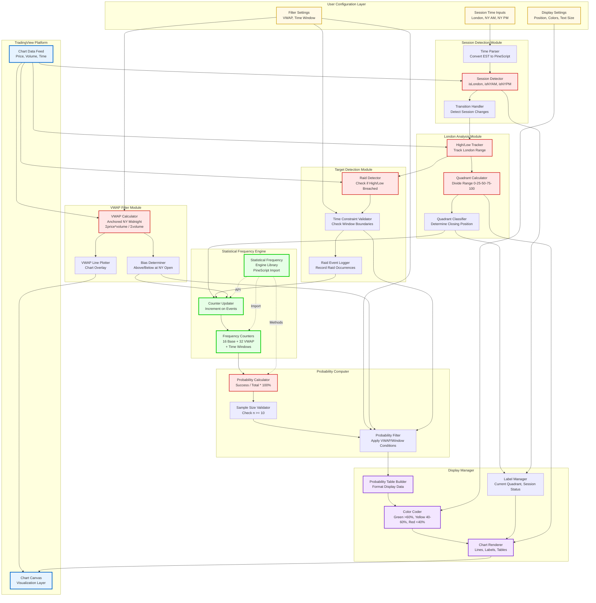

# London Session Profile Study - System Architecture

**Session**: 5
**Created**: 2025-10-13
**Description**: PineScript indicator architecture showing components, data flow, and integration with Statistical Frequency Engine

---

## Architecture Diagram

This diagram illustrates the complete system architecture of the London Session Profile Study PineScript indicator, showing all modules, data flow, and integration points.

## System Components

### TradingView Platform Layer
- **Chart Data Feed**: Provides real-time and historical price, volume, and time data
- **Chart Canvas**: Visualization layer where all indicator output is rendered

### User Configuration Layer
- **Session Time Inputs**: Configurable London, NY AM, and NY PM session times
- **Filter Settings**: VWAP and time window filter toggles and configurations
- **Display Settings**: Customization options for position, colors, and text size

### Session Detection Module
- **Time Parser**: Converts user-specified EST times to PineScript time format
- **Session Detector**: Functions to identify current active session (London, NY AM, NY PM)
- **Transition Handler**: Detects session change events and triggers appropriate actions

### London Analysis Module
- **High/Low Tracker**: Tracks and locks London session high and low prices
- **Quadrant Calculator**: Divides London range into four 25% percentile quadrants
- **Quadrant Classifier**: Determines which quadrant price closed in at London close

### Target Detection Module
- **Raid Detector**: Checks if London high or low was breached during NY sessions
- **Time Constraint Validator**: Validates raids occurred within specified time windows
- **Raid Logger**: Records raid occurrences for statistical counting

### Statistical Frequency Engine (External Library)
- **Frequency Engine Library**: Imported PineScript library for statistical frequency counting
- **Frequency Counters**: Maintains 16 base counters + 32 VWAP-conditional counters + time window counters
- **Counter Updater**: Updates appropriate counters when raid events occur

### VWAP Filter Module
- **VWAP Calculator**: Computes volume-weighted average price anchored at NY midnight
- **Bias Determiner**: Identifies if price is above or below VWAP at NY open
- **VWAP Line Plotter**: Renders VWAP line on chart when filter is enabled

### Probability Computer
- **Probability Calculator**: Computes probability percentages (success / total × 100%)
- **Sample Size Validator**: Checks if sample size meets minimum threshold (n ≥ 10)
- **Probability Filter**: Applies VWAP and time window conditional filtering

### Display Manager
- **Probability Table Builder**: Formats probability data for display
- **Label Manager**: Manages labels for quadrant position and session status
- **Color Coder**: Applies color coding based on probability thresholds (>60%, 40-60%, <40%)
- **Chart Renderer**: Renders all visual elements (lines, labels, tables) to chart canvas

## Data Flow

### Main Data Paths

1. **Configuration Flow**: User settings → Time Parser → Session Detector → Core Logic
2. **Session Detection Flow**: Chart Data → Session Detector → Transition Handler → London Tracker
3. **Quadrant Analysis Flow**: Chart Data → High/Low Tracker → Quadrant Calculator → Quadrant Classifier
4. **Raid Detection Flow**: Chart Data + London Tracker → Raid Detector → Time Constraint → Raid Logger
5. **Frequency Update Flow**: Quadrant Classifier + Raid Logger + VWAP Bias → Counter Updater → Frequency Counters
6. **Probability Calculation Flow**: Frequency Counters → Probability Calculator → Sample Validator → Probability Filter
7. **Display Flow**: Filtered Probabilities + Configuration → Table Builder → Color Coder → Chart Renderer → Chart Display

### Integration Points

- **Statistical Frequency Engine** integrates via PineScript import statement
- **TradingView Platform** provides data input and display output
- **User Configuration** affects all processing modules dynamically

## Technology Stack

- **Language**: PineScript v5
- **Platform**: TradingView
- **External Library**: Statistical Frequency Engine (PineScript)
- **Data Structures**: Arrays, variables with `var` keyword for persistence
- **Visualization**: PineScript plot, label, line, and table functions

## Color Legend

- **Light Blue (Platform)**: TradingView platform components
- **Yellow (Configuration)**: User-configurable settings
- **Light Red (Core)**: Core processing modules
- **Light Green (Library)**: External Statistical Frequency Engine library
- **Purple (Display)**: Display and visualization components

## Related Documents

- **PRD**: ai-docs/2-prds/prd5.md
- **User Stories**: ai-docs/2-user-stories/stories-5.md
- **Technical Specs**: ai-docs/2-specs/specs-5.md (detailed implementation tasks)
- **Validation**: ai-docs/2-validation/validation-5.md
- **Workflow Diagram**: ai-docs/2-diagrams/workflow-5.md
