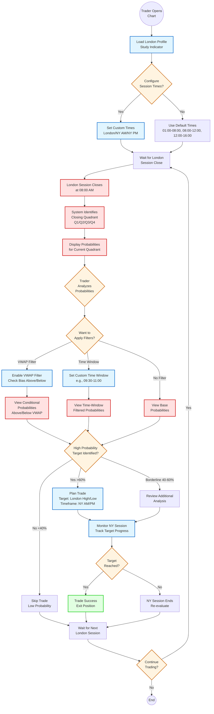

# London Session Profile Study - User Workflow

**Session**: 5
**Created**: 2025-10-13
**Description**: Trader workflow from session observation through probability analysis to trading decision

---

## Workflow Diagram

This diagram illustrates the complete user journey for a trader using the London Session Profile Study indicator, from initial chart setup through probability analysis to trading decisions.

## Key Workflow Steps

### 1. Initial Setup
- Trader loads the indicator on TradingView chart
- Optionally configures custom session times or uses defaults

### 2. Session Observation
- Wait for London session to close at 08:00 AM EST
- System automatically identifies closing quadrant (Q1, Q2, Q3, or Q4)

### 3. Probability Analysis
- System displays probability data for current quadrant
- Trader can apply optional filters:
  - **VWAP Filter**: View conditional probabilities based on price position relative to VWAP
  - **Time Window Filter**: Focus on specific time ranges within NY session
  - **No Filter**: View base probabilities

### 4. Trading Decision
- **High Probability (>60%)**: Plan trade targeting London high or low during NY session
- **Low Probability (<40%)**: Skip trade due to low statistical likelihood
- **Borderline (40-60%)**: Review additional analysis before deciding

### 5. Trade Execution & Monitoring
- If trade is planned, monitor NY session for target achievement
- Track whether London high/low is reached
- Exit position if target is hit, or re-evaluate at session end

### 6. Next Session
- Wait for next London session to repeat the process
- Continue daily trading loop or end session

## Color Legend

- **Blue (User Action)**: Actions performed by the trader
- **Red (System Process)**: Automated system calculations and displays
- **Orange (Decision)**: Decision points in the workflow
- **Green (Success)**: Successful trade outcome

## Related Documents

- **PRD**: ai-docs/2-prds/prd5.md
- **User Stories**: ai-docs/2-user-stories/stories-5.md
- **Technical Specs**: ai-docs/2-specs/specs-5.md
- **Validation**: ai-docs/2-validation/validation-5.md
- **Architecture Diagram**: ai-docs/2-diagrams/architecture-5.md
