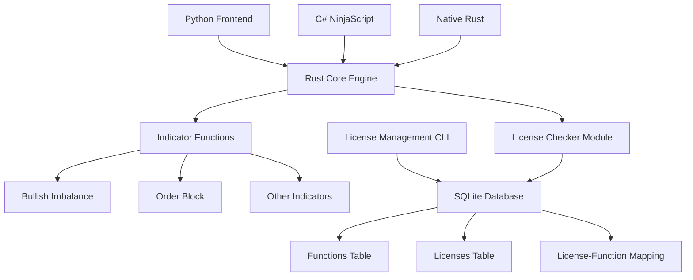

# Multi-Timeframe Level Detector with License Management System - Specification

## Vision

Create a high-performance, license-controlled Rust-based framework for technical analysis indicators that can be used across multiple languages (Python, C#, Rust) while maintaining proprietary source code protection through compiled binaries and sophisticated license management.

### Objectives

- Build a fast, compiled Rust backend for heavy computational tasks (candlestick processing, level extraction)
- Implement flexible license management with tier-based and function-specific access controls
- Create a clean separation between computation (Rust) and visualization (Python/Plotly)
- Enable cross-language interoperability through DLL/shared library compilation
- Maintain source code privacy through binary distribution
- Provide a centralized license management CLI tool for easy administration

### Success Metrics

- All indicator functions process OHLC data efficiently in Rust
- License checking adds minimal performance overhead
- Functions can be selectively enabled/disabled based on license tiers
- Single codebase can be used across Python, C#, and native Rust
- License management CLI provides complete CRUD operations for licenses and functions
- Database schema supports both local SQLite and cloud migration

## Architecture Overview



## Tasks

=4 Task 1.0: Database Schema Design and Implementation
* =4 1.1: Create SQLite database schema with functions table (id, name)
* =4 1.2: Create licenses table (id, key, tier)
* =4 1.3: Create license_function_map table (license_id, function_id)
* =4 1.4: Implement database connection and basic CRUD operations using rusqlite
* =4 1.5: Create database initialization scripts and sample data

=4 Task 2.0: License Checker Module Implementation
* =4 2.1: Create license_checker.rs module with database query functions
* =4 2.2: Implement check_license(function_name: &str) -> Result<(), &str>
* =4 2.3: Add function to query database for license-function mappings
* =4 2.4: Implement tier-based and individual function license validation
* =4 2.5: Add error handling for database connection failures and invalid licenses

=4 Task 3.0: Core Indicator Function Structure
* =4 3.1: Define OHLC data structure for candlestick data
* =4 3.2: Create base indicator function signature (ohlc_data: &[Ohlc], index: usize) -> Result<bool, &str>
* =4 3.3: Implement bullish_imbalance indicator with license check
* =4 3.4: Implement order_block indicator with license check
* =4 3.5: Create template for additional indicator functions

=4 Task 4.0: License Management CLI Tool
* =4 4.1: Create new Rust binary project for license management (lk command)
* =4 4.2: Implement 'lk new' command to create new license keys
* =4 4.3: Implement 'lk add-function' command to add function names to database
* =4 4.4: Implement 'lk associate' command to link licenses with functions
* =4 4.5: Implement 'lk list' command to display licenses and associated functions
* =4 4.6: Implement 'lk remove' command to delete licenses or functions
* =4 4.7: Add CLI argument parsing and help documentation

=4 Task 5.0: Cross-Language Integration Setup
* =4 5.1: Configure Rust project for DLL/shared library compilation
* =4 5.2: Create C-compatible function interfaces for external language binding
* =4 5.3: Test Python integration using ctypes or PyO3
* =4 5.4: Document C# P/Invoke integration patterns
* =4 5.5: Create example usage scripts for each target language

=4 Task 6.0: Testing and Validation
* =4 6.1: Create unit tests for license checker functionality
* =4 6.2: Create integration tests for indicator functions with various license scenarios
* =4 6.3: Test CLI tool commands with various database states
* =4 6.4: Validate cross-language integration with sample applications
* =4 6.5: Performance benchmarking of license checking overhead

=4 Task 7.0: Documentation and Distribution
* =4 7.1: Create user guide for license management CLI
* =4 7.2: Document indicator function API and usage patterns  
* =4 7.3: Create integration examples for Python, C#, and Rust
* =4 7.4: Document build process for creating distributable binaries
* =4 7.5: Create cloud migration guide for database

## Technical Requirements

### Input/Output Specifications
- **Indicator Function Inputs**: OHLC data vector, current bar index, optional parameters
- **Indicator Function Outputs**: Boolean result or structured data based on indicator type
- **License Function**: No external inputs (reads from internal config/database)

### Data Structures
```rust
pub struct Ohlc {
    pub timestamp: u64,
    pub open: f64,
    pub high: f64,
    pub low: f64,
    pub close: f64,
    pub volume: f64,
}
```

### Database Schema
```sql
-- Functions table
CREATE TABLE functions (
    id INTEGER PRIMARY KEY,
    name TEXT UNIQUE NOT NULL
);

-- Licenses table  
CREATE TABLE licenses (
    id INTEGER PRIMARY KEY,
    key TEXT UNIQUE NOT NULL,
    tier TEXT
);

-- License-Function mapping
CREATE TABLE license_function_map (
    license_id INTEGER,
    function_id INTEGER,
    FOREIGN KEY(license_id) REFERENCES licenses(id),
    FOREIGN KEY(function_id) REFERENCES functions(id),
    PRIMARY KEY(license_id, function_id)
);
```

## Development Conventions

### Code Quality
1. Use type hints and proper error handling with Result<T, E> types
2. Write comprehensive docstrings for all public functions and modules
3. Follow Rust naming conventions (snake_case for functions, PascalCase for types)
4. Implement proper input validation for all external interfaces
5. Use #[cfg(test)] for test modules and maintain high test coverage

### Database Operations
1. Use prepared statements for all database queries to prevent SQL injection
2. Implement proper connection pooling for concurrent access
3. Use transactions for operations that modify multiple tables
4. Handle database errors gracefully with meaningful error messages

### License Management
1. Store license keys securely and validate format consistency
2. Implement atomic operations for license-function associations
3. Cache frequently accessed license data for performance
4. Log license validation attempts for audit purposes

### Cross-Language Compatibility
1. Use C-compatible function signatures for external bindings
2. Handle string encoding properly across language boundaries
3. Implement proper memory management for shared data structures
4. Document calling conventions for each target language

### CLI Design
1. Use clap crate for argument parsing and help generation
2. Implement consistent error reporting across all commands
3. Support both interactive and batch operation modes
4. Provide clear success/failure feedback for all operations

### Build and Distribution
1. Create separate build configurations for development and distribution
2. Use static linking where possible to minimize dependencies
3. Document compilation flags for optimal performance
4. Create automated scripts for cross-platform builds

## Environment Setup

### Dependencies
- `rusqlite` - SQLite database operations
- `clap` - CLI argument parsing
- `serde` - Serialization/deserialization
- `anyhow` - Error handling

### Development Environment
- Rust toolchain with cargo
- SQLite3 for database inspection
- Cross-compilation tools for multi-platform builds

## Security Considerations

1. **License Key Storage**: Keys are compiled into binary, not stored in plain text files
2. **Function Access Control**: Runtime validation ensures only licensed functions execute
3. **Database Security**: Use appropriate file permissions for local SQLite database
4. **Binary Distribution**: Source code remains private through compilation

## Future Enhancements

1. **Cloud Database Migration**: Transition from SQLite to cloud-based license validation
2. **Advanced License Features**: Time-based licenses, usage tracking, remote revocation
3. **Additional Indicators**: Expand library with more technical analysis functions
4. **Performance Optimization**: Implement caching and parallel processing where beneficial
5. **GUI Management Tool**: Web-based interface for license administration

## Migration Path

### Phase 1: Local Development
- SQLite database with file-based storage
- Simple CLI for license management
- Basic indicator functions with license checks

### Phase 2: Enhanced Features  
- Additional indicator implementations
- Cross-language integration testing
- Performance optimization

### Phase 3: Cloud Integration
- Database migration to cloud provider
- Remote license validation
- Scalable multi-client support

This specification provides a comprehensive roadmap for implementing the multi-timeframe level detector with sophisticated license management while maintaining the flexibility and performance requirements discussed in the brainstorming session.
