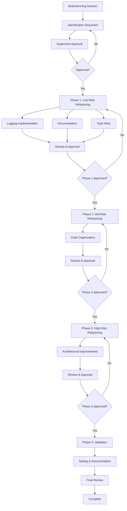

# Specification: Incremental Pipeline Refactoring Workflow

## Vision

Create a systematic, incremental refactoring workflow for Python data pipelines that balances three critical objectives:
1. **Code Quality**: Improve code maintainability, readability, and robustness through structured refactoring
2. **Team Continuity**: Maintain understanding and familiarity for existing engineers without disrupting their workflow
3. **Engineer Onboarding**: Enable new engineers to learn and understand the codebase through hands-on, low-risk refactoring tasks

This approach ensures that refactoring serves as both a technical improvement process and an effective onboarding mechanism, executed in small, supervised, incremental steps.

## Objectives

- Refactor pipeline code incrementally, starting with low-risk improvements
- Onboard new engineer through practical engagement with the codebase
- Minimize disruption to existing team members familiar with current implementation
- Progress from low-risk to higher-risk refactoring tasks as understanding deepens
- Maintain supervisor approval at each stage to ensure alignment
- Create a reusable, agnostic refactoring framework applicable to any Python project

## Success Metrics

- All low-risk refactoring tasks (logging, docstrings, type hints) completed without breaking changes
- New engineer demonstrates understanding of codebase architecture and functionality
- Existing team members successfully adapt to incremental changes
- Each refactoring phase approved by supervisor before implementation
- Code quality metrics improve (type coverage, documentation coverage, logging completeness)
- Zero production incidents caused by refactoring changes

---

## Tasks

### Phase 1: Low-Risk Refactoring (Foundation)

=4 **Task 1.0: Implement Professional Logging System**
* =4 1.1: Review current logging implementation (if any) and identify gaps
* =4 1.2: Create `logger.py` module with Loguru configuration
* =4 1.3: Configure logging to output to both file and terminal
* =4 1.4: Define log levels appropriate for pipeline stages (DEBUG, INFO, WARNING, ERROR)
* =4 1.5: Integrate logger into existing pipeline functions without modifying core logic
* =4 1.6: Test logging output in development environment
* =4 1.7: Document logging conventions for team

=4 **Task 2.0: Add Documentation with Docstrings**
* =4 2.1: Review existing functions and classes to understand current implementation
* =4 2.2: Document all public functions with clear, concise docstrings (Google or NumPy style)
* =4 2.3: Document all classes with purpose, attributes, and usage examples
* =4 2.4: Keep docstrings brief and focused on "what" and "why", not "how"
* =4 2.5: Review docstrings for consistency and clarity
* =4 2.6: Obtain supervisor approval for documentation approach

=4 **Task 3.0: Add Type Hints**
* =4 3.1: Review function signatures to understand current parameter and return types
* =4 3.2: Add type hints to all function parameters
* =4 3.3: Add return type hints to all functions
* =4 3.4: Add type hints to class attributes
* =4 3.5: Use appropriate typing imports (List, Dict, Optional, Union, etc.)
* =4 3.6: Run type checker (mypy) to validate type hints
* =4 3.7: Resolve any type checking errors or inconsistencies

### Phase 2: Mid-Risk Refactoring (Code Organization)

=4 **Task 4.0: Analyze Code Structure and Identify Improvement Opportunities**
* =4 4.1: Review overall pipeline architecture and module organization
* =4 4.2: Identify code duplication and opportunities for consolidation
* =4 4.3: Identify functions that violate single responsibility principle
* =4 4.4: Document proposed organizational improvements
* =4 4.5: Present analysis and proposed changes to supervisor for approval
* =4 4.6: Prioritize organizational changes by risk level

=4 **Task 5.0: Refactor Function Organization**
* =4 5.1: Review current function implementations and dependencies
* =4 5.2: Extract reusable utility functions into separate module
* =4 5.3: Group related functions into logical modules
* =4 5.4: Maintain backward compatibility with existing function calls
* =4 5.5: Update imports across codebase incrementally
* =4 5.6: Test functionality after each organizational change
* =4 5.7: Document new module structure for team

=4 **Task 6.0: Refactor Class Structure**
* =4 6.1: Review existing class implementations and responsibilities
* =4 6.2: Identify classes with multiple responsibilities
* =4 6.3: Split complex classes into smaller, focused classes where appropriate
* =4 6.4: Ensure classes follow SOLID principles (especially Single Responsibility)
* =4 6.5: Update instantiation and usage patterns incrementally
* =4 6.6: Test each class refactor in isolation
* =4 6.7: Obtain team feedback on new class structure

### Phase 3: High-Risk Refactoring (Architectural Improvements)

=4 **Task 7.0: Plan Architectural Improvements**
* =4 7.1: Review overall pipeline flow and identify architectural bottlenecks
* =4 7.2: Identify opportunities for improved error handling and resilience
* =4 7.3: Document proposed architectural changes with diagrams
* =4 7.4: Assess risk and potential breaking changes for each proposal
* =4 7.5: Create detailed implementation plan with rollback strategies
* =4 7.6: Present architectural proposal to team and supervisor for approval
* =4 7.7: Schedule implementation in coordination with team availability

=4 **Task 8.0: Implement Architectural Improvements**
* =4 8.1: Review approved architectural plan and dependencies
* =4 8.2: Implement changes incrementally, one component at a time
* =4 8.3: Create comprehensive tests for new architectural patterns
* =4 8.4: Run full test suite after each incremental change
* =4 8.5: Monitor production-like environment for any issues
* =4 8.6: Document new architectural patterns for team reference
* =4 8.7: Conduct code review with team before finalizing changes

### Phase 4: Validation and Knowledge Transfer

=4 **Task 9.0: Comprehensive Testing and Validation**
* =4 9.1: Review all refactored code for completeness and quality
* =4 9.2: Run full test suite and ensure all tests pass
* =4 9.3: Perform manual testing of pipeline end-to-end
* =4 9.4: Validate logging output provides adequate observability
* =4 9.5: Review type checking passes without errors
* =4 9.6: Confirm documentation is complete and accurate
* =4 9.7: Obtain final supervisor approval

=4 **Task 10.0: Knowledge Transfer and Documentation**
* =4 10.1: Create summary document of all refactoring changes
* =4 10.2: Document lessons learned and best practices discovered
* =4 10.3: Present refactoring outcomes to team in walkthrough session
* =4 10.4: Update team onboarding documentation with new structure
* =4 10.5: Create reference guide for common patterns used in refactored code
* =4 10.6: Collect team feedback on refactoring process
* =4 10.7: Document recommendations for future refactoring efforts

---

## Development Conventions

### Code Quality Standards

1. **Type Hints**: Use type hints for all function parameters, return values, and class attributes
2. **Docstrings**: Write clear, concise docstrings following Google or NumPy style conventions
3. **Naming**: Use descriptive, meaningful names that reflect purpose and scope
4. **Line Length**: Keep files under 700 lines; split larger files into logical modules
5. **Complexity**: Maintain low cyclomatic complexity (aim for <10 per function)
6. **PEP 8**: Follow PEP 8 style guidelines consistently

### Logging Standards

1. **Library**: Use Loguru for all logging operations
2. **Configuration**: Centralize logging configuration in `logger.py`
3. **Outputs**: Configure both file and terminal logging outputs
4. **Levels**: Use appropriate log levels (DEBUG, INFO, WARNING, ERROR, CRITICAL)
5. **Context**: Include relevant context in log messages (function name, parameters, state)
6. **Structured**: Use structured logging for easier parsing and analysis

### Validation and Testing

1. **Framework**: Use pytest for all unit testing
2. **Validation**: Use Pydantic for data validation and parsing
3. **Test Location**: Create `tests/` subdirectory within module directories
4. **Test Structure**: Mirror source directory structure in test directories
5. **Coverage**: Aim for high test coverage, especially for business logic
6. **Test Cases**: Include both positive and negative test scenarios

### Package Management

1. **Tool**: Use `uv` for all package management operations
2. **Dependencies**: Document all dependencies and their purpose
3. **Versions**: Pin dependency versions for reproducibility
4. **Virtual Environment**: Always work within project virtual environment
5. **Updates**: Test dependency updates in isolation before merging

### Incremental Development Process

1. **Review First**: Every task begins with reviewing current implementation
2. **Small Steps**: Make small, focused changes that can be easily reviewed
3. **Test Continuously**: Run tests after each incremental change
4. **Commit Frequently**: Create granular commits with clear messages
5. **Seek Approval**: Obtain supervisor approval before moving to next phase
6. **Document Changes**: Update documentation alongside code changes
7. **Team Communication**: Keep existing team informed of changes through clear commit messages and documentation

### Risk Management

1. **Risk Assessment**: Evaluate potential breaking changes before implementation
2. **Rollback Plan**: Have clear rollback strategy for each change
3. **Staging**: Test changes in development/staging before production
4. **Incremental Deployment**: Deploy changes incrementally, not all at once
5. **Monitoring**: Monitor system behavior after each deployment
6. **Team Coordination**: Coordinate timing of changes with team availability

---

## Process Flow

```mermaid
graph TD
    A[Brainstorming Session] --> B[Specification Document]
    B --> C[Supervisor Approval]
    C --> D{Approved?}
    D -->|No| B
    D -->|Yes| E[Phase 1: Low-Risk Refactoring]
    E --> F[Logging Implementation]
    E --> G[Documentation]
    E --> H[Type Hints]
    F --> I[Review & Approval]
    G --> I
    H --> I
    I --> J{Phase 1 Approved?}
    J -->|No| E
    J -->|Yes| K[Phase 2: Mid-Risk Refactoring]
    K --> L[Code Organization]
    L --> M[Review & Approval]
    M --> N{Phase 2 Approved?}
    N -->|No| K
    N -->|Yes| O[Phase 3: High-Risk Refactoring]
    O --> P[Architectural Improvements]
    P --> Q[Review & Approval]
    Q --> R{Phase 3 Approved?}
    R -->|No| O
    R -->|Yes| S[Phase 4: Validation]
    S --> T[Testing & Documentation]
    T --> U[Final Review]
    U --> V[Complete]
```

---

## Dual Purpose Framework

This refactoring workflow serves two parallel and equally important purposes:

### Purpose 1: Code Improvement
- Enhance code quality through systematic refactoring
- Improve maintainability with better documentation and type safety
- Increase observability through professional logging
- Optimize code organization and architecture

### Purpose 2: Engineer Onboarding
- Build deep understanding of codebase through hands-on refactoring
- Learn system architecture by working with existing implementation
- Develop confidence for future, more complex changes
- Establish foundation for becoming on-call support engineer

### Balancing Act

The key challenge is maintaining equilibrium between:
- **Change** (improving the code) and **Stability** (preserving team understanding)
- **Learning** (onboarding new engineer) and **Efficiency** (minimizing disruption)
- **Innovation** (better architecture) and **Caution** (avoiding breaking changes)

This is achieved through:
1. **Incremental progression** from low-risk to high-risk changes
2. **Continuous approval** from supervisor at phase boundaries
3. **Clear communication** with existing team through documentation and commits
4. **Systematic testing** to catch issues early
5. **Reversible changes** with clear rollback strategies

---

## Notes

- This specification is intentionally agnostic and can be applied to any Python pipeline or codebase
- Task numbering uses =4 (not started), =� (in progress), =� (completed) status indicators
- Each phase should be completed and approved before moving to the next
- The specification emphasizes that review and understanding must precede implementation
- Low-risk changes (Phase 1) build foundation and familiarity for higher-risk changes (Phases 2-3)
- Success depends on balancing competing goals: improvement, stability, and onboarding
