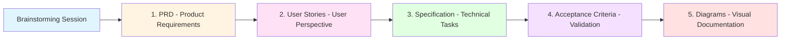
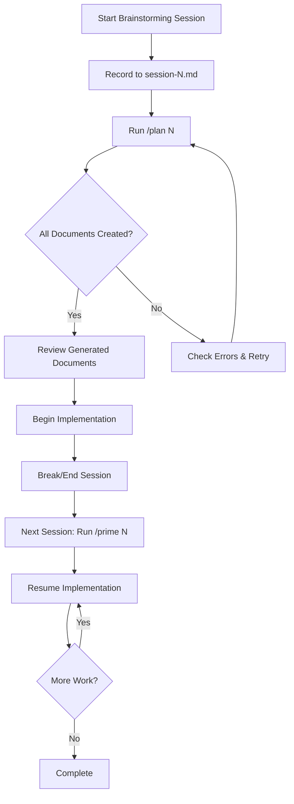

# AI Development Workflow Enhancement System - Specification

## Vision

Create a comprehensive, document-driven AI development workflow system that enables seamless context management, multi-document generation, and intelligent session resumption for AI-assisted software development using Claude Code.

### Objectives

- Implement a master `/plan` command that orchestrates generation of multiple planning documents from brainstorming sessions
- Create a sequential document generation pipeline: PRD → User Stories → Specification → Acceptance Criteria
- Develop a `/prime` command for intelligent context loading and session resumption
- Generate visual documentation through Mermaid diagrams for workflow and architecture
- Enable modular code analysis through a dedicated codebase researcher sub-agent
- Maintain a structured AI-docs directory that serves as the single source of truth for development

### Success Metrics

- Single `/plan <session_number>` command generates all required planning documents
- Each document builds incrementally on previous documents, maintaining context
- `/prime` command successfully loads relevant context for session resumption
- Generated Mermaid diagrams accurately represent workflows and architecture
- Codebase researcher sub-agent provides comprehensive project understanding
- All documents follow standardized naming conventions and directory structure

## Architecture Overview

```mermaid
graph TD
    A[Brainstorming Session] --> B[/plan Command]
    B --> C[brain2prd Agent]
    C --> D[PRD Document]

    B --> E[brain2stories Agent]
    A --> E
    D --> E
    E --> F[User Stories Document]

    B --> G[brain2specs Agent]
    A --> G
    D --> G
    F --> G
    G --> H[Specification Document]

    B --> I[brain2validation Agent]
    A --> I
    D --> I
    F --> I
    H --> I
    I --> J[Acceptance Criteria Document]

    B --> K[graph Command]
    A --> K
    D --> K
    F --> K
    H --> K
    J --> K
    K --> L[Workflow Diagram]
    K --> M[Architecture Diagram]

    N[/prime Command] --> O{Has Argument?}
    O -->|No Arg| P[Full Project Scan]
    O -->|/path| Q[Module-Specific Analysis]
    O -->|session number| R[Session Context Load]

    R --> S[Load Brainstorming]
    R --> T[Load PRD]
    R --> U[Load Specs]
    R --> V[Load Stories]
    R --> W[Load Validation]

    P --> X[Codebase Researcher Agent]
    Q --> X
    X --> Y[Project Understanding Report]
```

## Document Hierarchy and Flow



## Tasks

## ✅ Atomic Task 1.0: Survey and Validate Existing Infrastructure
- ✅ Sub-atomic 1.1: Verify existence of ai-docs directory structure (0-brainstorming, 1-prds, 2-specs, 4-prompts, 5-workflows)
- ✅ Sub-atomic 1.2: Confirm presence of brain2specs.md and brain2prd prompts in 4-prompts directory
- ✅ Sub-atomic 1.3: Check .claude/commands directory for existing command files
- ✅ Sub-atomic 1.4: Document current naming conventions for session files (session-N.md, prdN.md, specs-N.md)
- ✅ Sub-atomic 1.5: Identify missing directories (3-user-stories, 6-acceptance-criteria, 7-diagrams)

## ✅ Atomic Task 2.0: Create Missing Directory Structure
- ✅ Sub-atomic 2.1: Create ai-docs/2-user-stories directory for user story documents (Layer 2 = Planning)
- ✅ Sub-atomic 2.2: Create ai-docs/2-validation directory for validation documents (Layer 2 = Planning)
- ✅ Sub-atomic 2.3: Create ai-docs/2-diagrams directory for Mermaid diagram exports (Layer 2 = Planning)
- ✅ Sub-atomic 2.4: Update directory structure documentation in README if exists
- ✅ Sub-atomic 2.5: Verify write permissions for all new directories

## ✅ Atomic Task 3.0: Design Codebase Researcher Sub-Agent
- ✅ Sub-atomic 3.1: Use agent-architect to define codebase researcher role and capabilities
- ✅ Sub-atomic 3.2: Specify researcher agent tools: Read, Grep, Glob, Bash
- ✅ Sub-atomic 3.3: Define researcher output format: project structure summary, key components, technology stack
- ✅ Sub-atomic 3.4: Create agent configuration in .claude/agents/ directory
- ✅ Sub-atomic 3.5: Document researcher agent usage patterns and best practices

## ✅ Atomic Task 4.0: Implement brain2stories Prompt
- ✅ Sub-atomic 4.1: Create ai-docs/4-prompts/brain2stories.md following brain2specs pattern
- ✅ Sub-atomic 4.2: Define user story document structure (Epic → Stories → Acceptance Criteria)
- ✅ Sub-atomic 4.3: Specify input requirements: brainstorming session + PRD document
- ✅ Sub-atomic 4.4: Define output format with user persona, story description, and acceptance criteria
- ✅ Sub-atomic 4.5: Add guidelines for extracting user-facing features from technical requirements
- ✅ Sub-atomic 4.6: Include examples of well-formatted user stories

## ✅ Atomic Task 5.0: Implement brain2validation Prompt
- ✅ Sub-atomic 5.1: Create ai-docs/4-prompts/brain2validation.md for acceptance criteria generation
- ✅ Sub-atomic 5.2: Define validation document structure (Feature → Test Scenarios → Acceptance Criteria)
- ✅ Sub-atomic 5.3: Specify input requirements: brainstorming + PRD + stories + specs
- ✅ Sub-atomic 5.4: Define test scenario format with Given-When-Then patterns
- ✅ Sub-atomic 5.5: Add guidelines for comprehensive test coverage and edge cases
- ✅ Sub-atomic 5.6: Include examples of validation criteria linked to specifications

## ✅ Atomic Task 6.0: Implement graph Command Prompt
- ✅ Sub-atomic 6.1: Create ai-docs/4-prompts/brain2graph.md for diagram generation
- ✅ Sub-atomic 6.2: Define workflow diagram requirements (user journey, process flow)
- ✅ Sub-atomic 6.3: Define architecture diagram requirements (components, data flow, integrations)
- ✅ Sub-atomic 6.4: Specify input requirements: all generated documents from session
- ✅ Sub-atomic 6.5: Add Mermaid syntax guidelines and diagram complexity limits
- ✅ Sub-atomic 6.6: Define output format and file naming convention (workflow-N.mmd, architecture-N.mmd)

## ✅ Atomic Task 7.0: Create Claude Command Files
- ✅ Sub-atomic 7.1: Create .claude/commands/brain2stories.md that invokes brain2stories prompt
- ✅ Sub-atomic 7.2: Create .claude/commands/brain2validation.md that invokes brain2validation prompt
- ✅ Sub-atomic 7.3: Create .claude/commands/graph.md that invokes brain2graph prompt
- ✅ Sub-atomic 7.4: Verify all command files accept session_number as input parameter
- ✅ Sub-atomic 7.5: Test individual commands with existing brainstorming sessions

## ✅ Atomic Task 8.0: Implement Master /plan Command
- ✅ Sub-atomic 8.1: Create .claude/commands/plan.md with session_number parameter
- ✅ Sub-atomic 8.2: Implement sequential invocation: brain2prd → brain2stories → brain2specs → brain2validation → graph
- ✅ Sub-atomic 8.3: Add context passing between commands (each receives previous outputs)
- ✅ Sub-atomic 8.4: Implement progress reporting for each document generation step
- ✅ Sub-atomic 8.5: Add error handling for missing brainstorming sessions
- ✅ Sub-atomic 8.6: Create validation checks to ensure all documents are generated successfully
- ✅ Sub-atomic 8.7: Document expected file outputs in comments

## ⭕ Atomic Task 9.0: Implement /prime Command - Base Cases
- ⭕ Sub-atomic 9.1: Create .claude/commands/prime.md with optional parameter handling
- ⭕ Sub-atomic 9.2: Implement no-argument case: scan current directory structure
- ⭕ Sub-atomic 9.3: Add README file detection and analysis for project context
- ⭕ Sub-atomic 9.4: Implement directory tree generation for project overview
- ⭕ Sub-atomic 9.5: Add technology stack detection (package.json, requirements.txt, Cargo.toml, etc.)
- ⭕ Sub-atomic 9.6: Create summary output format with key project characteristics

## ⭕ Atomic Task 10.0: Implement /prime Command - Module Analysis
- ⭕ Sub-atomic 10.1: Implement path argument parsing (/prime /path/to/module)
- ⭕ Sub-atomic 10.2: Validate provided path exists in project
- ⭕ Sub-atomic 10.3: Invoke codebase researcher sub-agent for targeted analysis
- ⭕ Sub-atomic 10.4: Configure researcher to analyze module structure, dependencies, and exports
- ⭕ Sub-atomic 10.5: Generate module-specific context summary
- ⭕ Sub-atomic 10.6: Present key functions, classes, and interfaces from module

## ⭕ Atomic Task 11.0: Implement /prime Command - Session Context
- ⭕ Sub-atomic 11.1: Implement session number argument parsing (/prime <number>)
- ⭕ Sub-atomic 11.2: Load brainstorming session-<number>.md from ai-docs/0-brainstorming
- ⭕ Sub-atomic 11.3: Load prd<number>.md from ai-docs/2-prds
- ⭕ Sub-atomic 11.4: Load stories-<number>.md from ai-docs/2-user-stories
- ⭕ Sub-atomic 11.5: Load specs-<number>.md from ai-docs/2-specs
- ⭕ Sub-atomic 11.6: Load validation-<number>.md from ai-docs/2-validation
- ⭕ Sub-atomic 11.7: Load diagrams from ai-docs/2-diagrams if available
- ⭕ Sub-atomic 11.8: Generate comprehensive session context summary
- ⭕ Sub-atomic 11.9: Highlight current implementation status from specs document
- ⭕ Sub-atomic 11.10: Identify next actionable tasks from specification

## ⭕ Atomic Task 12.0: Integration Testing
- ⭕ Sub-atomic 12.1: Test /plan command with existing session-1
- ⭕ Sub-atomic 12.2: Verify all documents generated with correct naming convention
- ⭕ Sub-atomic 12.3: Validate document content continuity across the pipeline
- ⭕ Sub-atomic 12.4: Test /prime command with no arguments
- ⭕ Sub-atomic 12.5: Test /prime with module path argument
- ⭕ Sub-atomic 12.6: Test /prime with session number argument
- ⭕ Sub-atomic 12.7: Verify codebase researcher sub-agent integration

## ⭕ Atomic Task 13.0: Documentation and Examples
- ⭕ Sub-atomic 13.1: Create usage guide for /plan command with examples
- ⭕ Sub-atomic 13.2: Create usage guide for /prime command with all variants
- ⭕ Sub-atomic 13.3: Document expected directory structure and file naming conventions
- ⭕ Sub-atomic 13.4: Create example workflow: brainstorming → planning → priming → implementation
- ⭕ Sub-atomic 13.5: Document how to extend system with new document types
- ⭕ Sub-atomic 13.6: Add troubleshooting guide for common issues

## ⭕ Atomic Task 14.0: Optimization and Refinement
- ⭕ Sub-atomic 14.1: Implement caching for /prime command to avoid redundant analysis
- ⭕ Sub-atomic 14.2: Add file modification timestamps to context summaries
- ⭕ Sub-atomic 14.3: Implement incremental updates for existing documents
- ⭕ Sub-atomic 14.4: Add command to list all available sessions
- ⭕ Sub-atomic 14.5: Create command to validate ai-docs directory integrity
- ⭕ Sub-atomic 14.6: Add progress indicators for long-running document generation

## Technical Requirements

### Command Interface Specifications

```markdown
# /plan <session_number>
Input: Integer session number
Output:
  - ai-docs/2-prds/prd<number>.md
  - ai-docs/2-user-stories/stories-<number>.md
  - ai-docs/2-specs/specs-<number>.md
  - ai-docs/2-validation/validation-<number>.md
  - ai-docs/2-diagrams/workflow-<number>.mmd
  - ai-docs/2-diagrams/architecture-<number>.mmd

# /prime [optional_argument]
Variants:
  - /prime              → Full project scan
  - /prime /path        → Module-specific analysis
  - /prime <number>     → Session context load
```

### Document Naming Conventions

```
Brainstorming:  ai-docs/0-brainstorming/session-N.md OR sessionN.md
Meeting Notes:  ai-docs/1-meeting-minutes/minutes-N.md
PRD:            ai-docs/2-prds/prdN.md
Specs:          ai-docs/2-specs/specs-N.md
User Stories:   ai-docs/2-user-stories/stories-N.md
Validation:     ai-docs/2-validation/validation-N.md
Diagrams:       ai-docs/2-diagrams/{workflow|architecture}-N.mmd
```

### Sub-Agent Configuration

```yaml
# Codebase Researcher Agent
role: Project Analysis and Documentation
tools: [Read, Grep, Glob, Bash]
output_format: Structured markdown with sections:
  - Project Overview
  - Directory Structure
  - Technology Stack
  - Key Components
  - Dependencies
  - Entry Points
  - Notable Patterns
```

### Data Flow Between Document Generations

1. **PRD Generation**: Input = Brainstorming Session
2. **User Stories Generation**: Input = Brainstorming + PRD
3. **Specification Generation**: Input = Brainstorming + PRD + Stories
4. **Validation Generation**: Input = Brainstorming + PRD + Stories + Specs
5. **Diagram Generation**: Input = All documents from session

## Development Conventions

### File and Directory Management
1. Use consistent naming conventions across all document types
2. Maintain numeric session identifiers for document traceability
3. Create directories with proper permissions (755)
4. Validate file existence before operations
5. Implement atomic file writes to prevent corruption

### Command Implementation
1. Use clear, descriptive command names that reflect their purpose
2. Implement robust parameter validation and error messages
3. Provide progress indicators for multi-step commands
4. Return meaningful success/failure status codes
5. Log command execution for debugging and audit trails

### Document Generation
1. Each document type must follow its defined template structure
2. Include metadata headers: session number, generation date, dependencies
3. Maintain markdown formatting consistency across all documents
4. Validate document completeness before marking as done
5. Implement version tracking for document updates

### Context Management
1. Load only necessary context for current operation
2. Cache frequently accessed documents for performance
3. Implement lazy loading for large document sets
4. Clear context appropriately to avoid memory issues
5. Provide context summary rather than full content dumps

### Sub-Agent Integration
1. Define clear input/output contracts for sub-agents
2. Implement timeout handling for long-running analysis
3. Capture and format sub-agent output appropriately
4. Handle sub-agent failures gracefully
5. Log sub-agent invocations and results

### Error Handling
1. Validate all file paths before operations
2. Provide clear error messages with actionable suggestions
3. Implement fallback behaviors for missing documents
4. Log errors with sufficient context for debugging
5. Return appropriate exit codes for command-line integration

### Testing Strategy
1. Create test fixtures for each document type
2. Test commands in isolation before integration
3. Validate document generation with various input complexities
4. Test error conditions and edge cases
5. Verify sub-agent integration with mocked and real agents

### Code Quality
1. Write clear, self-documenting code with meaningful variable names
2. Add comments for complex logic and non-obvious decisions
3. Follow Claude Code command file conventions
4. Maintain consistent formatting across all command files
5. Use version control for all changes

## Workflow Guidelines

### Development Sequence

1. **Initial Setup** (Tasks 1-2)
   - Validate existing infrastructure
   - Create missing directories
   - Establish baseline

2. **Agent Development** (Task 3)
   - Design codebase researcher
   - Test agent capabilities
   - Document agent usage

3. **Prompt Creation** (Tasks 4-6)
   - Implement missing prompts
   - Validate prompt templates
   - Test with sample inputs

4. **Command Implementation** (Tasks 7-8)
   - Create individual commands
   - Implement master plan command
   - Test sequential execution

5. **Prime Command Development** (Tasks 9-11)
   - Implement base scanning
   - Add module analysis
   - Complete session context loading

6. **Testing and Refinement** (Tasks 12-14)
   - Integration testing
   - Documentation
   - Optimization

### Usage Workflow



## Future Enhancements

1. **Incremental Updates**: Support updating existing documents when brainstorming evolves
2. **Document Diffing**: Show changes between document versions
3. **Template Customization**: Allow project-specific document templates
4. **Progress Tracking**: Integrate with issue tracking systems
5. **Export Formats**: Support PDF, HTML export for generated documents
6. **Collaboration Features**: Multi-user session support
7. **Analytics**: Track time spent on tasks, document generation metrics
8. **AI Model Selection**: Allow different models for different document types

## Security Considerations

1. **File Access**: Validate all file paths to prevent directory traversal
2. **Command Injection**: Sanitize all user inputs to commands
3. **Sub-Agent Sandboxing**: Ensure sub-agents cannot access sensitive files
4. **Credentials**: Never store credentials in ai-docs directory
5. **Version Control**: Add .gitignore rules for sensitive content

## Migration Notes

### For Existing Projects

1. Run audit command to identify existing documentation
2. Rename files to match new naming conventions
3. Move files to appropriate ai-docs subdirectories
4. Generate missing documents for existing sessions
5. Update any custom commands to use new structure

### Backward Compatibility

- Support both session-N.md and sessionN.md naming in brainstorming
- Support both prdN.md and prd-N.md in PRD directory
- Implement fallback searches for legacy file patterns
- Provide migration helper command to update old structure

## Success Criteria

This implementation will be considered successful when:

1. A developer can run `/plan 1` and receive all planning documents
2. A developer can run `/prime 1` after a break and understand project state
3. Generated documents maintain consistency and build upon each other
4. The codebase researcher provides accurate project understanding
5. All commands handle errors gracefully with helpful messages
6. Documentation is clear enough for new team members to adopt the system
7. The workflow reduces context-switching time for AI-assisted development

## Appendix: File Structure Example

```
ai-dev-environment/
├── .claude/
│   ├── commands/
│   │   ├── brain2prd.md
│   │   ├── brain2specs.md
│   │   ├── brain2stories.md         # New
│   │   ├── brain2validation.md      # New
│   │   ├── graph.md                 # New
│   │   ├── plan.md                  # New - Master command
│   │   └── prime.md                 # Enhance existing
│   └── agents/
│       └── codebase-researcher.json # New
├── ai-docs/
│   ├── 0-brainstorming/             # Layer 0: Source - Brainstorming sessions
│   │   ├── session-1.md
│   │   ├── session-2.md
│   │   └── session-4.md
│   ├── 0-voice/                     # Layer 0: Source - Voice transcripts
│   │   └── voice-N.md
│   ├── 0-meetings/                  # Layer 0: Source - Meeting recordings
│   │   └── meeting-N.md
│   ├── 0-emails/                    # Layer 0: Source - Email threads
│   │   └── email-N.md
│   ├── 1-meeting-minutes/           # Layer 1: Meeting notes
│   │   └── minutes-N.md
│   ├── 2-prds/                      # Layer 2: Planning - Product requirements
│   │   ├── prd1.md
│   │   ├── prd2.md
│   │   └── prd4.md                  # Generated by plan
│   ├── 2-specs/                     # Layer 2: Planning - Technical specs
│   │   ├── specs-1.md
│   │   ├── specs-2.md
│   │   └── specs-4.md               # Generated by plan
│   ├── 2-user-stories/              # Layer 2: Planning - User stories
│   │   ├── stories-1.md
│   │   ├── stories-2.md
│   │   └── stories-4.md             # Generated by plan
│   ├── 2-validation/                # Layer 2: Planning - Acceptance criteria
│   │   ├── validation-1.md
│   │   ├── validation-2.md
│   │   └── validation-4.md          # Generated by plan
│   ├── 2-diagrams/                  # Layer 2: Planning - Visual docs
│   │   ├── workflow-1.mmd
│   │   ├── architecture-1.mmd
│   │   ├── workflow-4.mmd           # Generated by plan
│   │   └── architecture-4.mmd       # Generated by plan
│   ├── 4-prompts/                   # Layer 4: Reusable prompts
│   │   ├── brain2specs.md
│   │   ├── session-to-prd.md
│   │   ├── brain2stories.md         # New
│   │   ├── brain2validation.md      # New
│   │   └── brain2graph.md           # New
│   └── 5-workflows/                 # Layer 5: Workflow definitions
│       └── workflow1.md
└── [project files...]
```

This specification provides a comprehensive roadmap for implementing the enhanced AI development workflow system with document generation, intelligent context management, and seamless session resumption capabilities.
