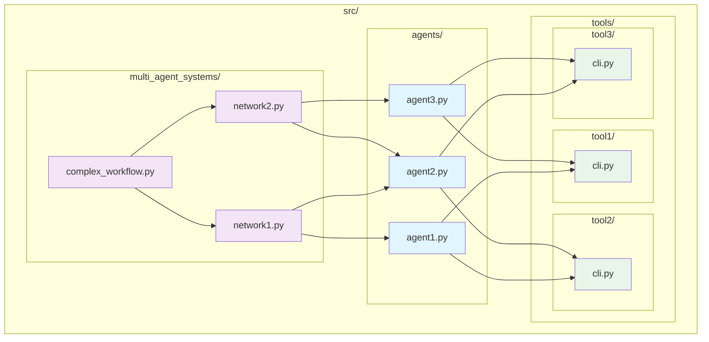

# Modular Agent Framework - Technical Specification

## Vision

Create a modular, self-contained agent framework that enables rapid development and deployment of both individual AI agents and orchestrated multi-agent systems. Each agent will be completely self-contained in a single Python file, making them portable and instantly runnable while maintaining the flexibility to be orchestrated together using LangGraph for complex workflows.

### Objectives
- Build self-contained single-file agents with embedded system prompts, models, and CLI interfaces
- Create orchestration capabilities for multi-agent networks using LangGraph state machine functionality
- Develop modular CLI-based tools that can be shared across all agents
- Ensure maximum portability where any agent file can be copied and run independently
- Provide both standalone agent execution and complex multi-agent workflow capabilities

### Success Metrics
- Single agent files can be executed independently without external dependencies
- Agent files can be copied to any directory and run out-of-the-box
- Multi-agent systems can be composed by importing and orchestrating individual agents
- All agents have functional CLI interfaces using Click framework
- Tools can be invoked as CLI utilities by any agent
- LangGraph integration enables shared memory and state management across agent networks

## Tasks

⏳ Task 1.0: Create project structure and directory architecture
* ⏳ 1.1: Set up src/ root directory for the entire framework
* ⏳ 1.2: Create src/agents/ directory for single-file agent storage
* ⏳ 1.3: Create src/multi_agent_systems/ directory for orchestrated agent networks
* ⏳ 1.4: Create src/tools/ directory with subdirectories for each CLI tool
* ⏳ 1.5: Initialize proper Python package structure with __init__.py files

⏳ Task 2.0: Implement single-file agent template and base structure
* ⏳ 2.1: Create agent base class with standard interface for system prompts, models, and context handling
* ⏳ 2.2: Integrate LangGraph model interface for consistent model specification
* ⏳ 2.3: Implement structured output capabilities using Pydantic type structures
* ⏳ 2.4: Add memory management using LangGraph's native dictionary-based storage
* ⏳ 2.5: Design input/output handling for context and environment inputs

⏳ Task 3.0: Implement CLI interface for single-file agents
* ⏳ 3.1: Integrate Click framework for command-line argument parsing
* ⏳ 3.2: Create default main() function that executes when no arguments provided
* ⏳ 3.3: Implement parameter passing for context, inputs, and configuration options
* ⏳ 3.4: Add help documentation and usage examples for each agent's CLI
* ⏳ 3.5: Ensure agents can be executed directly via `python agent_file.py`

⏳ Task 4.0: Create CLI-based tools infrastructure
* ⏳ 4.1: Design standard CLI tool interface that agents can invoke
* ⏳ 4.2: Create tool discovery mechanism for agents to find available tools
* ⏳ 4.3: Implement parameter passing and result handling for tool invocation
* ⏳ 4.4: Add error handling and validation for tool execution
* ⏳ 4.5: Create example tools to demonstrate the CLI interface pattern

⏳ Task 5.0: Implement multi-agent orchestration capabilities
* ⏳ 5.1: Create LangGraph-based orchestration template for agent networks
* ⏳ 5.2: Implement agent import and registration system for network files
* ⏳ 5.3: Add shared memory and context passing between orchestrated agents
* ⏳ 5.4: Create state management for complex multi-agent workflows
* ⏳ 5.5: Enable sub-network capabilities where networks can include other networks

⏳ Task 6.0: Implement agent portability and self-containment features
* ⏳ 6.1: Ensure all agent dependencies are properly imported within each file
* ⏳ 6.2: Create validation system to verify agent self-containment
* ⏳ 6.3: Add compatibility checks for Python environment requirements
* ⏳ 6.4: Document and test agent portability across different directories
* ⏳ 6.5: Consider integration with Python-uv for enhanced portability options

⏳ Task 7.0: Create documentation and example implementations
* ⏳ 7.1: Create example single-file agent demonstrating all capabilities
* ⏳ 7.2: Build example multi-agent system showing orchestration features
* ⏳ 7.3: Create example CLI tools showcasing the tool interface
* ⏳ 7.4: Write comprehensive usage documentation and best practices
* ⏳ 7.5: Add troubleshooting guide and common usage patterns

⏳ Task 8.0: Implement testing and validation framework
* ⏳ 8.1: Create unit tests for agent base functionality
* ⏳ 8.2: Add integration tests for multi-agent orchestration
* ⏳ 8.3: Test CLI interfaces for all agents and tools
* ⏳ 8.4: Validate portability by testing agents in different environments
* ⏳ 8.5: Create automated testing pipeline for framework validation

## Development Conventions

### Code Quality
1. Use type hints for all function parameters and return values
2. Write clear docstrings for all functions, classes, and modules following Google style
3. Follow PEP 8 style guidelines for Python code formatting
4. Implement Pydantic models for all structured data inputs and outputs
5. Add comprehensive input validation for all agent interfaces

### Logging and UI
1. Use Python's built-in logging module with structured log levels
2. Implement clear, informative error messages with actionable guidance
3. Design consistent CLI output formatting across all agents and tools
4. Add progress indicators for long-running agent operations
5. Ensure all CLI interfaces provide helpful usage information

### Package Management
1. Use uv for Python package management and dependency resolution
2. Document all dependencies with specific version requirements
3. Maintain pyproject.toml with pinned dependency versions
4. Ensure minimal dependency footprint for maximum portability
5. Test compatibility with standard Python environments

### Testing
1. Write unit tests for all agent core functionality using pytest
2. Create integration tests for multi-agent orchestration workflows
3. Test CLI interfaces with various input scenarios
4. Aim for 80%+ test coverage of business logic
5. Include both positive and negative test cases for robust validation

### Environment Setup
- Python 3.8+ required for type hints and async support
- Virtual environment: `python -m venv .venv && source .venv/bin/activate` (Mac/Linux) or `.venv\Scripts\activate` (Windows)
- Package installation: `uv add langraph click pydantic`
- Development dependencies: `uv add --dev pytest black isort mypy`
- LangGraph setup for state machine and memory management capabilities

### Architecture Patterns
1. Each agent file must be completely self-contained and executable
2. Use dependency injection for tool integration rather than tight coupling
3. Implement consistent interface patterns across all agents and tools
4. Follow single responsibility principle for agent design
5. Use composition over inheritance for agent capability extension

