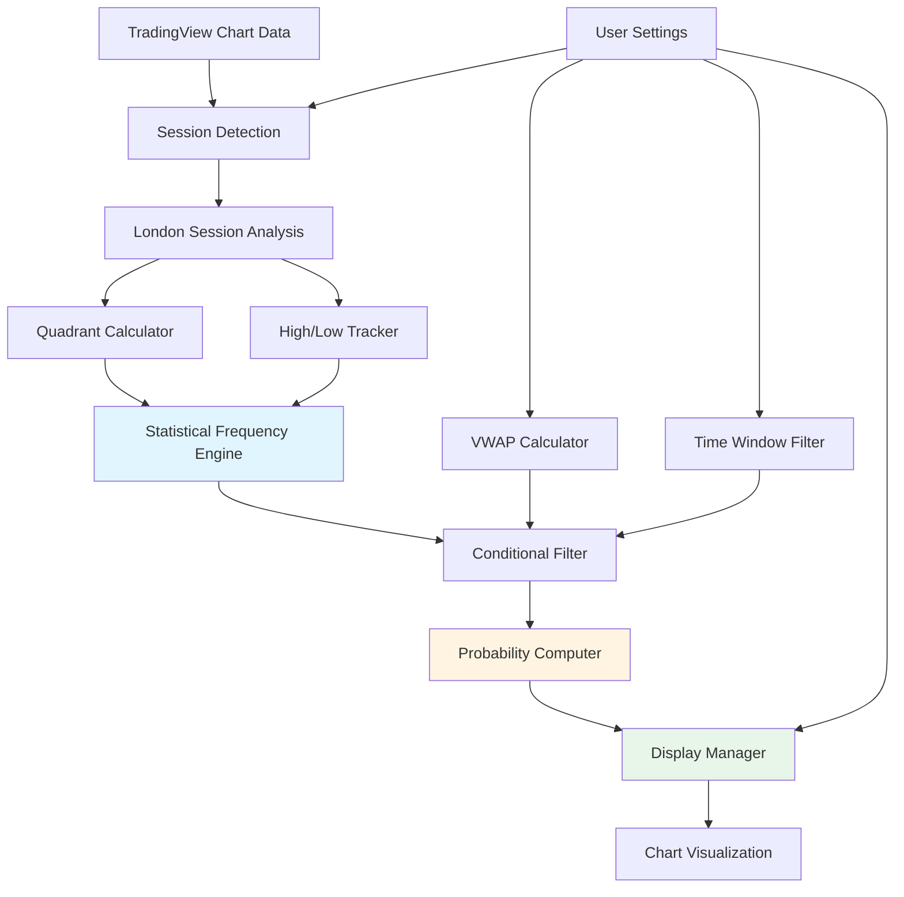
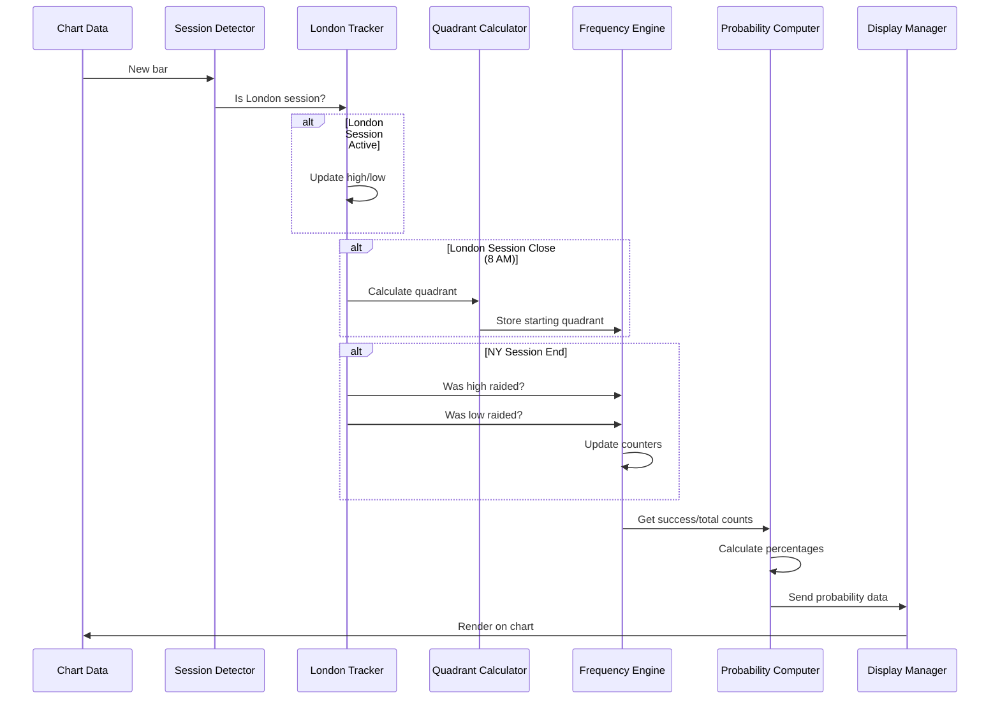

# London Session Profile Study - Technical Specification

**Session**: 5
**Created**: 2025-10-13
**Status**: Draft
**Implementation**: PineScript v5

---

# Vision

Create a TradingView PineScript indicator that provides statistical probability analysis of London session high/low targets being raided during New York trading sessions. The indicator will leverage an existing Statistical Frequency Engine library to compute probabilities based on which quadrant (0-25%, 25-50%, 50-75%, 75-100%) of the London session range price closed at. The study will support conditional filtering via VWAP bias and time-based target windows, enabling traders to make data-driven decisions about target probability.

## Objectives

- Compute and display probability of London high/low being raided during NY AM (8-12) and NY PM (12-4) sessions
- Divide London session range into four 25% percentile quadrants and track starting position
- Implement VWAP filter (anchored at NY midnight) to provide conditional probabilities
- Support time-based target window filtering to limit analysis to specific time ranges
- Integrate with existing Statistical Frequency Engine PineScript library
- Provide configurable session times for London, NY AM, and NY PM sessions
- Display probability statistics clearly on chart without excessive clutter
- Maintain historical frequency counts for statistical reliability

## Success Metrics

- All 16 base probability values computed (4 quadrants × 2 targets × 2 NY sessions)
- Probability calculations match manual backtest within 2% margin of error
- Script executes without timeout on 252+ trading days of historical data
- VWAP filter produces distinct conditional probabilities
- Session times configurable through TradingView settings interface
- Probability displays with sample size indicators for statistical confidence

---

# System Architecture



---

# Tasks

## Phase 1: Foundation and Session Detection

=4 **Task 1.0: Project Setup and Library Integration**
* =4 1.1: Create new PineScript indicator file `LondonSessionProfileStudy.pine`
* =4 1.2: Import Statistical Frequency Engine library using PineScript import statement
* =4 1.3: Locate and review reference implementation that uses Statistical Frequency Engine
* =4 1.4: Set up indicator metadata (title, shorttitle, overlay=true, max_bars_back)
* =4 1.5: Define script version as PineScript v5 using `//@version=5` directive

=4 **Task 2.0: Session Time Configuration**
* =4 2.1: Create input variables for London session start time (default: "0100-0000" EST)
* =4 2.2: Create input variables for London session end time (default: "0800-0000" EST)
* =4 2.3: Create input variables for NY AM session start/end (default: "0800-0000" to "1200-0000")
* =4 2.4: Create input variables for NY PM session start/end (default: "1200-0000" to "1600-0000")
* =4 2.5: Implement time parsing function to convert EST time strings to PineScript time format
* =4 2.6: Add input group "Session Configuration" to organize session time inputs

=4 **Task 3.0: Session Detection Logic**
* =4 3.1: Implement `isLondonSession()` function that returns true when current bar is within London session
* =4 3.2: Implement `isNYAMSession()` function that returns true when current bar is within NY AM session
* =4 3.3: Implement `isNYPMSession()` function that returns true when current bar is within NY PM session
* =4 3.4: Implement session transition detection to identify when London session closes (8 AM default)
* =4 3.5: Test session detection with various timezone configurations and chart timeframes

=4 **Task 4.0: London Session High/Low Tracking**
* =4 4.1: Create variables to store London session high, low, and range for current day
* =4 4.2: Implement logic to reset London high/low at start of each London session
* =4 4.3: Track running high and low during London session using `ta.highest()` and `ta.lowest()`
* =4 4.4: Lock London high/low values at London session close (8 AM)
* =4 4.5: Validate that London high/low persist correctly through NY sessions

## Phase 2: Quadrant Calculation and Classification

=4 **Task 5.0: Quadrant Division and Detection**
* =4 5.1: Calculate London session range: `londonRange = londonHigh - londonLow`
* =4 5.2: Calculate quadrant boundaries:
  - Q1 upper: londonLow + (londonRange * 0.25)
  - Q2 upper: londonLow + (londonRange * 0.50)
  - Q3 upper: londonLow + (londonRange * 0.75)
  - Q4 upper: londonHigh
* =4 5.3: Implement `getQuadrant(price, londonLow, londonRange)` function returning 1-4
* =4 5.4: Determine closing quadrant at London session close (8 AM)
* =4 5.5: Store closing quadrant value for use during NY sessions

=4 **Task 6.0: Quadrant Visualization**
* =4 6.1: Create input toggle "Show Quadrant Lines" (default: true)
* =4 6.2: Draw horizontal lines for each quadrant boundary using `line.new()`
* =4 6.3: Label each quadrant with "Q1 (0-25%)", "Q2 (25-50%)", etc. using `label.new()`
* =4 6.4: Highlight current closing quadrant with distinct color or marker
* =4 6.5: Implement cleanup logic to remove old quadrant lines after session ends

## Phase 3: Statistical Frequency Engine Integration

=4 **Task 7.0: Frequency Counter Setup**
* =4 7.1: Review Statistical Frequency Engine API and available functions
* =4 7.2: Create frequency counter instances for each scenario:
  - 4 quadrants × 2 targets (high/low) × 2 sessions (AM/PM) = 16 counters
* =4 7.3: Initialize counter variable naming convention: `freqQ[N]_[TARGET]_[SESSION]`
  - Example: `freqQ1_HIGH_AM`, `freqQ4_LOW_PM`
* =4 7.4: Implement counter initialization logic at script start
* =4 7.5: Add input for "Minimum Sample Size" (default: 10) for reliability threshold

=4 **Task 8.0: Target Raid Detection**
* =4 8.1: Implement `wasLondonHighRaided()` function to detect if London high was breached during NY session
* =4 8.2: Implement `wasLondonLowRaided()` function to detect if London low was breached during NY session
* =4 8.3: Add time-specific raid detection: `wasRaidedDuringNYAM()` and `wasRaidedDuringNYPM()`
* =4 8.4: Handle edge cases: gaps, wicks vs body close, exact level touches
* =4 8.5: Implement lookback logic to check raid occurrence at end of NY session

=4 **Task 9.0: Frequency Counting Logic**
* =4 9.1: At end of NY AM session, update frequency counters for AM scenarios based on:
  - Starting quadrant (stored at London close)
  - Whether London high was raided (increment success count if true)
  - Whether London low was raided (increment success count if true)
* =4 9.2: At end of NY PM session, update frequency counters for PM scenarios
* =4 9.3: Increment total count for each quadrant/target/session combination
* =4 9.4: Use Statistical Frequency Engine library methods to update counters
* =4 9.5: Ensure counters persist across chart reloads using PineScript `var` keyword

=4 **Task 10.0: Probability Calculation**
* =4 10.1: Implement `calculateProbability(successCount, totalCount)` function returning percentage
* =4 10.2: Add validation: return `na` if totalCount < minimum sample size threshold
* =4 10.3: Calculate all 16 base probabilities at real-time bar close
* =4 10.4: Store probability values in array or individual variables for display
* =4 10.5: Implement rounding to 1 decimal place for display (e.g., 65.4%)

## Phase 4: VWAP Bias Filtering

=4 **Task 11.0: VWAP Calculation**
* =4 11.1: Create input toggle "Enable VWAP Filter" (default: false)
* =4 11.2: Implement VWAP calculation anchored at New York midnight using `ta.vwap()` or manual calculation
* =4 11.3: Reset VWAP at midnight EST using session change detection
* =4 11.4: Store VWAP value at NY session open (8 AM) for bias determination
* =4 11.5: Validate VWAP calculation against TradingView built-in VWAP indicator

=4 **Task 12.0: VWAP Conditional Frequency Counters**
* =4 12.1: Create additional frequency counters for VWAP conditions:
  - 16 base counters × 2 VWAP conditions (above/below) = 32 additional counters
* =4 12.2: Naming convention: `freqQ[N]_[TARGET]_[SESSION]_ABOVE` and `_BELOW`
* =4 12.3: Determine VWAP bias at NY open: compare close price to VWAP value
* =4 12.4: Update appropriate VWAP-conditional counters at end of NY sessions
* =4 12.5: Calculate conditional probabilities: P(raid | quadrant AND VWAP bias)

=4 **Task 13.0: VWAP Visualization**
* =4 13.1: Plot VWAP line on chart when filter is enabled using `plot()`
* =4 13.2: Add input for VWAP line color and width customization
* =4 13.3: Display VWAP bias indicator at NY open (e.g., "Above VWAP" label)
* =4 13.4: Show both base and conditional probabilities when VWAP filter is active
* =4 13.5: Use formatting to distinguish conditional vs base probabilities (e.g., "Base: 65% | Above VWAP: 72%")

## Phase 5: Time-Based Target Window Filtering

=4 **Task 14.0: Time Window Configuration**
* =4 14.1: Create input toggle "Enable Time Window Filter" (default: false)
* =4 14.2: Create input for custom time window start (default: NY AM start)
* =4 14.3: Create input for custom time window end (default: NY PM end)
* =4 14.4: Implement time window validation to ensure start < end
* =4 14.5: Add input group "Time Window Filter" to organize these settings

=4 **Task 15.0: Time-Constrained Raid Detection**
* =4 15.1: Modify raid detection functions to accept optional time window parameters
* =4 15.2: Implement `wasRaidedInWindow(target, windowStart, windowEnd)` function
* =4 15.3: Track timestamp of when raid occurred (first breach of London high/low)
* =4 15.4: Compare raid timestamp against specified window boundaries
* =4 15.5: Update frequency counters only if raid occurred within specified window

=4 **Task 16.0: Window-Filtered Probability Display**
* =4 16.1: When time window filter is enabled, calculate window-specific probabilities
* =4 16.2: Display window boundaries in label (e.g., "Window: 9:30 AM - 11:00 AM")
* =4 16.3: Show comparison: "Full Session: 65% | Window: 58%"
* =4 16.4: Handle case where window produces insufficient sample size
* =4 16.5: Add tooltip or help text explaining time window filter behavior

## Phase 6: Display and Visualization

=4 **Task 17.0: Probability Display System**
* =4 17.1: Create input for display position (Top Left, Top Right, Bottom Left, Bottom Right)
* =4 17.2: Create input for text size (Small, Normal, Large)
* =4 17.3: Implement `createProbabilityTable()` function to format probability display
* =4 17.4: Use PineScript `label.new()` or `table.new()` for on-chart display
* =4 17.5: Update display in real-time as new bar data arrives

=4 **Task 18.0: Current Context Display**
* =4 18.1: Display current session status (London Active, NY AM Active, NY PM Active, Closed)
* =4 18.2: Display current quadrant at London close (e.g., "Starting Quadrant: Q4 (75-100%)")
* =4 18.3: Show relevant probabilities for current quadrant:
  - "London High Raid (NY AM): 42.3% (n=87)"
  - "London Low Raid (NY AM): 71.5% (n=87)"
* =4 18.4: Display VWAP bias if filter enabled (e.g., "VWAP Bias: Above")
* =4 18.5: Show active filters with indicator icons or labels

=4 **Task 19.0: Sample Size and Confidence Indicators**
* =4 19.1: Display sample size (n) alongside each probability value
* =4 19.2: Apply visual warning for low sample size (n < minimum threshold):
  - Use yellow/orange color
  - Add asterisk or warning icon
  - Display "Low confidence" tooltip
* =4 19.3: For insufficient data (n < 10), display "Insufficient data (n=X)" instead of percentage
* =4 19.4: Create input toggle "Show Sample Sizes" (default: true)
* =4 19.5: Implement tooltip hover to show detailed statistics (success count / total count)

=4 **Task 20.0: Multi-Quadrant Comparison View**
* =4 20.1: Create input toggle "Show All Quadrants" (default: false)
* =4 20.2: When enabled, display probability table for all 4 quadrants simultaneously
* =4 20.3: Format table with rows for quadrants and columns for targets/sessions:
  ```
  | Q | LH-AM | LL-AM | LH-PM | LL-PM |
  |---|-------|-------|-------|-------|
  | 1 | 45%   | 28%   | 38%   | 22%   |
  | 2 | 52%   | 48%   | 44%   | 41%   |
  | 3 | 58%   | 61%   | 51%   | 54%   |
  | 4 | 35%   | 73%   | 29%   | 68%   |
  ```
* =4 20.4: Highlight current quadrant row with distinct background color
* =4 20.5: Use color coding for probability ranges (e.g., >60% green, 40-60% yellow, <40% red)

## Phase 7: Configuration and Usability

=4 **Task 21.0: Display Customization**
* =4 21.1: Create input for probability text color (default: white)
* =4 21.2: Create input for background transparency (0-100, default: 80)
* =4 21.3: Create input for display border color and width
* =4 21.4: Implement color threshold settings for probability ranges:
  - High probability color (default: green) for >60%
  - Medium probability color (default: yellow) for 40-60%
  - Low probability color (default: red) for <40%
* =4 21.5: Add input to enable/disable color coding (default: true)

=4 **Task 22.0: Filter Management Interface**
* =4 22.1: Create input group "Filters" containing all filter toggles
* =4 22.2: Display active filter status on chart (e.g., "Filters: VWAP | Time Window")
* =4 22.3: Implement logic to combine multiple filters (VWAP AND Time Window)
* =4 22.4: Show combined conditional probability when multiple filters active
* =4 22.5: Handle insufficient data scenarios for combined filters gracefully

=4 **Task 23.0: Settings Validation and Error Handling**
* =4 23.1: Validate session time inputs to ensure logical ordering (London < NY AM < NY PM)
* =4 23.2: Display error message on chart if session times overlap or invalid
* =4 23.3: Validate time window is within NY session boundaries
* =4 23.4: Check for minimum data requirements and display warning if insufficient
* =4 23.5: Implement graceful handling of missing data (gaps, holidays)

=4 **Task 24.0: Reset and Default Settings**
* =4 24.1: Document default session times in script comments
* =4 24.2: Provide reset instructions in script description
* =4 24.3: Add tooltip help text to each input explaining its purpose
* =4 24.4: Create script description with usage instructions and examples
* =4 24.5: Include interpretation guide for probability values in script notes

## Phase 8: Testing and Validation

=4 **Task 25.0: Unit Testing and Validation**
* =4 25.1: Test session detection across different timeframes (1min, 5min, 15min, 1hour)
* =4 25.2: Verify quadrant calculations with known price levels
* =4 25.3: Manually backtest probability calculations on sample of 100 trading days
* =4 25.4: Compare script probabilities to manual calculations (within 2% margin)
* =4 25.5: Test with different instruments (ES, NQ, CL) to ensure broad compatibility

=4 **Task 26.0: Performance Testing**
* =4 26.1: Load chart with 252+ trading days (1 year) of historical data
* =4 26.2: Verify script executes without timeout or memory errors
* =4 26.3: Measure script execution time and optimize if needed
* =4 26.4: Test with maximum bars back (5000 bars) to ensure stability
* =4 26.5: Identify and resolve any performance bottlenecks

=4 **Task 27.0: Filter Validation**
* =4 27.1: Verify VWAP filter produces different probabilities than base values
* =4 27.2: Test time window filter with various window configurations
* =4 27.3: Validate combined filters (VWAP + Time Window) work correctly
* =4 27.4: Ensure filter toggles enable/disable functionality without errors
* =4 27.5: Confirm filtered sample sizes are appropriate (not too small)

=4 **Task 28.0: Edge Case Testing**
* =4 28.1: Test behavior during market holidays (no data)
* =4 28.2: Test with data gaps and missing bars
* =4 28.3: Test exact level touches (price == London high/low)
* =4 28.4: Test with zero-range London sessions (high == low)
* =4 28.5: Test behavior at DST transitions

=4 **Task 29.0: Documentation and Code Review**
* =4 29.1: Add comprehensive inline comments explaining key logic sections
* =4 29.2: Document Statistical Frequency Engine integration patterns
* =4 29.3: Create user guide with interpretation examples
* =4 29.4: Document known limitations and constraints
* =4 29.5: Add example scenarios showing how to use probability data for trading decisions

=4 **Task 30.0: Final Integration and Deployment**
* =4 30.1: Review code against PineScript best practices and style guidelines
* =4 30.2: Ensure all variable names follow consistent naming convention
* =4 30.3: Optimize code for readability and maintainability
* =4 30.4: Test final version on clean chart to simulate user experience
* =4 30.5: Prepare script for TradingView publication (description, tags, category)

---

# Development Conventions

## PineScript Standards

1. **Version and Imports**
   - Use `//@version=5` at top of script
   - Import libraries using `import` statement with proper namespacing
   - Document library dependencies in script header comments

2. **Variable Naming**
   - Use camelCase for variables and functions: `londonHigh`, `calculateProbability()`
   - Use descriptive names that clearly indicate purpose
   - Prefix boolean variables with `is`, `has`, `should`: `isLondonSession`, `hasInsufficientData`
   - Use consistent naming for frequency counters: `freqQ[N]_[TARGET]_[SESSION]`

3. **Function Structure**
   - Define all helper functions before main script logic
   - Use clear parameter names with type specifications
   - Keep functions focused on single responsibility
   - Add inline comments for complex logic

4. **State Management**
   - Use `var` keyword for variables that should persist across bars
   - Use `varip` only when absolutely necessary for intrabar persistence
   - Reset session-specific variables at appropriate session boundaries
   - Document state lifecycle in comments

## Code Quality

1. **Input Organization**
   - Group related inputs using `input.group()`
   - Provide sensible defaults that work out of the box
   - Add tooltip help text to explain each input
   - Use appropriate input types (bool, string, int, color)

2. **Type Safety**
   - Specify types for all function parameters and return values
   - Use `float`, `int`, `bool`, `string`, `color` appropriately
   - Handle `na` values explicitly with `na()` checks
   - Document expected value ranges in comments

3. **Error Handling**
   - Validate all user inputs and provide clear error messages
   - Handle edge cases gracefully (gaps, holidays, zero ranges)
   - Display warnings on chart when data quality issues detected
   - Log errors using appropriate PineScript debugging methods

4. **Performance Optimization**
   - Minimize use of `security()` calls which are expensive
   - Avoid unnecessary loops and calculations
   - Cache calculated values when appropriate
   - Use built-in functions (`ta.highest()`, `ta.lowest()`) when available

## Display and Visualization

1. **Chart Cleanliness**
   - Use `table` for structured data display (probability tables)
   - Use `label` for contextual information (current quadrant, session status)
   - Use `line` for visual markers (quadrant boundaries, VWAP)
   - Limit number of visual elements to prevent clutter

2. **Color Usage**
   - Use color coding consistently across all displays
   - Provide customization inputs for all colors
   - Ensure colors are accessible (avoid red-green only distinctions)
   - Use transparency appropriately to avoid obscuring price action

3. **Text Formatting**
   - Keep labels concise and easy to read
   - Use consistent formatting for probability values: "65.4% (n=87)"
   - Align text in tables for better readability
   - Use appropriate font sizes for different display contexts

## Testing and Validation

1. **Manual Verification**
   - Test on multiple timeframes (1m, 5m, 15m, 1h)
   - Test on multiple instruments (ES, NQ, CL, EUR/USD)
   - Verify calculations against manual backtests
   - Check behavior across DST transitions

2. **Data Quality**
   - Require minimum sample size for probability display
   - Display confidence indicators for borderline sample sizes
   - Handle missing data and gaps gracefully
   - Document data requirements in user guide

3. **Reference Implementation**
   - Follow patterns from Statistical Frequency Engine reference script
   - Maintain consistency with library API usage
   - Document any deviations from reference patterns
   - Cite reference script in code comments

## Documentation

1. **Inline Comments**
   - Explain "why" not just "what" in comments
   - Document complex calculations with examples
   - Note any PineScript-specific gotchas or limitations
   - Add TODO comments for future enhancements

2. **User Documentation**
   - Include interpretation guide in script description
   - Provide examples of how to use probability values
   - Explain all filters and their effects
   - Document limitations and known issues

3. **Script Header**
   ```pinescript
   //@version=5
   // London Session Profile Study
   // Computes probability of London high/low raids during NY sessions
   // Based on quadrant positioning at London close
   // Uses Statistical Frequency Engine library for frequency counting
   // Author: [Name]
   // Date: 2025-10-13
   ```

---

# Data Flow Diagram



---

# Implementation Notes

## Statistical Frequency Engine Integration

The Statistical Frequency Engine library should be integrated following this pattern:

```pinescript
// Import the library
import [username]/StatisticalFrequencyEngine/[version] as SFE

// Initialize frequency counters
var freqQ1_HIGH_AM = SFE.createCounter()
var freqQ1_LOW_AM = SFE.createCounter()
// ... (16 total base counters)

// Update counters at end of NY AM session
if isEndOfNYAM and not na(startingQuadrant)
    if startingQuadrant == 1
        SFE.increment(freqQ1_HIGH_AM, wasLondonHighRaided())
        SFE.increment(freqQ1_LOW_AM, wasLondonLowRaided())

// Calculate probabilities
probQ1_HIGH_AM = SFE.getProbability(freqQ1_HIGH_AM)
```

**Note**: Actual library API may differ - review reference implementation for exact patterns.

## Quadrant Calculation Logic

```pinescript
getQuadrant(price, londonLow, londonRange) =>
    if londonRange == 0
        na  // Handle zero-range case
    else
        pctInRange = (price - londonLow) / londonRange
        if pctInRange <= 0.25
            1
        else if pctInRange <= 0.50
            2
        else if pctInRange <= 0.75
            3
        else
            4
```

## VWAP Calculation

```pinescript
// Reset VWAP at NY midnight
var float vwapSum = 0.0
var float volumeSum = 0.0

if isNYMidnight
    vwapSum := 0.0
    volumeSum := 0.0

// Accumulate during session
vwapSum := vwapSum + (close * volume)
volumeSum := volumeSum + volume

vwap = volumeSum > 0 ? vwapSum / volumeSum : na
```

## Probability Display Format

Recommended format for on-chart display:

```
╔════════════════════════════════════════╗
║ London Session Profile Study          ║
║ Session: NY AM Active                  ║
║ Starting Quadrant: Q4 (75-100%)       ║
║ VWAP Bias: Above                      ║
╠════════════════════════════════════════╣
║ London High Raid Probability          ║
║   NY AM: 42.3% (n=87)                 ║
║   NY PM: 38.1% (n=87)                 ║
║                                        ║
║ London Low Raid Probability           ║
║   NY AM: 71.5% (n=87) ★               ║
║   NY PM: 68.2% (n=87)                 ║
╚════════════════════════════════════════╝

★ = High probability (>60%)
```

---

# Testing Checklist

## Functional Testing
- [ ] Session detection works on 1m, 5m, 15m, 1h timeframes
- [ ] London high/low tracked correctly throughout session
- [ ] Quadrant boundaries calculated accurately (25%, 50%, 75%)
- [ ] Starting quadrant identified correctly at London close
- [ ] Raid detection identifies breaches of London high/low
- [ ] Frequency counters increment appropriately
- [ ] Probabilities calculate correctly (within 2% of manual backtest)
- [ ] VWAP anchors at NY midnight and updates correctly
- [ ] VWAP filter produces conditional probabilities
- [ ] Time window filter limits analysis to specified windows
- [ ] All 16 base probabilities display correctly
- [ ] Sample sizes display alongside probabilities

## UI/UX Testing
- [ ] Probability display is readable and not cluttered
- [ ] Current session status clearly indicated
- [ ] Quadrant visualization is clear and intuitive
- [ ] Color coding helps identify high/low probability scenarios
- [ ] Insufficient data warnings display appropriately
- [ ] Settings are well-organized and easy to configure
- [ ] Tooltips provide helpful explanations

## Performance Testing
- [ ] Script loads without timeout on 1 year of data (252 days)
- [ ] Script executes efficiently with 5000 bars
- [ ] No memory errors or crashes
- [ ] Display updates smoothly in real-time

## Edge Case Testing
- [ ] Handles market holidays gracefully
- [ ] Handles data gaps without errors
- [ ] Handles exact level touches correctly
- [ ] Handles zero-range London sessions (high == low)
- [ ] Handles DST transitions
- [ ] Handles insufficient data (< 10 samples)

---

# Future Enhancements (Out of Scope for v1.0)

- Historical probability chart overlays showing evolution over time
- Multiple session pair analysis (Asian/London, etc.)
- Alert conditions based on probability thresholds
- Export probability data to CSV for external analysis
- Machine learning integration for predictive modeling
- Multi-timeframe probability analysis
- Correlation analysis between probabilities and market volatility
- Integration with other indicators (RSI, moving averages)

---

# References

- TradingView PineScript v5 Documentation: https://www.tradingview.com/pine-script-docs/
- Statistical Frequency Engine Library: [To be referenced from TradingView library]
- Reference Implementation Script: [To be identified during Task 1.3]
- PineScript Style Guide: https://www.tradingview.com/pine-script-docs/language/Style_guide.html
