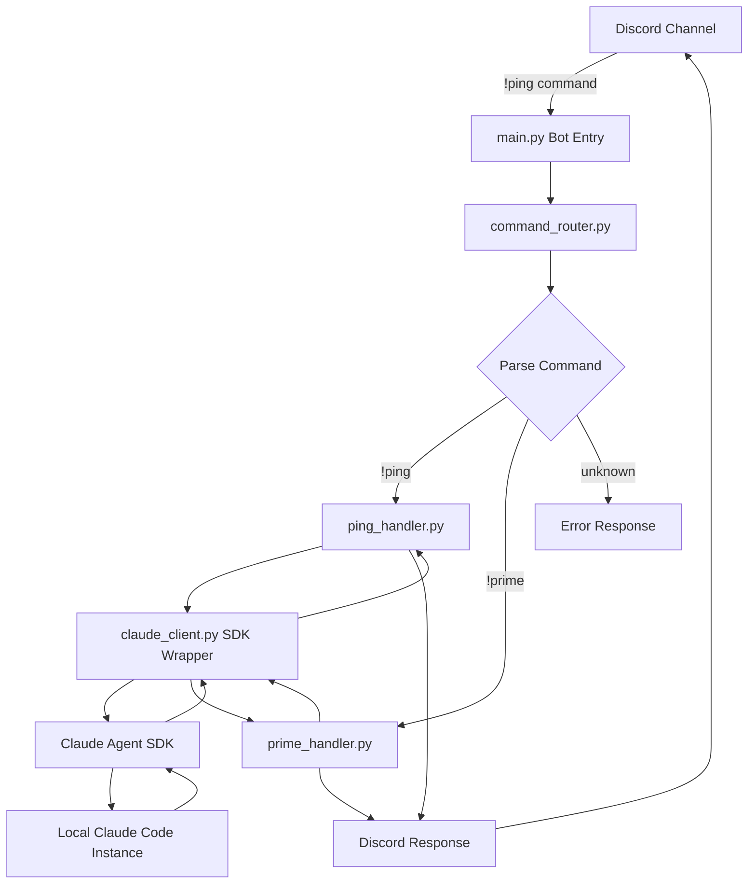
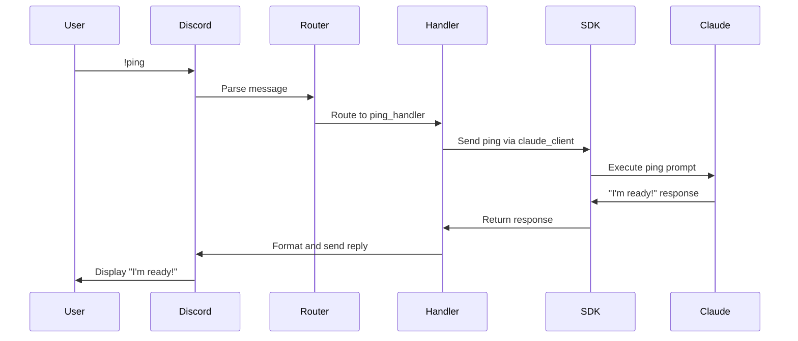

# Vision

Create a Discord-based command interface for Claude Code that enables asynchronous interaction with AI coding agents running locally. This system will allow developers to send commands through a private Discord channel and receive responses from the AI coder, eliminating the need to actively monitor long-running coding tasks.

## Objectives

- Enable remote command execution for Claude Code through Discord messaging
- Implement a bidirectional communication system between Discord and local Claude Code instance
- Create an agnostic architecture that can support multiple AI coding systems in the future
- Start with a minimal viable product (ping command) and expand incrementally
- Leverage the Claude Agent SDK for programmatic interaction with Claude Code
- Reuse existing Discord modules for two-way communication

## Success Metrics

- Successfully execute !ping command from Discord and receive response from Claude Code
- Establish reliable bidirectional communication channel
- Maintain modular architecture that supports easy addition of new commands
- Zero blocking time waiting for AI coder responses - developer can work asynchronously

# Tasks

## Phase 1: Foundation and MVP

=4 Task 1.0: Project scaffolding and initial setup
* =4 1.1: Create discord_claude_coder/ project directory structure
* =4 1.2: Set up main.py as entry point for Discord bot
* =4 1.3: Create config.yaml for tokens, model info, and configuration
* =4 1.4: Initialize logs/ directory with bot.log file
* =4 1.5: Create README.md with project overview

=4 Task 2.0: Copy reference materials into resources/
* =4 2.1: Add reusable Discord bot code to resources/discord_template.py
* =4 2.2: Add Claude SDK documentation to resources/claude_sdk_docs.md
* =4 2.3: Document resource files in README

=4 Task 3.0: Implement core routing infrastructure
* =4 3.1: Create core/command_router.py to dispatch commands to handlers
* =4 3.2: Implement command parsing logic (detect ! prefix and route accordingly)
* =4 3.3: Add error handling for unknown commands
* =4 3.4: Add logging for all command routing activity

=4 Task 4.0: Build Claude SDK wrapper
* =4 4.1: Create sdk/claude_client.py wrapper for Claude Agent SDK calls
* =4 4.2: Implement connection management to local Claude Code instance
* =4 4.3: Add error handling and retry logic
* =4 4.4: Add SDK response parsing and formatting

=4 Task 5.0: Implement !ping command handler (MVP)
* =4 5.1: Create handlers/ping_handler.py
* =4 5.2: Implement ping logic that calls claude_client.py
* =4 5.3: Send "ping" prompt to Claude using SDK
* =4 5.4: Return response to Discord channel
* =4 5.5: Test end-to-end !ping flow

## Phase 2: Advanced Command Support

=4 Task 6.0: Implement !prime command handler
* =4 6.1: Create handlers/prime_handler.py
* =4 6.2: Implement code introspection logic to scan AI-Docs directory
* =4 6.3: Generate codebase summary for Claude Code
* =4 6.4: Send priming context to Claude agent
* =4 6.5: Return confirmation message to Discord

=4 Task 7.0: Add command extensibility framework
* =4 7.1: Create handler registration system in command_router.py
* =4 7.2: Implement dynamic handler loading from handlers/ directory
* =4 7.3: Add command help system listing available commands
* =4 7.4: Document how to add new command handlers

## Phase 3: Polish and Documentation

=4 Task 8.0: Implement comprehensive logging
* =4 8.1: Add structured logging with appropriate log levels
* =4 8.2: Implement request/response logging for all commands
* =4 8.3: Add error tracking and debugging information

=4 Task 9.0: Create user documentation
* =4 9.1: Document Discord setup and bot configuration
* =4 9.2: Document available commands and usage
* =4 9.3: Create troubleshooting guide
* =4 9.4: Add examples of command flows

# Development Conventions

## Code Quality

1. Use type hints for all function parameters and return values
2. Write clear docstrings for all functions, classes, and modules following Google or NumPy style
3. Follow PEP 8 style guidelines for Python code
4. Implement appropriate validation for configuration and command inputs
5. Keep functions small and focused (single responsibility principle)

## Architecture Principles

1. **DRY (Don't Repeat Yourself)**: Each command handler is standalone and self-contained
2. **Orthogonality**: Handlers are independent - changes to one don't affect others
3. **Modularity**: Add new commands with minimal friction by dropping in new handlers
4. **Decoupling**: Claude SDK wrapper in sdk/ is completely decoupled from command logic

## Logging and Error Handling

1. Use Python's logging module with structured logging
2. Implement log levels: DEBUG for development, INFO for command execution, WARNING for recoverable issues, ERROR for failures
3. Design clear, informative error messages for Discord users
4. Log all SDK interactions for debugging and monitoring
5. Never expose sensitive information (tokens, credentials) in logs

## Discord Integration

1. Reuse two-way communication patterns from resources/discord_template.py
2. Support async replies for long-running commands
3. Implement proper Discord bot lifecycle management (startup, shutdown, reconnection)
4. Handle rate limiting and API errors gracefully

## Package Management

1. Use uv for Python package management
2. Maintain requirements.txt with pinned versions
3. Document all dependencies and their purpose in README
4. Keep dependencies minimal - only add what's necessary

## Configuration

1. Store all configuration in config.yaml (tokens, channels, model settings)
2. Never commit secrets to version control
3. Provide config.yaml.example as template
4. Support environment variable overrides for sensitive values

## Testing (Future)

1. Write unit tests for core functionality (command_router, handlers)
2. Mock Discord and Claude SDK interactions in tests
3. Aim for high test coverage of business logic
4. Include both positive and negative test cases

## Environment Setup

For Python environments with uv:
- Mac/Linux: `source .venv/bin/activate`
- Windows: `.venv\scripts\activate`

# System Architecture



# Command Flow: !ping Example



# Project Structure

```
discord_claude_coder/
├── main.py                      # Entry point for Discord bot
├── config.yaml                  # Configuration: tokens, channels, model info
├── config.yaml.example          # Template for configuration
├── handlers/
│   ├── ping_handler.py          # Handles !ping command (MVP)
│   └── prime_handler.py         # Handles !prime command (Phase 2)
├── sdk/
│   └── claude_client.py         # Wrapper for Claude Agent SDK calls
├── core/
│   └── command_router.py        # Dispatches commands to appropriate handlers
├── resources/
│   ├── discord_template.py      # Reference: 2-way Discord communication
│   └── claude_sdk_docs.md       # Claude SDK usage examples and docs
├── logs/
│   └── bot.log                  # Runtime logs
├── requirements.txt             # Python dependencies
└── README.md                    # Project documentation
```

# Next Steps

1. Review this specification and confirm alignment with vision
2. Set up resources/ directory with Discord template and Claude SDK documentation
3. Begin implementation with Task 1.0 (project scaffolding)
4. Test !ping command end-to-end as proof of concept
5. Iterate and expand to !prime and additional commands
