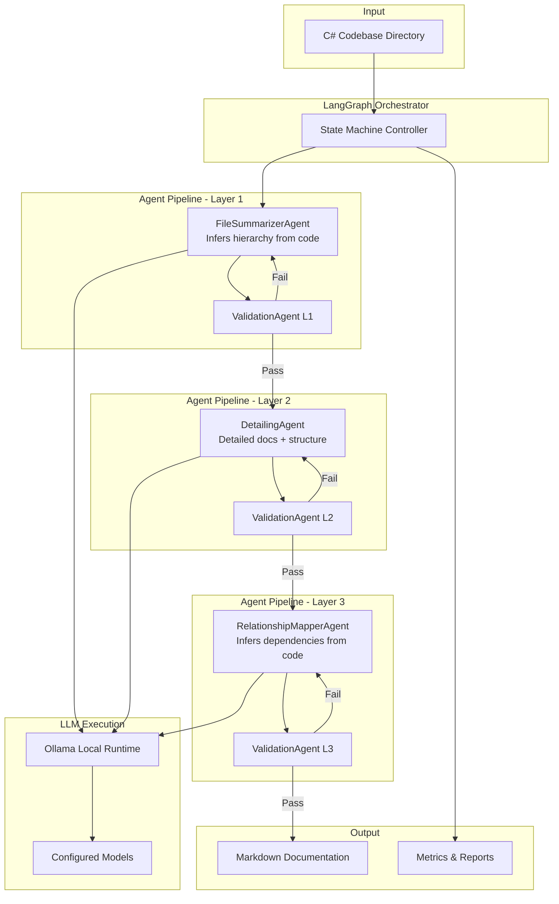
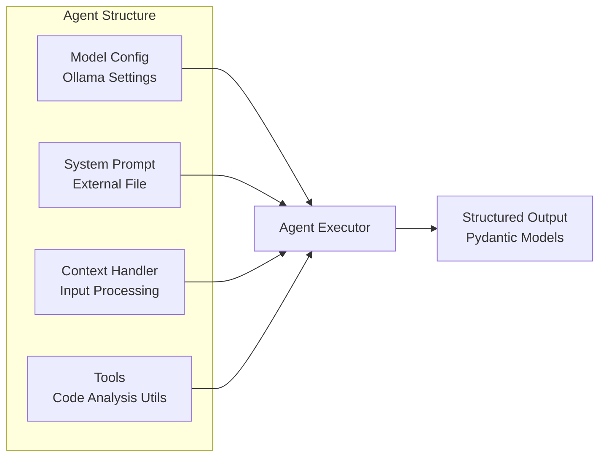
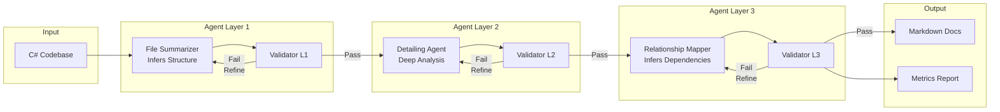
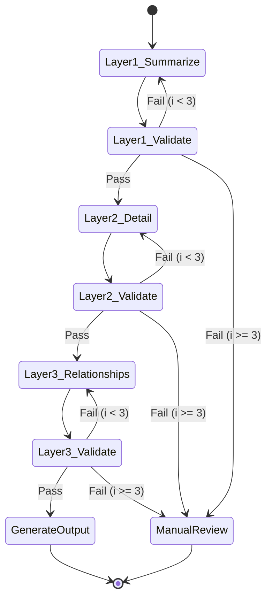

# C# Legacy Codebase Documentation System - Technical Specifications

# Vision

Build a multi-agent AI system that automatically generates comprehensive, multi-layered documentation for large legacy C# codebases using local LLMs. The system will employ a hierarchical documentation approach, processing code incrementally through specialized agents orchestrated by LangGraph, with built-in validation and refinement loops to ensure high-quality output while maintaining data privacy through local execution.

## Objectives

- Create an automated documentation pipeline that works with codebases of any size by processing files incrementally
- Use LLM agents to directly analyze code and infer hierarchy, relationships, and structure without external AST parsers
- Generate three layers of documentation: high-level summaries, detailed function/class documentation, and cross-file relationship mapping
- Ensure documentation quality through automated validation using Pydantic schemas with refinement loops
- Support local LLM execution via Ollama to maintain code privacy and security
- Build a modular, extensible agent architecture using LangGraph for state machine orchestration
- Enable incremental documentation updates as code changes without full regeneration

## Success Metrics

- **Coverage**: 95%+ of C# files documented with Layer 1 summaries, 90%+ with Layer 2 details
- **Quality**: 85%+ validation pass rate on first attempt, <5% requiring manual correction
- **Performance**: Process 100+ files per hour on standard hardware (8-core, 16GB RAM)
- **Reliability**: 99%+ successful pipeline completion rate
- **User Satisfaction**: 50% reduction in developer onboarding time, 80%+ satisfaction score

---

# System Architecture

## High-Level Architecture



## Agent Architecture

Each agent follows the "Four Pillars" pattern:



---

# Tasks

## Phase 1: Project Setup and Infrastructure

✅ Task 1.0: Initialize project structure and dependencies
* ✅ 1.1: Create project directory structure (src/, tests/, docs/, config/)
* ✅ 1.2: Initialize Python UV project with pyproject.toml
* ✅ 1.3: Add core dependencies (langgraph, pydantic, ollama-python)
* ✅ 1.4: Set up .gitignore for Python/UV projects
* ✅ 1.5: Create README.md with project overview and setup instructions

✅ Task 2.0: Configure development environment
* ✅ 2.1: Create environment setup script for Python UV activation
* ✅ 2.2: Configure Ollama installation verification script
* ✅ 2.3: Create configuration template files (config.yaml, prompts/)
* ✅ 2.4: Set up logging configuration with structured output
* ✅ 2.5: Create development vs production configuration profiles

## Phase 2: LangGraph Orchestrator

🚧 Task 3.0: Design LangGraph state machine
* ✅ 3.1: Define state schema using Pydantic (FileState, LayerState, ValidationState)
* ✅ 3.2: Create state transition graph: L1 -> Validate -> L2 -> Validate -> L3 -> Output
* ✅ 3.3: Implement conditional edges for validation pass/fail routing
* ✅ 3.4: Add iteration counter to prevent infinite refinement loops (max N=3)
* ⭕ 3.5: Create state persistence for resume capability

✅ Task 4.0: Implement orchestrator controller
* ✅ 4.1: Create DocuGenOrchestrator class wrapping LangGraph
* ✅ 4.2: Implement methods: process_file(), process_directory() (simplified - resume/status not needed)
* ✅ 4.3: Add progress tracking with file-level granularity (via loguru logger)
* ⭕ 4.4: Implement parallel processing for independent files (future enhancement)
* ✅ 4.5: Create metrics collection (total, completed, flagged, errors)

## Phase 3: Agent Implementation - Layer 1 (File Summarizer)

✅ Task 5.0: Implement FileSummarizerAgent base structure
* ✅ 5.1: Create agents/file_summarizer_agent.py with four pillars structure
* ✅ 5.2: Define agent interface (invoke method, input/output Pydantic models)
* ✅ 5.3: Implement Ollama model initialization with error handling
* ✅ 5.4: Load external system prompt from prompts/file_summarizer.md
* ✅ 5.5: Create FileSummary Pydantic model (summary, key_classes, purpose, category)

✅ Task 6.0: Implement FileSummarizerAgent logic
* ✅ 6.1: Create context preparation method (file content + metadata)
* ✅ 6.2: Implement prompt construction with file metadata
* ✅ 6.3: Add LLM invocation with error handling (Ollama structured output)
* ✅ 6.4: Parse and validate LLM output into structured format (Pydantic)
* ✅ 6.5: Implement fallback for unparseable responses (error_message in state)

🚧 Task 7.0: Create FileSummarizerAgent prompts and tools
* ✅ 7.1: Write comprehensive system prompt for file summarization
* ✅ 7.2: Define prompt template with placeholders (filename, code, path)
* ⭕ 7.3: Create code analysis utility tools (N/A - LLM analyzes directly)
* ⭕ 7.4: Implement token counting to ensure context window limits
* ✅ 7.5: Add prompt optimization for smaller models (concise instructions)

## Phase 5: Agent Implementation - Layer 2 (Detailing Agent)

✅ Task 8.0: Implement DetailingAgent base structure
* ✅ 8.1: Create agents/detailing_agent.py with four pillars structure
* ✅ 8.2: Define DetailingAgent input (FileState with file content + Layer 1 summary)
* ✅ 8.3: Define DetailedDocs output (classes, methods with MethodDoc/ClassDoc models)
* ✅ 8.4: Implement model initialization and prompt loading
* ✅ 8.5: Create unit tests for agent structure and validation (21 tests)

🚧 Task 9.0: Implement DetailingAgent logic
* ✅ 9.1: Create method to process methods via LLM (invoke method)
* ✅ 9.2: Implement docstring generation with parameters and returns (Pydantic models)
* ✅ 9.3: Add class-level documentation with descriptions (ClassDoc model)
* ✅ 9.4: Integrate Layer 1 summary as context for consistency (_prepare_context)
* ⭕ 9.5: Handle large files by chunking into processable sections

🚧 Task 10.0: Create DetailingAgent prompts and tools
* ✅ 10.1: Write comprehensive system prompt for detailed documentation
* ✅ 10.2: Create prompt template with Layer 1 context and code formatting
* ⭕ 10.3: Implement tools (N/A - LLM analyzes directly without external tools)
* ✅ 10.4: Add examples to prompts (C# XML, JavaDoc, Python examples included)
* ✅ 10.5: Optimize prompts for technical accuracy and completeness

## Phase 6: Agent Implementation - Layer 3 (Relationship Mapper)

✅ Task 11.0: Implement RelationshipMapperAgent base structure
* ✅ 11.1: Create agents/relationship_mapper_agent.py with four pillars
* ✅ 11.2: Define input (FileState with file + L1/L2 docs from previous layers)
* ✅ 11.3: Define RelationshipMap output (dependencies, dependents, architectural_role)
* ✅ 11.4: Implement model initialization and prompt loading
* ✅ 11.5: Create comprehensive unit tests (25 tests passing)

🚧 Task 12.0: Implement RelationshipMapperAgent logic
* ✅ 12.1: Create method to infer dependencies via LLM (invoke method)
* ✅ 12.2: Implement cross-file reference documentation (dependencies/dependents)
* ⭕ 12.3: Add data flow analysis as separate field (simplified in current version)
* ✅ 12.4: Generate architectural relationship descriptions (architectural_role)
* ✅ 12.5: Link to related files via dependents array

🚧 Task 13.0: Create RelationshipMapperAgent prompts and tools
* ✅ 13.1: Write comprehensive system prompt for relationship documentation
* ✅ 13.2: Create prompt template with Layer 1/2 context integration
* ⭕ 13.3: Implement tools (N/A - LLM infers relationships directly from code)
* ✅ 13.4: Add architectural pattern recognition (Repository, Service, etc.)
* ✅ 13.5: Optimize for identifying integration points and relationship types

## Phase 7: Validation System

✅ Task 14.0: Implement hybrid LLM-driven validation system
* ✅ 14.1: ValidationResult model with passed/issues/refinement_instructions fields
* ✅ 14.2: Create validation_layer1.md prompt for FileSummary quality evaluation
* ✅ 14.3: Create validation_layer2.md prompt for DetailedDocs quality evaluation
* ✅ 14.4: Create validation_layer3.md prompt for RelationshipMap quality evaluation
* ✅ 14.5: Add validation_model configuration option (defaults to detailing_model)

✅ Task 15.0: Implement ValidationAgent with hybrid approach
* ✅ 15.1: Create agents/validation_agent.py with two-phase validation structure
* ✅ 15.2: Implement Phase 1 programmatic pre-checks for structure/required fields
* ✅ 15.3: Implement Phase 2 LLM semantic validation via Ollama
* ✅ 15.4: Load external validation prompts for each layer
* ✅ 15.5: Return ValidationResult with specific refinement instructions from LLM

✅ Task 16.0: Implement refinement loop logic
* ✅ 16.1: Refinement logic in orchestrator via _should_retry_layer1/2/3 methods
* ✅ 16.2: Pass validation feedback and previous layer context to agents
* ✅ 16.3: Iteration counters tracked in FileState (layer1/2/3_iterations)
* ✅ 16.4: Validation failures logged at WARNING level via loguru
* ✅ 16.5: Max iterations handled by setting flagged_for_review flag

## Phase 8: Output Generation

✅ Task 17.0: Implement LLM-driven documentation generation
* ✅ 17.1: Create writers/json_writer.py to save layer outputs as JSON
* ✅ 17.2: Implement save_layer_outputs() for layer1/2/3 JSON files
* ✅ 17.3: Create DocumentationAgent (Layer 4) to synthesize JSON into markdown
* ✅ 17.4: Add comprehensive system prompt for documentation generation
* ✅ 17.5: Integrate DocumentationAgent into CLI pipeline

✅ Task 18.0: Implement output file management
* ✅ 18.1: Create output directory structure (docs_output/)
* ✅ 18.2: Save layer1_summaries.json, layer2_details.json, layer3_relationships.json
* ✅ 18.3: Generate DOCUMENTATION.md via LLM synthesis
* ✅ 18.4: Implement atomic write operations for JSON and markdown
* ⭕ 18.5: Create index file linking all documentation (future enhancement)

🚧 Task 19.0: Implement metrics and reporting
* ✅ 19.1: Collect pipeline metrics (total, completed, flagged, errors)
* ✅ 19.2: Display coverage metrics in CLI (files documented, success rate)
* ✅ 19.3: Track quality metrics (validation pass rates, flagged files)
* ⭕ 19.4: Generate performance metrics (processing time, throughput)
* ⭕ 19.5: Export metrics report in JSON and markdown formats

## Phase 9: CLI and User Interface

✅ Task 20.0: Implement command-line interface
* ✅ 20.1: Create cli/main.py using Click framework
* ✅ 20.2: Implement test commands: layer1, layer2, layer3 for isolated agent testing
* ✅ 20.3: Add options: --config, --input, --output, --limit, --verbose
* ✅ 20.4: Implement rich output display with tables and trees
* ✅ 20.5: Add verbose logging option for debugging

⭕ Task 21.0: Implement status monitoring
* ⭕ 21.1: Create StatusMonitor class for real-time progress tracking
* ⭕ 21.2: Implement file-level progress display (current file, layer, status)
* ⭕ 21.3: Add estimated time remaining calculation
* ⭕ 21.4: Display validation statistics in real-time
* ⭕ 21.5: Implement graceful Ctrl+C handling with state save

⭕ Task 22.0: Implement error handling and user feedback
* ⭕ 22.1: Create centralized exception handling with user-friendly messages
* ⭕ 22.2: Implement actionable error messages with remediation steps
* ⭕ 22.3: Add warnings for common issues (Ollama not running, config errors)
* ⭕ 22.4: Create error log with detailed technical info for debugging
* ⭕ 22.5: Implement dry-run mode for validation without generation

## Phase 10: Incremental Update System

⭕ Task 23.0: Implement change detection
* ⭕ 23.1: Create ChangeDetector class using file modification timestamps
* ⭕ 23.2: Implement method to compare current files vs last run metadata
* ⭕ 23.3: Add support for git integration (detect changed files via git diff)
* ⭕ 23.4: Store last run metadata in .docgen/metadata.json
* ⭕ 23.5: Create inclusion/exclusion filters for manual override

⭕ Task 24.0: Implement incremental documentation update
* ⭕ 24.1: Modify orchestrator to process only changed files
* ⭕ 24.2: Implement dependency cascade (update dependent file docs if references changed)
* ⭕ 24.3: Add merge logic for partial regeneration
* ⭕ 24.4: Update index and navigation links after incremental run
* ⭕ 24.5: Validate consistency between updated and existing docs

## Phase 11: Testing and Quality Assurance

⭕ Task 25.0: Implement unit tests for core components
* ⭕ 25.1: Create tests for each agent with mocked LLM responses
* ⭕ 25.2: Create tests for validation system with pass/fail cases
* ⭕ 25.3: Create tests for orchestrator with various state transitions
* ⭕ 25.4: Create tests for configuration management
* ⭕ 25.5: Achieve 80%+ test coverage on business logic

⭕ Task 26.0: Implement integration tests
* ⭕ 26.1: Create test fixtures with small C# codebase (10-20 files)
* ⭕ 26.2: Implement end-to-end pipeline test with assertions
* ⭕ 26.3: Test validation and refinement loop scenarios
* ⭕ 26.4: Test incremental update functionality
* ⭕ 26.5: Test resume capability after interruption

⭕ Task 27.0: Implement performance testing
* ⭕ 27.1: Create benchmark suite with varying codebase sizes
* ⭕ 27.2: Measure throughput (files per hour) on standard hardware
* ⭕ 27.3: Profile memory usage and identify bottlenecks
* ⭕ 27.4: Test scalability up to 5000+ file codebases
* ⭕ 27.5: Optimize based on profiling results

## Phase 12: Documentation and Deployment

⭕ Task 28.0: Create user documentation
* ⭕ 28.1: Write comprehensive README with quickstart guide
* ⭕ 28.2: Create installation guide (Python UV, Ollama, dependencies)
* ⭕ 28.3: Write usage guide with examples for all CLI commands
* ⭕ 28.4: Document configuration options with examples
* ⭕ 28.5: Create troubleshooting guide for common issues

⭕ Task 29.0: Create developer documentation
* ⭕ 29.1: Document architecture with updated Mermaid diagrams
* ⭕ 29.2: Create agent development guide for customization
* ⭕ 29.3: Write prompt engineering guide for tuning output
* ⭕ 29.4: Document extending the system (new agents, validators)
* ⭕ 29.5: Create API reference documentation

⭕ Task 30.0: Prepare deployment artifacts
* ⭕ 30.1: Create Docker container for easy deployment
* ⭕ 30.2: Write deployment guide for different environments
* ⭕ 30.3: Create systemd service file for background execution
* ⭕ 30.4: Package for PyPI distribution (optional)
* ⭕ 30.5: Create example configurations for different use cases

---

# Development Conventions

## Code Quality Standards

### Python Code Style
1. Follow PEP 8 style guide strictly (use black formatter)
2. Use type hints for all function parameters and return values
3. Write comprehensive docstrings using Google style
4. Maximum function complexity: 10 (radon cc)
5. Maximum line length: 100 characters

### Documentation Requirements
1. All classes must have docstrings with purpose and usage examples
2. All public methods must document parameters, returns, and exceptions
3. Complex algorithms must include inline comments explaining logic
4. Use typing module for complex type hints (List, Dict, Optional, Union)

### Validation and Error Handling
1. Use Pydantic models for all structured data (input/output validation)
2. Implement custom exceptions for different error categories
3. Always provide context in error messages (what failed, why, how to fix)
4. Log exceptions with full stack traces at ERROR level
5. Never silently catch exceptions without logging

## Logging and Monitoring

### Logging Configuration
1. Use Python logging module with structured formatters
2. Log levels: DEBUG (development), INFO (progress), WARNING (issues), ERROR (failures)
3. Include context in all log messages (file name, agent name, task)
4. Rotate log files daily, keep 7 days of history
5. Separate logs: application.log, error.log, metrics.log

### Progress Reporting
1. Use rich library for terminal progress bars and status updates
2. Update progress at file-level granularity
3. Display current layer, file name, and estimated time remaining
4. Show validation pass/fail status in real-time
5. Provide summary statistics at completion

## Package and Dependency Management

### Python UV Usage
1. Initialize project with `uv init`
2. Add dependencies with `uv add <package>`
3. Pin all dependencies in pyproject.toml with version constraints
4. Document the purpose of each dependency in comments
5. Activate environment: `source .venv/bin/activate` (Mac/Linux)

### Dependency Organization
1. Group dependencies: core, agents, validation, output, testing
2. Use optional dependency groups for different use cases
3. Specify minimum Python version: 3.11+
4. Include dev dependencies separately (pytest, black, mypy)

## Agent Development Pattern

### Four Pillars Structure
Every agent must implement:

```python
class BaseAgent:
    def __init__(self, config: AgentConfig):
        self.model = self._init_model(config.model_config)  # Pillar 1: Model
        self.prompt = self._load_prompt(config.prompt_path)  # Pillar 2: Prompt
        self.context = None  # Pillar 3: Context (set per invocation)
        self.tools = self._init_tools(config.tools)  # Pillar 4: Tools

    def invoke(self, input_data: InputModel) -> OutputModel:
        """Execute agent with input, return validated output"""
        pass
```

### Agent Implementation Guidelines
1. Each agent is a single Python file in agents/ directory
2. Agents must be stateless (no instance variables beyond pillars)
3. All inputs/outputs use Pydantic models for validation
4. Prompts are external files in prompts/ directory
5. Agents must handle LLM failures gracefully with retries

## LangGraph State Management

### State Schema Definition
1. Define all states using Pydantic models with validation
2. Include metadata in state (timestamps, iteration count, validation status)
3. Keep state immutable where possible (functional updates)
4. Persist state to disk for resume capability
5. Include clear state transition logic

### State Transitions
1. Use conditional edges for validation pass/fail routing
2. Implement iteration counters to prevent infinite loops
3. Log all state transitions at INFO level
4. Include rollback capability for failed transitions
5. Validate state consistency before transitions

## Testing Requirements

### Unit Testing
1. Use pytest as testing framework
2. Aim for 80%+ code coverage on business logic
3. Mock external dependencies (Ollama, file system)
4. Test both happy path and error scenarios
5. Use parametrized tests for multiple input cases

### Test Organization
```
tests/
├── unit/
│   ├── test_agents.py
│   ├── test_orchestrator.py
│   └── test_validation.py
├── integration/
│   ├── test_pipeline.py
│   └── test_incremental.py
└── fixtures/
    └── sample_csharp_files/
```

### Test Fixtures
1. Create realistic C# code samples for testing
2. Include edge cases (empty files, large files, malformed code)
3. Store expected outputs for comparison
4. Use pytest fixtures for reusable test data

## Configuration Management

### Configuration File Structure
```yaml
# config.yaml
models:
  default: "codellama:13b"
  summarizer: "codellama:7b"
  detailing: "codellama:13b"

validation:
  max_iterations: 3
  min_summary_length: 50
  require_all_public_methods: true

output:
  base_path: "./docs_output"
  format: "markdown"
  include_metadata: true

processing:
  parallel_files: 4
  enable_incremental: true
```

### Configuration Validation
1. Validate configuration on startup with clear error messages
2. Support environment variable overrides (e.g., DOCGEN_MODEL)
3. Provide sensible defaults for all optional settings
4. Document all configuration options in config.example.yaml

## Performance Optimization

### Optimization Guidelines
1. Process independent files in parallel (use ProcessPoolExecutor)
2. Implement caching for repeated analyses (dependency trees)
3. Optimize prompts for token efficiency (reduce verbose instructions)
4. Use streaming for large file processing
5. Profile performance regularly and address bottlenecks

### Resource Management
1. Monitor memory usage and implement cleanup for large codebases
2. Implement token counting to avoid exceeding context windows
3. Add backpressure mechanisms for parallel processing
4. Implement graceful degradation when resources are constrained

## Security and Privacy

### Data Handling
1. All processing must occur locally (no external API calls)
2. Do not log sensitive code snippets at INFO level
3. Sanitize file paths in logs to prevent information leakage
4. Support air-gapped deployment (no internet connectivity required)
5. Document data flow in privacy policy

### Secure Defaults
1. Output directory should have restricted permissions (750)
2. Configuration files should not contain hardcoded credentials
3. Log files should be stored in user-specific directories
4. Implement secure temporary file handling

---

# Environment Setup

## Prerequisites
- Python 3.11 or higher
- Ollama installed and running locally
- Git (for incremental update integration)
- 8GB+ RAM recommended
- 8-core CPU recommended for parallel processing

## Installation Steps

```bash
# 1. Clone repository
git clone <repository-url>
cd csharp-doc-generator

# 2. Initialize Python UV environment
uv init
uv venv

# 3. Activate virtual environment
source .venv/bin/activate  # Mac/Linux
.venv\Scripts\activate     # Windows

# 4. Install dependencies
uv add langgraph pydantic ollama rich click pytest

# 5. Verify Ollama is running
ollama list

# 6. Pull required models
ollama pull codellama:7b
ollama pull codellama:13b

# 7. Create configuration
cp config.example.yaml config.yaml
# Edit config.yaml with your settings

# 8. Run tests
pytest tests/

# 9. Run on sample codebase
python -m cli.main document --config config.yaml --input /path/to/csharp/code
```

## Environment Activation (Quick Reference)
- **Mac/Linux**: `source .venv/bin/activate`
- **Windows**: `.venv\Scripts\activate`

---

# Mermaid Diagrams

## Data Flow Diagram



## Agent State Machine



---

# Implementation Notes

## Critical Path
The critical path for MVP delivery focuses on core pipeline functionality:
1. Phase 2 (LangGraph Orchestrator) - Required for agent coordination
2. Phase 3-5 (Agent Implementation) - Core documentation generation using LLM inference
3. Phase 7 (Validation System) - Quality assurance
4. Phase 8-9 (Output & CLI) - User-facing functionality

## Phase Dependencies
- Phase 3-5 (Agents) require Phase 2 (Orchestrator) completion
- Phase 7 (Validation) should be implemented in parallel with Phase 3-5
- Phase 10 (Incremental Updates) requires Phase 1-9 completion
- Phase 11 (Testing) runs continuously throughout development
- Phase 12 (Documentation) runs in parallel with development

## Risk Mitigation
- **LLM Quality**: Benchmark multiple Ollama models; implement A/B testing for prompts
- **LLM Inference Accuracy**: Agents infer structure directly from code - validate outputs carefully
- **Performance**: Implement parallelization early; profile continuously
- **Validation Rules**: Start lenient, tighten based on real results; make fully configurable

## Future Enhancements
- Support for other languages (Java, Python, JavaScript)
- IDE integration (VS Code extension)
- Real-time documentation during development
- Documentation diff viewer for changes
- Unit test generation alongside documentation
- Interactive documentation web interface
