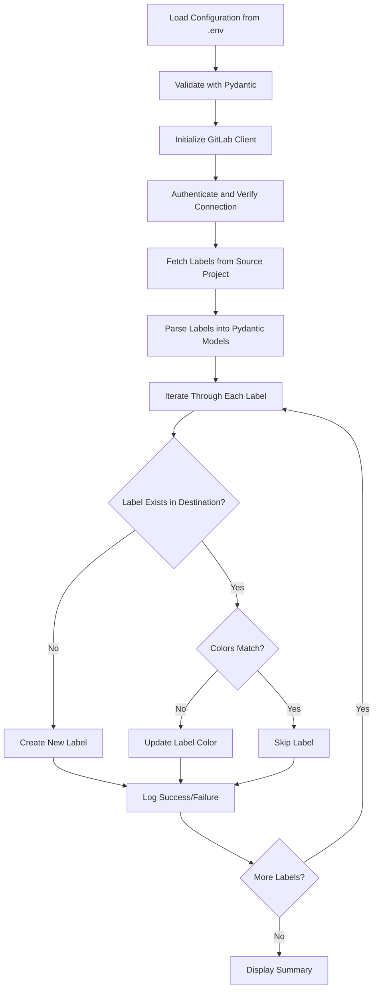

# Vision

Create a minimalistic, single-file Python utility for seamless migration of GitLab labels from one repository to another. The tool should be straightforward, require minimal setup, and provide a reliable way to replicate label configurations (names and colors) across GitLab projects using project IDs.

## Objectives

- Build a single-file Python script using `python-gitlab` library for GitLab API interactions
- Use Pydantic for configuration data validation and structure
- Store source and destination project IDs in a `.env` file for easy configuration
- Fetch all labels (names and colors) from a source GitLab project
- Replicate those labels to a destination GitLab project
- Use `uv` for Python package management and dependency handling
- Keep the solution minimal, simple, and focused on the core utility function

## Success Metrics

- Successfully authenticates with GitLab API using personal access token
- Accurately fetches all labels from source project without data loss
- Successfully creates or updates labels in destination project with correct names and colors
- Script executes without errors in a clean environment using `uv`
- Single-file implementation remains under 700 lines of code
- Configuration is easily modifiable through `.env` file

# Tasks

=4 Task 1.0: Project Setup and Configuration
* =4 1.1: Initialize Python project structure with `uv`
* =4 1.2: Create `.env.example` file with required configuration fields (GITLAB_TOKEN, SOURCE_PROJECT_ID, DESTINATION_PROJECT_ID)
* =4 1.3: Add `python-gitlab` and `pydantic` dependencies to project
* =4 1.4: Add `python-dotenv` for environment variable loading

=4 Task 2.0: Define Pydantic Configuration Model
* =4 2.1: Create Pydantic model for label data (name, color, description)
* =4 2.2: Create Pydantic model for configuration (source_project_id, destination_project_id, gitlab_token, gitlab_url)
* =4 2.3: Add validation rules for project IDs and token format
* =4 2.4: Implement configuration loading from environment variables

=4 Task 3.0: Implement GitLab Client Authentication
* =4 3.1: Initialize `python-gitlab` client with token and URL from configuration
* =4 3.2: Implement connection validation to verify authentication
* =4 3.3: Add error handling for authentication failures
* =4 3.4: Implement loguru logging for authentication status

=4 Task 4.0: Fetch Labels from Source Project
* =4 4.1: Retrieve project object using source project ID
* =4 4.2: Fetch all labels from source project
* =4 4.3: Parse label attributes (name, color, description) into Pydantic models
* =4 4.4: Log the number of labels fetched and their basic information
* =4 4.5: Handle cases where source project has no labels

=4 Task 5.0: Replicate Labels to Destination Project
* =4 5.1: Retrieve destination project object using project ID
* =4 5.2: Check if label already exists in destination project
* =4 5.3: Create new label if it doesn't exist
* =4 5.4: Update existing label if name matches but color differs
* =4 5.5: Log success/failure for each label operation
* =4 5.6: Implement error handling for API rate limits and failures

=4 Task 6.0: Main Script Logic and Execution Flow
* =4 6.1: Implement main function to orchestrate the migration process
* =4 6.2: Add CLI argument parsing for optional overrides (if needed)
* =4 6.3: Implement graceful error handling and cleanup
* =4 6.4: Add summary logging (total labels processed, successes, failures)
* =4 6.5: Ensure script can be executed with `uv run python script.py`

=4 Task 7.0: Testing and Validation
* =4 7.1: Create pytest test suite for Pydantic models
* =4 7.2: Create unit tests for label fetching logic
* =4 7.3: Create unit tests for label creation/update logic
* =4 7.4: Add integration test with mock GitLab API responses
* =4 7.5: Test edge cases (empty labels, duplicate labels, missing permissions)
* =4 7.6: Ensure test coverage meets quality standards

=4 Task 8.0: Documentation and Usage Instructions
* =4 8.1: Create README with setup instructions
* =4 8.2: Document `.env` configuration requirements
* =4 8.3: Add usage examples with sample project IDs
* =4 8.4: Document required GitLab permissions for the access token
* =4 8.5: Add troubleshooting section for common errors

# Development Conventions

## Code Quality

1. Use type hints for all function parameters and return values
2. Write clear docstrings following Google or NumPy docstring format
3. Follow PEP 8 style guidelines for Python code
4. Use Pydantic for all data validation and configuration management
5. Keep the main script under 700 lines of code
6. Use meaningful variable and function names that reflect their purpose

## Logging

1. Use `loguru` for all logging operations
2. Implement structured logging with appropriate log levels:
   - DEBUG: Detailed diagnostic information
   - INFO: Confirmation of expected operations (labels fetched, created)
   - WARNING: Unexpected situations that don't prevent operation
   - ERROR: Errors that prevent specific operations
3. Log all API interactions for debugging purposes
4. Include context in log messages (project IDs, label names, etc.)

## Package Management

1. Use `uv` for Python package management and dependency handling
2. Maintain dependencies in `pyproject.toml`
3. Use `uv sync` to install dependencies
4. Run the script with `uv run python <script_name>.py`

## Testing

1. Use `pytest` as the testing framework
2. Create tests in a `tests/` subdirectory
3. Aim for high test coverage of business logic (>80%)
4. Include both positive and negative test cases
5. Mock external API calls to GitLab in unit tests
6. Test edge cases: empty repositories, duplicate labels, API failures

## Error Handling

1. Use try-except blocks for all external API calls
2. Provide clear, actionable error messages to users
3. Log stack traces for debugging while showing user-friendly messages
4. Handle specific exceptions (network errors, authentication failures, API rate limits)
5. Implement graceful degradation where possible

## Configuration Management

1. Store sensitive data (tokens) in `.env` file
2. Never commit `.env` file to version control
3. Provide `.env.example` with placeholder values
4. Validate all configuration values on startup using Pydantic
5. Support optional GitLab URL override for self-hosted instances

## Code Structure


```mermaid
graph TD
    A[Load Configuration from .env] --> B[Validate with Pydantic]
    B --> C[Initialize GitLab Client]
    C --> D[Authenticate and Verify Connection]
    D --> E[Fetch Labels from Source Project]
    E --> F[Parse Labels into Pydantic Models]
    F --> G[Iterate Through Each Label]
    G --> H{Label Exists in Destination?}
    H -->|No| I[Create New Label]
    H -->|Yes| J{Colors Match?}
    J -->|No| K[Update Label Color]
    J -->|Yes| L[Skip Label]
    I --> M[Log Success/Failure]
    K --> M
    L --> M
    M --> N{More Labels?}
    N -->|Yes| G
    N -->|No| O[Display Summary]
```

## Data Models

### Configuration Model
```python
class GitLabConfig(BaseModel):
    gitlab_url: str = "https://gitlab.com"
    gitlab_token: str
    source_project_id: int
    destination_project_id: int
```

### Label Model
```python
class GitLabLabel(BaseModel):
    name: str
    color: str
    description: Optional[str] = None
```

## Environment Setup

For activation of Python environment:
- **Mac/Linux**: `source .venv/bin/activate`
- **Windows**: `.venv\scripts\activate`

For running with uv without activation:
- `uv run python gitlab_label_migration.py`

## GitLab API Considerations

1. Ensure the personal access token has sufficient permissions:
   - Read access to source project (at least Reporter role)
   - Write access to destination project (at least Developer role)
   - API scope enabled

2. Handle API rate limiting gracefully:
   - Implement exponential backoff for rate limit errors
   - Log rate limit warnings

3. Label color format:
   - GitLab uses hex color codes (e.g., `#FF0000`)
   - Validate color format before creating/updating labels

## Project Structure

```
.
├── gitlab_label_migration.py  # Single-file main script
├── .env                        # Configuration (not in git)
├── .env.example               # Example configuration
├── pyproject.toml             # Project metadata and dependencies
├── README.md                  # Documentation
└── tests/                     # Test directory
    └── test_label_migration.py
```

## Completion Criteria

The project is considered complete when:

1. All tasks marked with =4 are completed and changed to =�
2. Script successfully migrates labels between test projects
3. All tests pass with adequate coverage
4. Documentation is clear and includes usage examples
5. Error handling covers all expected failure scenarios
6. Code follows all development conventions listed above
