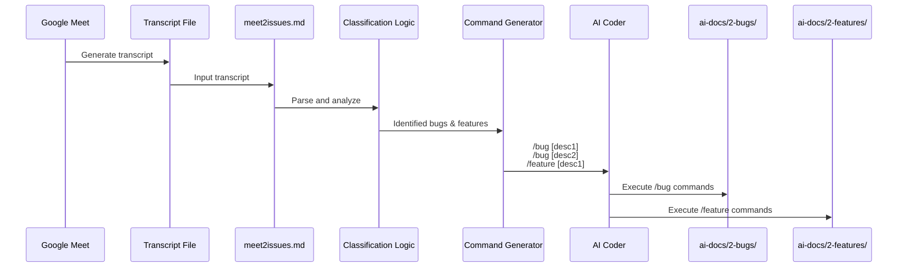

# Meet-to-Issues - Technical Specification

## Vision

Create a Higher-Order Prompt (HOP) workflow that automatically processes Google Meet transcripts from client-developer meetings, classifying conversation segments into actionable bugs and features. The system will generate individual command files for each identified item, enabling the AI coder to systematically implement all issues through a command-driven workflow.

### Objectives
- Automate the extraction and classification of bugs and features from meeting transcripts
- Generate structured command files (/bug and /feature) for each identified item
- Create a reusable Claude command that orchestrates the entire workflow
- Produce organized markdown documentation for both bugs and features in their respective directories
- Enable seamless handoff from client meetings to implementation through structured AI commands

### Success Metrics
- Successfully parse and classify Google Meet transcripts from ai-docs/0-meetings/transcript<number>.md into distinct bug and feature segments
- Generate accurate /bug and /feature commands with clear descriptions for each identified item
- Save bug markdown files to ai-docs/2-bugs/ directory with appropriate filenames
- Save feature markdown files to ai-docs/2-features/ directory with appropriate filenames
- Create functional meet2issues.md command file in .claude/commands/ directory
- Enable AI coder to execute all generated commands sequentially without manual intervention

## Tasks

=� Task 1.0: Create system prompt infrastructure for bug and feature classification
* =� 1.1: Review existing /bug command prompt structure in .claude/commands/ directory
* =� 1.2: Review existing /feature command prompt structure in .claude/commands/ directory
* =� 1.3: Document the expected input format and output format for both prompts
* =� 1.4: Identify classification criteria that distinguish bugs from features in meeting transcripts
* =� 1.5: Define conversation segment extraction strategy (context window, sentence boundaries, etc.)

=� Task 2.0: Design the meet2issues.md higher-order prompt structure
* =� 2.1: Define the prompt header with clear purpose statement
* =� 2.2: Specify input requirements (Google Meet transcript format, ai-docs/0-meetings/transcript<number>.md file path, etc.)
* =� 2.3: Design classification logic instructions for identifying bugs vs features
* =� 2.4: Create template for command generation output format (/bug [description] and /feature [description])
* =� 2.5: Define line-by-line command structure for multiple bugs and features
* =� 2.6: Specify how to handle edge cases (ambiguous items, overlapping concerns, no bugs/features found)

=� Task 3.0: Implement transcript parsing and segmentation logic
* =� 3.1: Define transcript input format specifications (plain text, timestamps, speaker labels from ai-docs/0-meetings/transcript<number>.md)
* =� 3.2: Create instructions for identifying conversation segments related to issues
* =� 3.3: Define context preservation strategy for each extracted segment
* =� 3.4: Specify filtering rules to exclude non-actionable discussion (greetings, off-topic, etc.)
* =� 3.5: Create segment validation criteria to ensure completeness

=� Task 4.0: Design bug classification and extraction workflow
* =� 4.1: Define bug identification criteria (error reports, unexpected behavior, defects, etc.)
* =� 4.2: Create bug description extraction template
* =� 4.3: Specify bug description formatting standards (concise, actionable, context-aware)
* =� 4.4: Design bug priority inference logic (if mentioned in transcript)
* =� 4.5: Create /bug command generation template with proper description format

=� Task 5.0: Design feature classification and extraction workflow
* =� 5.1: Define feature identification criteria (enhancement requests, new functionality, improvements)
* =� 5.2: Create feature description extraction template
* =� 5.3: Specify feature description formatting standards (clear scope, user benefit, acceptance criteria)
* =� 5.4: Design feature complexity inference logic (if mentioned in transcript)
* =� 5.5: Create /feature command generation template with proper description format

=� Task 6.0: Implement command generation logic in meet2issues.md
* =� 6.1: Define the output structure for multiple command lines
* =� 6.2: Create formatting template for /bug commands (one per line)
* =� 6.3: Create formatting template for /feature commands (one per line)
* =� 6.4: Specify command ordering logic (bugs first vs features first vs chronological)
* =� 6.5: Add instruction for AI coder on how to execute each generated command sequentially

=� Task 7.0: Define output file structure and naming conventions
* =� 7.1: Establish bug markdown filename convention (e.g., fix-[component]-[issue-type].md)
* =� 7.2: Establish feature markdown filename convention (e.g., [feature-name].md)
* =� 7.3: Define markdown file content template for bugs (description, context, priority, etc.)
* =� 7.4: Define markdown file content template for features (description, scope, acceptance criteria, etc.)
* =� 7.5: Specify ai-docs/2-bugs/ directory structure requirements for bugs
* =� 7.6: Specify ai-docs/2-features/ directory structure requirements

=� Task 8.0: Create the meet2issues.md command file
* =� 8.1: Write comprehensive prompt header explaining the HOP workflow
* =� 8.2: Include instructions for transcript input handling
* =� 8.3: Integrate classification logic for bugs and features
* =� 8.4: Add command generation instructions with examples
* =� 8.5: Include output formatting specifications
* =� 8.6: Add usage examples and expected workflow
* =� 8.7: Save the command file to .claude/commands/meet2issues.md

=4 Task 9.0: Implement validation and quality assurance logic
* =4 9.1: Define validation criteria for extracted bugs (completeness, clarity, actionability)
* =4 9.2: Define validation criteria for extracted features (scope, feasibility, clarity)
* =4 9.3: Add instruction to check for duplicate or overlapping issues
* =4 9.4: Create guidelines for handling ambiguous conversation segments
* =4 9.5: Specify error handling for malformed transcripts or missing data

=4 Task 10.0: Document the workflow and create usage guide
* =4 10.1: Create step-by-step usage instructions for the meet2issues command
* =4 10.2: Document expected transcript format at ai-docs/0-meetings/transcript<number>.md and preprocessing requirements
* =4 10.3: Provide example input transcript and expected output commands
* =4 10.4: Document integration with existing /bug and /feature commands
* =4 10.5: Include troubleshooting section for common issues
* =4 10.6: Add this workflow to the main project documentation

=4 Task 11.0: Test the complete workflow end-to-end
* =4 11.1: Create sample Google Meet transcript for testing
* =4 11.2: Run meet2issues command on sample transcript
* =4 11.3: Verify generated /bug and /feature commands are properly formatted
* =4 11.4: Execute generated commands and verify output files are created correctly
* =4 11.5: Validate markdown files in ai-docs/2-bugs/ and ai-docs/2-features/ directories
* =4 11.6: Iterate on prompt based on test results

## Development Conventions

### Code Quality
1. Use type hints for all function parameters and return values (if implementing supporting scripts)
2. Write clear docstrings for all functions, classes, and modules
3. Follow PEP 8 style guidelines for Python code
4. Use Pydantic for data validation of transcript structures and command outputs
5. Implement appropriate validation for data structures

### Logging and UI
1. Use Loguru for logging throughout the workflow
2. Implement structured logging with appropriate log levels (DEBUG, INFO, WARNING, ERROR)
3. Design clear, informative error messages for classification failures
4. Log each identified bug and feature with confidence indicators
5. Provide progress indicators for long transcript processing

### Package Management
1. Use uv for Python package management
2. Document all dependencies (Pydantic, Loguru, etc.) and their purpose
3. Maintain pyproject.toml with pinned versions
4. Installation command: `uv add <package_name>`

### Testing
1. Use pytest for unit testing all supporting modules
2. Create tests subdirectory within the module directory (following project convention)
3. Write unit tests for transcript parsing logic
4. Write unit tests for bug/feature classification accuracy
5. Write unit tests for command generation formatting
6. Test with various transcript formats and edge cases
7. Aim for high test coverage of business logic
8. Include both positive and negative test cases

### File Management
1. Keep all implementation files under 700 lines of code
2. Ensure proper directory structure: ai-docs/0-meetings/ (input), ai-docs/2-bugs/ and ai-docs/2-features/ (output)
3. Create directories if they don't exist
4. Use absolute file paths for all file operations
5. Implement proper error handling for file I/O operations
6. Meeting transcripts are stored in ai-docs/0-meetings/ directory

### Environment Setup
- Activate Python virtual environment:
  - Mac/Linux: `source .venv/bin/activate`
  - Windows: `.venv\scripts\activate`
- Install dependencies: `uv add loguru pydantic pytest`

## System Architecture

```mermaid
graph TD
    A[Google Meet Transcript<br/>ai-docs/0-meetings/] --> B[meet2issues.md Command]
    B --> C{Classification Engine}
    C -->|Analyze Segments| D[Bug Identification]
    C -->|Analyze Segments| E[Feature Identification]
    D --> F[Generate /bug Commands]
    E --> G[Generate /feature Commands]
    F --> H[Command List Output]
    G --> H
    H --> I[AI Coder Executes Commands]
    I --> J[/bug Command]
    I --> K[/feature Command]
    J --> L[Save to ai-docs/2-bugs/]
    K --> M[Save to ai-docs/2-features/]
```

## Workflow Overview



## Higher-Order Prompt Structure

The meet2issues.md command is a Higher-Order Prompt (HOP) that follows this structure:

1. **Purpose Statement**: Clear explanation of transcript-to-issues workflow
2. **Input Handling**: Instructions for processing Google Meet transcript format from ai-docs/0-meetings/ directory
3. **Classification Section**:
   - Bug identification criteria
   - Feature identification criteria
   - Segmentation strategy
4. **Command Generation Section**:
   - /bug [description] format
   - /feature [description] format
   - Line-by-line output structure
5. **Execution Instructions**: Guidance for AI coder on sequential command execution
6. **Output Specifications**: Expected markdown file format and location (ai-docs/2-bugs/ and ai-docs/2-features/)

## Key Design Decisions

1. **One Command Per Line**: Each /bug and /feature command is on a separate line for clear sequential execution
2. **Description Format**: Descriptions should be concise yet complete, capturing context from the transcript
3. **Chronological Processing**: Maintain the order of issues as they appear in the meeting transcript
4. **No Manual Filtering**: The HOP should handle all classification automatically without human intervention
5. **Extensibility**: Design allows for future addition of other issue types (e.g., /task, /question)

## Edge Cases and Error Handling

1. **No Issues Found**: Generate informative message indicating clean meeting discussion
2. **Ambiguous Classification**: Default to feature unless clearly a bug (error/defect language)
3. **Overlapping Concerns**: Split into separate commands if bug and feature aspects are distinct
4. **Incomplete Context**: Request additional information or mark as needs-clarification
5. **Malformed Transcript**: Provide clear error message with formatting requirements

## Success Criteria Validation

The meet2issues workflow is considered successful when:
- [ ] All bugs mentioned in transcript are extracted as /bug commands
- [ ] All features mentioned in transcript are extracted as /feature commands
- [ ] Generated commands are properly formatted and executable
- [ ] AI coder can execute all commands without errors
- [ ] Output markdown files are saved to correct directories with proper naming
- [ ] Workflow can be repeated for multiple meeting transcripts consistently
- [ ] Command file is properly saved as .claude/commands/meet2issues.md
