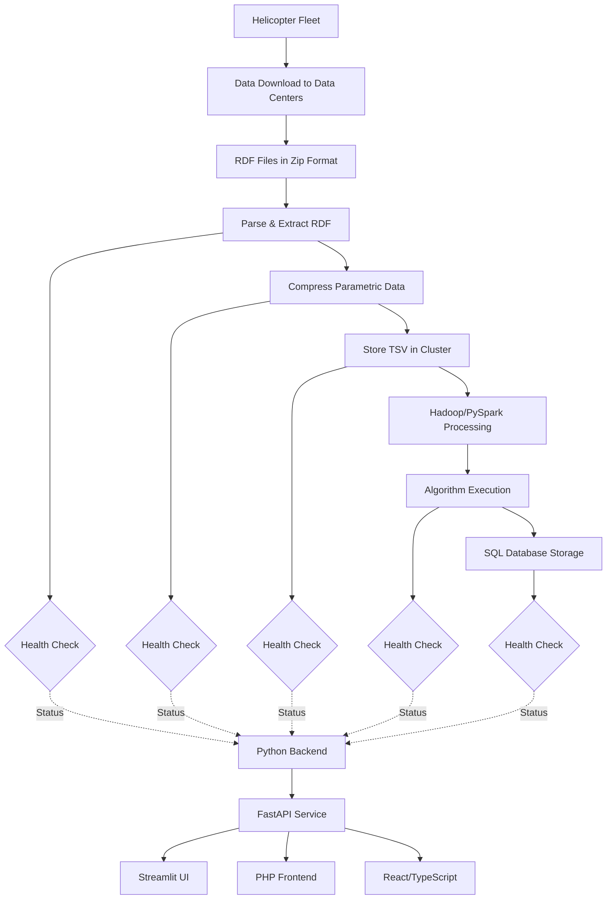

# Dataflow Health Monitoring System - Technical Specification

## Vision

Create a high-level, visual "Dataflow Health Monitoring" dashboard that provides engineers with at-a-glance observability into the health status of a multi-stage helicopter data ingestion pipeline. The system will display process stages as visual blocks with color-coded health indicators (green/red) based on real-time health checks, enabling rapid identification of failure points in the data flow from helicopter RDF files to SQL database storage.

## Objectives

- Build a modular, backend-agnostic Python system for generating dynamic health monitoring diagrams
- Create a flexible configuration system supporting variable numbers of processes and health checks
- Provide a FastAPI service layer for frontend-agnostic access to health monitoring data
- Implement Mermaid diagram generation for visual representation of pipeline health
- Develop a Streamlit demo application as proof-of-concept frontend
- Separate concerns between backend logic (Python) and frontend presentation (Streamlit/PHP/React)
- Enable extensibility to add new algorithms and data ingestion processes without code changes

## Success Metrics

- Health status updates reflect in real-time or near-real-time (< 5 seconds)
- Engineers can identify failed pipeline stages within 3 seconds of viewing dashboard
- System supports addition of new processes via configuration only (no code changes)
- Backend API provides response times < 500ms for diagram generation
- Modular architecture allows frontend swapping (Streamlit, React, TypeScript, PHP)
- Mermaid diagram accurately represents pipeline state with color-coded health indicators

## Current State

The existing dashboard provides a tabular, drill-down view showing:
- Individual RDF files
- Algorithm processing results per file
- Upload datetime for each algorithm

**Gap**: Missing high-level overview dashboard showing overall pipeline health status across all stages.

## System Architecture



## Data Pipeline Stages

1. **Data Download**: Helicopter data transferred to data centers in RDF format
2. **Zip Extraction**: RDF files extracted from compressed archives
3. **Parsing**: RDF parser extracts parametric data
4. **Compression**: Parametric data compressed for storage
5. **TSV Storage**: Data stored as TSV files in cluster
6. **Hadoop/PySpark Processing**: Data ingestion into analytics cluster
7. **Algorithm Execution**: Spark algorithms detect helicopter issues (oil pressure, fuel systems, etc.)
8. **SQL Storage**: Algorithm results with upload timestamps stored in SQL database

Each stage has associated health checks that monitor process success/failure status.

# Tasks

=4 Task 1.0: Design Core Domain Model
* =4 1.1: Create Process class representing pipeline stage with name, status, metadata
* =4 1.2: Create HealthCheck class with boolean status check logic and timestamp
* =4 1.3: Create Pipeline class managing collection of processes and their health checks
* =4 1.4: Define ProcessStatus enum (HEALTHY, FAILED, UNKNOWN)
* =4 1.5: Define HealthCheckResult model with status, timestamp, error_message fields

=4 Task 2.0: Implement Configuration System
* =4 2.1: Create YAML/JSON schema for pipeline configuration
* =4 2.2: Implement ConfigLoader class to parse configuration files
* =4 2.3: Define configuration structure: processes list, health_checks mapping, connections
* =4 2.4: Add validation for configuration file structure and required fields
* =4 2.5: Support dynamic registration of new processes via configuration updates

=4 Task 3.0: Build Health Check Framework
* =4 3.1: Create abstract HealthCheckBase class with execute() method
* =4 3.2: Implement concrete health check types (FileExists, DatabaseConnectivity, ServiceRunning)
* =4 3.3: Create HealthCheckRegistry for registering custom health check implementations
* =4 3.4: Implement health check execution with timeout and error handling
* =4 3.5: Add health check result caching with configurable TTL

=4 Task 4.0: Develop Mermaid Diagram Generator
* =4 4.1: Create MermaidGenerator class converting Pipeline to Mermaid syntax
* =4 4.2: Implement color-coding logic (green for healthy, red for failed processes)
* =4 4.3: Generate process nodes with proper Mermaid node syntax
* =4 4.4: Generate health check sensor nodes between process stages
* =4 4.5: Create connection arrows showing data flow between stages
* =4 4.6: Add styling for visual clarity (node shapes, colors, labels)

=4 Task 5.0: Create FastAPI Backend Service
* =4 5.1: Initialize FastAPI application with CORS configuration
* =4 5.2: Create GET /health endpoint returning overall system health
* =4 5.3: Create GET /diagram endpoint returning Mermaid diagram as text
* =4 5.4: Create GET /diagram/svg endpoint returning rendered SVG diagram
* =4 5.5: Create GET /status endpoint returning JSON of all process statuses
* =4 5.6: Implement request validation and error handling middleware
* =4 5.7: Add response caching for diagram generation endpoints

=4 Task 6.0: Build Streamlit Demo Application
* =4 6.1: Create Streamlit app structure with main page layout
* =4 6.2: Implement Mermaid diagram rendering using streamlit-mermaid component
* =4 6.3: Add refresh button to manually trigger health check updates
* =4 6.4: Display process status table showing all stages and their health
* =4 6.5: Add configuration panel for demo/testing different pipeline configs
* =4 6.6: Implement auto-refresh functionality with configurable interval
* =4 6.7: Add error notifications when backend API is unavailable

=4 Task 7.0: Implement Backend-Frontend Separation
* =4 7.1: Define OpenAPI schema for FastAPI endpoints
* =4 7.2: Create API client library for consuming FastAPI endpoints
* =4 7.3: Document API endpoints with request/response examples
* =4 7.4: Add API authentication mechanism (optional, for production)
* =4 7.5: Create example integration code for PHP frontend
* =4 7.6: Create example integration code for React/TypeScript frontend

=4 Task 8.0: Add Logging and Observability
* =4 8.1: Configure loguru for structured logging throughout application
* =4 8.2: Add logging for health check execution (success/failure/duration)
* =4 8.3: Add logging for API requests and responses
* =4 8.4: Implement log level configuration via environment variables
* =4 8.5: Add request ID tracking for distributed tracing

=4 Task 9.0: Implement Testing Suite
* =4 9.1: Create unit tests for Process, HealthCheck, and Pipeline classes
* =4 9.2: Create unit tests for configuration loading and validation
* =4 9.3: Create unit tests for Mermaid diagram generation
* =4 9.4: Create integration tests for FastAPI endpoints
* =4 9.5: Add fixtures for test data and mock health checks
* =4 9.6: Configure pytest with coverage reporting (target: 90%+ coverage)

=4 Task 10.0: Create Documentation and Deployment
* =4 10.1: Write README with project overview and setup instructions
* =4 10.2: Document configuration file format with examples
* =4 10.3: Create API documentation using FastAPI auto-generated docs
* =4 10.4: Document how to extend system with custom health checks
* =4 10.5: Create Docker containerization for backend service
* =4 10.6: Create docker-compose setup for local development
* =4 10.7: Document deployment process for production environment

# Development Conventions

## Code Quality

1. Use Pydantic models for all data validation and serialization
2. Apply type hints to all function parameters and return values
3. Write docstrings following Google style guide for all public classes and methods
4. Keep files under 700 lines of code (split into modules if exceeding)
5. Follow PEP 8 style guidelines with black formatter (line length: 100)
6. Use descriptive variable names avoiding abbreviations unless widely understood

## Logging and Error Handling

1. Use loguru for all logging throughout the application
2. Implement structured logging with contextual information (request_id, process_name, etc.)
3. Log health check failures with ERROR level including error details
4. Log API requests with INFO level including endpoint, duration, status
5. Use appropriate log levels: DEBUG (development details), INFO (important events), WARNING (recoverable issues), ERROR (failures)
6. Implement graceful error handling with user-friendly error messages
7. Never expose internal system details in API error responses

## Package Management

1. Use uv for Python package management and virtual environment
2. Maintain pyproject.toml with all dependencies and project metadata
3. Pin dependency versions for reproducible builds
4. Separate development dependencies from production dependencies
5. Document purpose of each major dependency in pyproject.toml comments

## Testing Strategy

1. Write pytest unit tests for all business logic classes
2. Place tests in tests/ subdirectory within each module directory
3. Aim for 90%+ code coverage for core business logic
4. Include both positive and negative test cases
5. Use fixtures for reusable test data and mock objects
6. Test edge cases and error conditions explicitly
7. Use pytest-asyncio for testing async FastAPI endpoints

## Project Structure

```
dataflow-health-monitoring/
├── src/
│   ├── core/
│   │   ├── models.py          # Process, HealthCheck, Pipeline models
│   │   ├── config.py          # Configuration loading and validation
│   │   ├── registry.py        # HealthCheck registry
│   │   └── tests/
│   ├── healthchecks/
│   │   ├── base.py            # Abstract base class
│   │   ├── implementations.py # Concrete health check types
│   │   └── tests/
│   ├── diagram/
│   │   ├── generator.py       # Mermaid diagram generation
│   │   └── tests/
│   ├── api/
│   │   ├── main.py            # FastAPI application
│   │   ├── endpoints.py       # API route handlers
│   │   ├── dependencies.py    # FastAPI dependencies
│   │   └── tests/
│   └── streamlit_app/
│       └── app.py             # Streamlit demo application
├── config/
│   └── pipeline.yaml          # Example pipeline configuration
├── pyproject.toml
├── README.md
└── docker-compose.yml
```

## API Design Principles

1. Follow REST conventions for endpoint naming and HTTP methods
2. Use appropriate HTTP status codes (200, 400, 404, 500, etc.)
3. Return consistent JSON response structure with status, data, error fields
4. Implement CORS configuration for cross-origin frontend access
5. Version API endpoints if breaking changes are anticipated (/api/v1/)
6. Provide OpenAPI documentation accessible at /docs endpoint
7. Include rate limiting for production deployments (optional)

## Frontend Integration Guidelines

1. Backend provides data via JSON API only (no server-side rendering)
2. Frontends consume FastAPI endpoints independently
3. Mermaid diagram can be retrieved as text or pre-rendered SVG
4. Health status updates should poll /status endpoint at configurable intervals
5. Frontend responsible for user interaction, visualization, and refresh logic
6. Backend remains stateless for scalability

## Configuration Best Practices

1. Use environment variables for deployment-specific settings (log level, ports, etc.)
2. Use YAML/JSON files for pipeline structure configuration
3. Provide sensible defaults for all optional configuration values
4. Validate configuration at startup with clear error messages on invalid config
5. Support hot-reloading of pipeline configuration without service restart (optional enhancement)

## Security Considerations (Production)

1. Implement API authentication using API keys or JWT tokens
2. Validate all user inputs to prevent injection attacks
3. Use HTTPS for all API communication in production
4. Implement rate limiting to prevent abuse
5. Sanitize error messages to avoid information disclosure
6. Regular dependency updates for security patches
