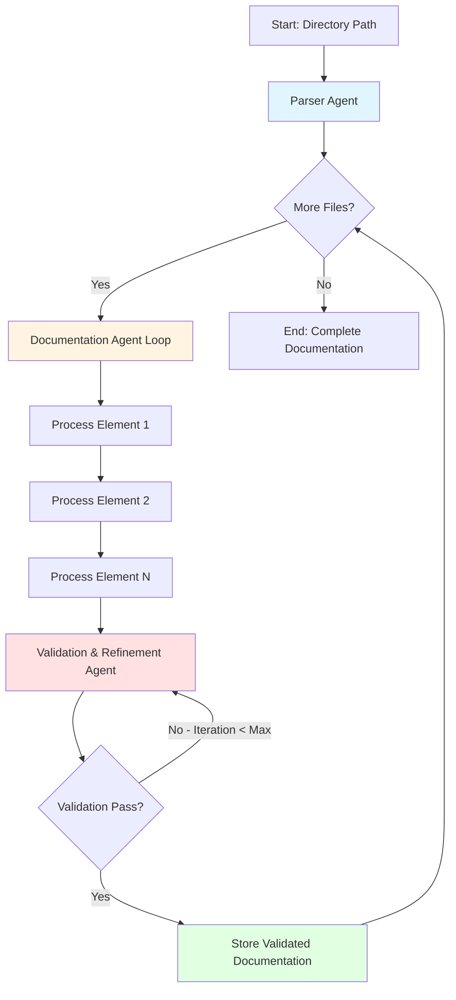
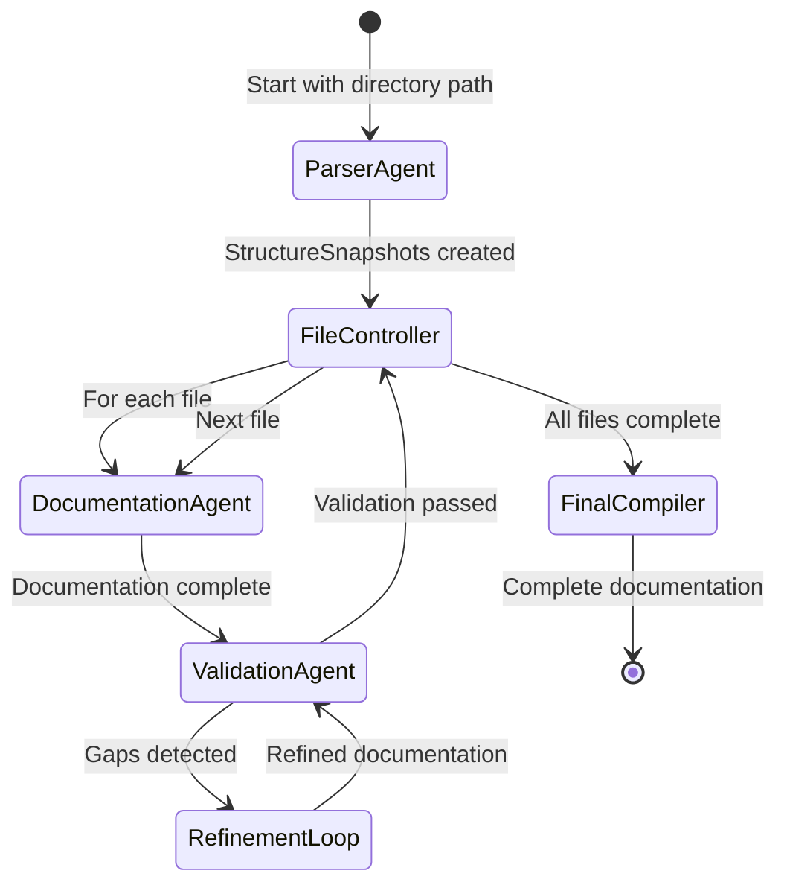
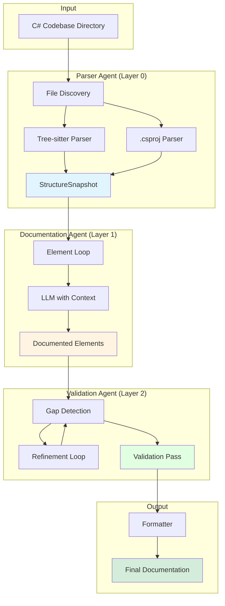
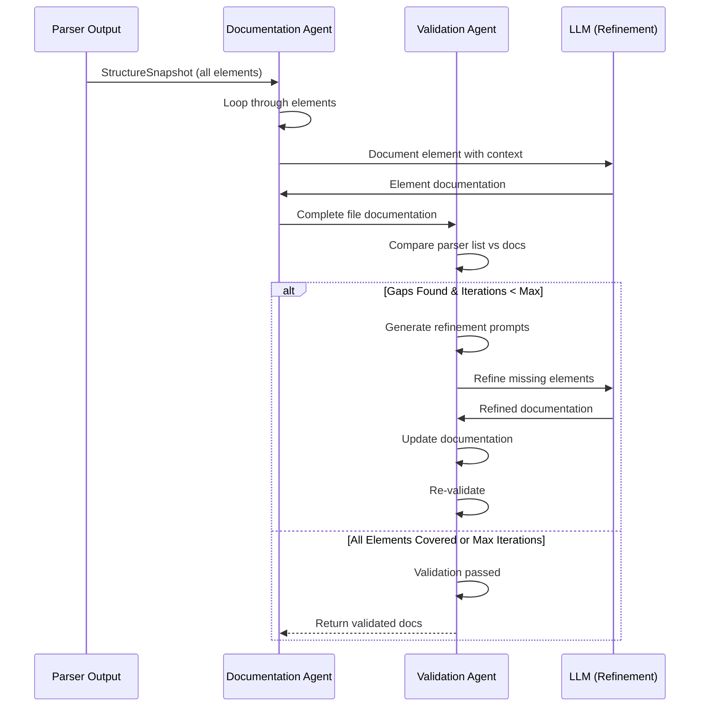

# Parser-Led Documentation Generation System - Technical Specification

## Version
Version: 1.0.0
Date: 2025-10-28
Session: 9

---

# Vision

Create a parser-led, multi-agent documentation generation system that fundamentally improves the accuracy, completeness, and consistency of C# codebase documentation. This new architecture addresses critical gaps in the current LLM-first approach by establishing a hybrid workflow where a structured programmatic parser provides ground truth, while LLMs add semantic enrichment and validation. The system leverages the strengths of both approaches: the parser ensures comprehensive structural coverage and eliminates guesswork, while the LLM provides contextual understanding, catches edge cases, and adds descriptive documentation.

## Objectives

- **Improve Documentation Accuracy**: Ensure all classes, methods, attributes, properties, and dependencies are documented accurately with minimal omissions
- **Establish Ground Truth via Parser**: Use Tree-sitter and .csproj parsing to programmatically identify all code elements before LLM processing
- **Create Symbiotic Parser-LLM Workflow**: Design a feedback loop where the parser guides the LLM, and the LLM validates and refines parser output
- **Implement Iterative Refinement**: Use a validation agent with multiple refinement passes to catch missed elements and ensure completeness
- **Build Modular LangGraph Architecture**: Design the workflow as independent, reusable agents and nodes that can be extended or modified
- **Eliminate Current Issues**: Address all 10 feedback items including missing classes, incorrect dependencies, inconsistent formatting, and missing private members

## Success Metrics

- **Structural Coverage**: 100% coverage of all classes, methods, attributes, and properties identified by the parser
- **Dependency Accuracy**: 100% accurate dependency extraction from .csproj files via ProjectReference tags
- **Inheritance Accuracy**: Correct identification of base classes and interfaces (no more "Enum" or "None (partial class)" errors)
- **Member Completeness**: Include all public and private methods, attributes, and properties (configurable)
- **Formatting Consistency**: Standardized parameter/return documentation with consistent structure across all methods
- **Validation Pass Rate**: Achieve 95%+ validation success rate within 3-4 refinement iterations
- **Character Cleanliness**: Zero special characters or Unicode artifacts in final documentation
- **Cross-File Consistency**: Identical terminology and descriptions for entities appearing across multiple files

---

# Architecture Overview

## System Design Philosophy

The new architecture implements a **parser-first, LLM-enhanced** approach where:

1. **Parser as Guide**: The structured parser (Tree-sitter + .csproj) provides the authoritative list of code elements
2. **LLM as Documentor**: The LLM receives parser-identified elements with full file context to generate detailed documentation
3. **LLM as Validator**: A separate validation agent compares parser output, LLM documentation, and source files to identify gaps
4. **Iterative Refinement**: Multiple validation passes ensure completeness and accuracy before moving to the next file

This creates a **symbiotic relationship** where the parser lightens the LLM's burden by providing structure, while the LLM corrects parser limitations and adds semantic understanding.

## LangGraph Multi-Agent Workflow



## Agent Responsibilities

### 1. Parser Agent (Structure Harvest Node)
- **Input**: Directory path containing .cs files
- **Process**:
  - Recursively discover all .cs files in directory
  - Run Tree-sitter parser on each file to extract:
    - Classes (including nested and partial classes)
    - Methods (public and private)
    - Attributes and properties
    - Inheritance relationships (base classes, interfaces)
  - Parse .csproj files to extract ProjectReference dependencies
- **Output**: `StructureSnapshot` - complete structural map of each file

### 2. Documentation Agent (Element Documentation Node)
- **Input**: Single code element (class/method/attribute) + full file context
- **Process**:
  - Receive parser-identified element
  - Access full source file for contextual understanding
  - Generate detailed documentation for that specific element
  - Follow consistent formatting guidelines
- **Output**: Documented element with parameters, returns, and descriptions

### 3. Validation & Refinement Agent (Quality Assurance Node)
- **Input**: Parser output + LLM documentation + original source file
- **Process**:
  - Compare parser's element list against LLM-generated documentation
  - Identify missing, incomplete, or inconsistent elements
  - Generate refinement prompts for gaps
  - Execute 3-4 refinement iterations
  - Validate inheritance relationships, dependencies, and descriptions
- **Output**: Validated, complete file-level documentation

### 4. File Iteration Controller (Orchestration Node)
- **Input**: List of files from Parser Agent
- **Process**:
  - Control workflow for each file
  - Pass file to Documentation Agent
  - Route to Validation Agent
  - Store completed documentation
  - Move to next file
- **Output**: Compiled documentation set for entire codebase

---

# Tasks

## Phase 1: Parser Integration

✅ Task 1.0: Implement Tree-sitter Parser Integration
* ✅ 1.1: Install and configure Tree-sitter for C# parsing
* ✅ 1.2: Create `structure_service.py` module for parser abstraction
* ✅ 1.3: Implement class extraction (including nested and partial classes)
* ✅ 1.4: Implement method extraction (public and private based on config)
* ✅ 1.5: Implement attribute and property extraction
* ✅ 1.6: Implement inheritance relationship parsing (base classes, interfaces)
* ✅ 1.7: Add unit tests for parser accuracy against sample C# files

✅ Task 2.0: Implement .csproj Dependency Parser
* ✅ 2.1: Create `csproj_parser.py` module using xml.etree.ElementTree
* ✅ 2.2: Extract all ProjectReference tags from .csproj files
* ✅ 2.3: Build dependency graph data structure
* ✅ 2.4: Add validation to ensure all referenced projects exist
* ✅ 2.5: Add unit tests for dependency extraction accuracy

✅ Task 3.0: Create StructureSnapshot Data Model
* ✅ 3.1: Define Pydantic model for `StructureSnapshot` with fields:
  - file_path: str
  - classes: List[ClassInfo]
  - dependencies: List[str]
  - namespace: str
* ✅ 3.2: Define `ClassInfo` model with fields:
  - name: str
  - base_class: Optional[str]
  - interfaces: List[str]
  - methods: List[MethodInfo]
  - attributes: List[AttributeInfo]
  - properties: List[PropertyInfo]
  - is_partial: bool
  - is_nested: bool
* ✅ 3.3: Define `MethodInfo`, `AttributeInfo`, and `PropertyInfo` models
* ✅ 3.4: Add validation rules for required fields
* ✅ 3.5: Add serialization/deserialization methods

✅ Task 4.0: Implement Parser Agent (LangGraph Node)
* ✅ 4.1: Create `parser_agent.py` module with LangGraph node definition
* ✅ 4.2: Implement recursive file discovery for .cs files
* ✅ 4.3: Integrate Tree-sitter parser for each discovered file
* ✅ 4.4: Integrate .csproj parser for dependency extraction
* ✅ 4.5: Store StructureSnapshot for each file in workflow state
* ✅ 4.6: Add error handling for malformed C# files
* ✅ 4.7: Add logging using loguru for parser progress and results

## Phase 2: Documentation Agent Implementation

✅ Task 5.0: Create Documentation Agent (LangGraph Node)
* ✅ 5.1: Create `documentation_agent.py` module with LangGraph node
* ✅ 5.2: Implement element-by-element documentation loop
* ✅ 5.3: Design prompt template that includes:
  - Specific element to document (class/method/attribute)
  - Full file context
  - Instructions for consistent formatting
* ✅ 5.4: Integrate LLM provider (OpenAI, Azure, Anthropic, or Mistral)
* ✅ 5.5: Implement response parsing and validation
* ✅ 5.6: Store documented elements in structured format

✅ Task 6.0: Design Consistent Documentation Format
* ✅ 6.1: Define standard format for class documentation:
  - Class name and inheritance
  - Purpose and description
  - List of attributes
  - List of properties
  - List of methods
* ✅ 6.2: Define standard format for method documentation:
  - Method signature
  - Description
  - Parameters: (each on new line with name and description)
  - Returns: (on new line with type and description)
* ✅ 6.3: Create formatter utility functions
* ✅ 6.4: Add examples to prompt template

✅ Task 7.0: Implement Element Processing Loop
* ✅ 7.1: Iterate through all classes in StructureSnapshot
* ✅ 7.2: For each class, document class-level information
* ✅ 7.3: For each method in class, generate method documentation
* ✅ 7.4: For each attribute and property, generate descriptions
* ✅ 7.5: Maintain full file context in each LLM prompt
* ✅ 7.6: Aggregate all documented elements for file
* ✅ 7.7: Add progress tracking and logging

## Phase 3: Validation & Refinement Agent

✅ Task 8.0: Create Validation Agent (LangGraph Node)
* ✅ 8.1: Create `validation_agent.py` module with LangGraph node
* ✅ 8.2: Implement comparison logic:
  - Parser element list
  - LLM documented element list
  - Original source file
* ✅ 8.3: Build gap detection algorithm to identify missing elements
* ✅ 8.4: Design validation prompt template for refinement

✅ Task 9.0: Implement Iterative Refinement Loop
* ✅ 9.1: Set configurable max iterations (default: 3-4)
* ✅ 9.2: For each iteration:
  - Compare parser elements vs documented elements
  - Identify missing items (classes, methods, attributes)
  - Generate targeted refinement prompt
  - Re-run LLM on missing elements
  - Update documentation with refined results
* ✅ 9.3: Implement termination conditions:
  - All elements documented
  - Max iterations reached
* ✅ 9.4: Add validation metrics tracking (coverage percentage)

✅ Task 10.0: Implement Specific Validation Checks
* ✅ 10.1: Validate all parser-identified classes are documented
* ✅ 10.2: Validate all methods (public/private based on config) are documented
* ✅ 10.3: Validate all attributes and properties are documented
* ✅ 10.4: Validate inheritance relationships match parser output
* ✅ 10.5: Validate dependency list matches .csproj ProjectReferences
* ✅ 10.6: Validate parameter and return documentation consistency
* ✅ 10.7: Check for special characters and Unicode artifacts

✅ Task 11.0: Build Refinement Prompt Generator
* ✅ 11.1: Create targeted prompts for missing classes
* ✅ 11.2: Create targeted prompts for missing methods
* ✅ 11.3: Create targeted prompts for incomplete method documentation
* ✅ 11.4: Create targeted prompts for missing attributes/properties
* ✅ 11.5: Include relevant file context in each refinement prompt

## Phase 4: File Iteration Controller

✅ Task 12.0: Create File Iteration Controller (LangGraph Node)
* ✅ 12.1: Create `file_controller.py` orchestration node
* ✅ 12.2: Manage list of files from Parser Agent
* ✅ 12.3: Route each file through Documentation Agent
* ✅ 12.4: Route to Validation Agent after documentation
* ✅ 12.5: Collect validated documentation for each file
* ✅ 12.6: Store completed documentation in output structure

✅ Task 13.0: Implement Workflow State Management
* ✅ 13.1: Define `ParserLedState` Pydantic model with fields:
  - directory_path: str
  - discovered_files: List[str]
  - current_file_index: int
  - structure_snapshots: Dict[str, StructureSnapshot]
  - documented_files: Dict[str, FileDocumentation]
  - validation_results: Dict[str, ValidationResult]
* ✅ 13.2: Implement state transitions between nodes
* ✅ 13.3: Add state persistence for resumable workflows

✅ Task 14.0: Build Final Documentation Compiler
* ✅ 14.1: Aggregate all validated file documentation
* ✅ 14.2: Generate final markdown output structure
* ✅ 14.3: Include table of contents with file hierarchy
* ✅ 14.4: Apply consistent formatting across entire documentation
* ✅ 14.5: Remove special characters using regex cleanup
* ✅ 14.6: Export to markdown file(s)

## Phase 5: Configuration & Customization

✅ Task 15.0: Create Configuration System
* ✅ 15.1: Define `ParserLedConfig` Pydantic model with options:
  - include_private_members: bool (default: True)
  - max_validation_iterations: int (default: 3)
  - llm_provider: str
  - llm_model: str
  - output_format: str (markdown, json, etc.)
* ✅ 15.2: Load configuration from YAML or environment variables
* ✅ 15.3: Pass configuration through workflow state
* ✅ 15.4: Add configuration validation

🚧 Task 16.0: Implement LLM Provider Abstraction
* ✅ 16.1: Create `llm_service.py` with provider interface
* ✅ 16.2: Support OpenAI provider
* ⭕ 16.3: Support Azure OpenAI provider
* ⭕ 16.4: Support Anthropic provider
* ⭕ 16.5: Support Mistral provider
* ⭕ 16.6: Implement retry logic with exponential backoff
* ⭕ 16.7: Add token usage tracking and cost estimation

## Phase 6: Output Formatting & Consistency

✅ Task 17.0: Create Documentation Formatter Module
* ✅ 17.1: Create `formatter.py` with formatting utilities
* ✅ 17.2: Implement `format_class_documentation()` function
* ✅ 17.3: Implement `format_method_documentation()` function
* ✅ 17.4: Implement `format_parameters()` - ensure each parameter on new line
* ✅ 17.5: Implement `format_returns()` - ensure returns on new line
* ✅ 17.6: Implement `remove_special_chars()` - clean Unicode/control chars
* ✅ 17.7: Add consistent indentation and spacing rules

⭕ Task 18.0: Implement Cross-File Consistency Layer (Optional - Phase 8)
* ⭕ 18.1: Create `terminology_cache.py` module
* ⭕ 18.2: Build cache of entity descriptions across files
* ⭕ 18.3: Detect duplicate entities (e.g., "HealthIndicator")
* ⭕ 18.4: Standardize descriptions for repeated entities
* ⭕ 18.5: Apply consistent terminology during final compilation

## Phase 7: Integration & Orchestration

✅ Task 19.0: Build Complete LangGraph Workflow
* ✅ 19.1: Define workflow graph with all nodes:
  - START → Parser Agent
  - Parser Agent → File Controller
  - File Controller → Documentation Agent
  - Documentation Agent → Validation Agent
  - Validation Agent → (conditional) Refinement Loop or Next File
  - All Files Complete → Final Compiler → END
* ✅ 19.2: Implement conditional edges for refinement iterations
* ✅ 19.3: Add state checkpoints for resumable execution
* ✅ 19.4: Integrate error handling at workflow level

✅ Task 20.0: Create CLI Interface
* ✅ 20.1: Update `cli.py` to add new `parser-led` command
* ✅ 20.2: Accept directory path as input
* ✅ 20.3: Accept configuration options via CLI flags
* ✅ 20.4: Display progress using Rich progress bars
* ✅ 20.5: Show validation metrics after each file
* ✅ 20.6: Display final summary with coverage statistics

✅ Task 21.0: Implement Logging & Monitoring
* ✅ 21.1: Configure loguru for all agents
* ✅ 21.2: Log parser progress and results
* ✅ 21.3: Log LLM API calls and token usage
* ✅ 21.4: Log validation results and gaps identified
* ✅ 21.5: Log refinement iterations and improvements
* ✅ 21.6: Create structured log output for debugging

## Phase 8: Testing & Validation

✅ Task 22.0: Create Test Suite for Parser
* ✅ 22.1: Create `tests/parser/` directory
* ✅ 22.2: Write tests for Tree-sitter class extraction
* ✅ 22.3: Write tests for method extraction (public and private)
* ✅ 22.4: Write tests for attribute and property extraction
* ✅ 22.5: Write tests for inheritance parsing
* ✅ 22.6: Write tests for nested and partial class handling
* ✅ 22.7: Create sample C# fixtures covering edge cases

⭕ Task 23.0: Create Test Suite for Documentation Agent
* ⭕ 23.1: Create `tests/documentation/` directory
* ⭕ 23.2: Mock LLM responses for consistent testing
* ⭕ 23.3: Test element-by-element documentation loop
* ⭕ 23.4: Test prompt generation with file context
* ⭕ 23.5: Test response parsing and formatting
* ⭕ 23.6: Verify documentation completeness

✅ Task 24.0: Create Test Suite for Validation Agent
* ✅ 24.1: Create `tests/validation/` directory
* ✅ 24.2: Test gap detection algorithm with missing elements
* ✅ 24.3: Test refinement prompt generation
* ✅ 24.4: Test iterative refinement loop termination
* ✅ 24.5: Test validation metrics calculation
* ✅ 24.6: Verify validation passes identify all gaps

✅ Task 25.0: Create Integration Tests
* ✅ 25.1: Create `tests/integration/` directory
* ✅ 25.2: Test complete workflow on small C# project
* ✅ 25.3: Verify all 10 original feedback issues are resolved:
  - Missing classes (e.g., dif_crh_accel_bias)
  - Correct dependencies from .csproj
  - Accurate inheritance relationships
  - All private methods included
  - All attributes and properties documented
  - Consistent parameter/return formatting
  - Parameters/returns on separate lines
  - Detailed descriptions maintained
  - Consistent terminology across files
  - No special characters in output
* ✅ 25.4: Measure coverage percentage and validation success rate
* ✅ 25.5: Compare output quality against original LLM-first approach

⭕ Task 26.0: Performance Testing & Optimization
* ⭕ 26.1: Test workflow on large C# codebase (1000+ files)
* ⭕ 26.2: Measure execution time and token usage
* ⭕ 26.3: Identify bottlenecks in parser or LLM calls
* ⭕ 26.4: Implement parallel processing for independent files
* ⭕ 26.5: Optimize prompt sizes to reduce token costs
* ⭕ 26.6: Add caching for repeated LLM queries

## Phase 9: Documentation & Deployment

⭕ Task 27.0: Create User Documentation
* ⭕ 27.1: Write README for parser-led workflow
* ⭕ 27.2: Document configuration options and their effects
* ⭕ 27.3: Provide usage examples with CLI commands
* ⭕ 27.4: Document LLM provider setup for each supported provider
* ⭕ 27.5: Create troubleshooting guide for common issues

⭕ Task 28.0: Create Developer Documentation
* ⭕ 28.1: Document architecture and design decisions
* ⭕ 28.2: Explain parser-LLM symbiotic relationship
* ⭕ 28.3: Document state management and workflow transitions
* ⭕ 28.4: Provide examples of extending the system
* ⭕ 28.5: Document testing strategy and fixtures

⭕ Task 29.0: Migration Guide
* ⭕ 29.1: Document differences between old and new workflows
* ⭕ 29.2: Provide migration path for existing users
* ⭕ 29.3: Explain when to use parser-led vs original workflow
* ⭕ 29.4: Create comparison table of features and outputs

✅ Task 30.0: Release & Deployment
* ✅ 30.1: Version the parser-led workflow as separate module
* ✅ 30.2: Update project version to indicate new capability
* ✅ 30.3: Add parser-led workflow to CI/CD pipeline
* ⭕ 30.4: Create release notes highlighting improvements
* ⭕ 30.5: Deploy to production environment

---

# Development Conventions

## Code Quality

1. **Type Hints**: Use type hints for all function parameters and return values
   ```python
   def parse_csharp_file(file_path: str) -> StructureSnapshot:
       ...
   ```

2. **Pydantic Models**: Use Pydantic for all data validation and state management
   ```python
   from pydantic import BaseModel, Field

   class StructureSnapshot(BaseModel):
       file_path: str
       classes: List[ClassInfo]
       dependencies: List[str]
   ```

3. **Docstrings**: Write clear docstrings for all functions, classes, and modules
   ```python
   def extract_methods(class_node) -> List[MethodInfo]:
       """Extract all methods from a C# class node.

       Args:
           class_node: Tree-sitter node representing a C# class

       Returns:
           List of MethodInfo objects containing method details
       """
   ```

4. **Error Handling**: Implement comprehensive error handling with informative messages
   ```python
   try:
       snapshot = parse_csharp_file(file_path)
   except ParseError as e:
       logger.error(f"Failed to parse {file_path}: {e}")
       raise
   ```

## Logging and Monitoring

1. **Loguru**: Use loguru for all logging with appropriate log levels
   ```python
   from loguru import logger

   logger.info(f"Parsing file: {file_path}")
   logger.warning(f"Partial class detected: {class_name}")
   logger.error(f"Failed to extract dependencies: {error}")
   ```

2. **Progress Tracking**: Use Rich for terminal UI and progress bars
   ```python
   from rich.progress import track

   for file in track(files, description="Processing files..."):
       process_file(file)
   ```

3. **Structured Logging**: Include contextual information in logs
   ```python
   logger.info(
       "Validation complete",
       file=file_path,
       coverage=coverage_pct,
       iterations=iteration_count
   )
   ```

## LangGraph Conventions

1. **Node Definition**: All nodes should follow consistent structure
   ```python
   def parser_agent_node(state: ParserLedState) -> ParserLedState:
       """Parser agent node - discovers and parses C# files."""
       logger.info("Running Parser Agent")
       # Node logic here
       return updated_state
   ```

2. **State Management**: Always return updated state from nodes
   ```python
   state.structure_snapshots[file_path] = snapshot
   return state
   ```

3. **Conditional Edges**: Use clear condition functions
   ```python
   def should_refine(state: ParserLedState) -> str:
       """Determine if refinement is needed."""
       if state.validation_results[file].coverage < 1.0:
           if state.iteration_count < state.config.max_iterations:
               return "refine"
       return "next_file"
   ```

## Testing Conventions

1. **Pytest**: Use pytest for all unit and integration tests
2. **Fixtures**: Create reusable fixtures for test data
   ```python
   @pytest.fixture
   def sample_csharp_file():
       return Path("tests/fixtures/sample.cs")
   ```

3. **Test Organization**: Place tests in subdirectories matching module structure
   ```
   tests/
   ├── parser/
   │   ├── test_tree_sitter.py
   │   └── test_csproj_parser.py
   ├── documentation/
   │   └── test_documentation_agent.py
   └── integration/
       └── test_full_workflow.py
   ```

4. **Coverage**: Aim for 90%+ test coverage of business logic
5. **Mocking**: Mock LLM API calls in unit tests for speed and reliability

## Package Management

1. **UV**: Use `uv` for package management and dependency resolution
2. **Requirements**: Maintain separate files for different environments
   - `requirements.txt`: Production dependencies
   - `requirements-dev.txt`: Development dependencies (pytest, mypy, etc.)

## File Organization

```
src/modules/docugen/
├── agents/
│   ├── parser_agent.py          # Phase 1
│   ├── documentation_agent.py   # Phase 2
│   ├── validation_agent.py      # Phase 3
│   └── file_controller.py       # Phase 4
├── tools/
│   ├── structure_service.py     # Tree-sitter parser
│   ├── csproj_parser.py         # .csproj dependency parser
│   └── llm_service.py           # LLM provider abstraction
├── writers/
│   ├── formatter.py             # Output formatting
│   └── terminology_cache.py     # Cross-file consistency
├── models/
│   ├── structure_snapshot.py    # Pydantic models for parser output
│   └── parser_led_state.py      # Workflow state model
├── workflows/
│   └── parser_led_workflow.py   # Complete LangGraph workflow
└── tests/
    ├── parser/
    ├── documentation/
    ├── validation/
    └── integration/
```

---

# Implementation Notes

## Critical Design Decisions

### 1. Parser-First Approach
**Rationale**: The original LLM-first approach resulted in:
- Missing classes (e.g., dif_crh_accel_bias)
- Incorrect dependencies (guessed from using statements)
- Wrong inheritance relationships (Enum misidentifications)
- Missing private methods and properties

**Solution**: Parser provides ground truth, eliminating LLM guesswork.

### 2. Symbiotic Parser-LLM Relationship
**Rationale**: Neither parser nor LLM is perfect:
- Parser is deterministic but may miss complex nested structures
- LLM has semantic understanding but can hallucinate or miss details

**Solution**: Parser provides structure, LLM adds semantics and validates completeness through iterative refinement.

### 3. Element-by-Element Documentation
**Rationale**: Original summarization approach produced incomplete coverage.

**Solution**: Loop through each parser-identified element, giving LLM focused task with full file context.

### 4. Iterative Validation
**Rationale**: Single-pass documentation often misses edge cases.

**Solution**: 3-4 refinement iterations catch gaps and improve completeness to 95%+ validation rate.

### 5. Separate Workflow (Not Refactor)
**Rationale**: Minimize risk, allow A/B testing, enable gradual migration.

**Solution**: Build new parser-led workflow alongside existing system, don't refactor existing code.

## Key Differences from Current System

| Aspect | Current LLM-First | New Parser-Led |
|--------|-------------------|----------------|
| **Entry Point** | LLM summarization | Tree-sitter parser |
| **Structure Discovery** | LLM inference | Deterministic parsing |
| **Dependencies** | Guessed from using statements | Extracted from .csproj |
| **Coverage** | Variable, 70-80% | 100% of parsed elements |
| **Private Members** | Often missing | Configurable inclusion |
| **Validation** | Minimal | Iterative refinement (3-4 passes) |
| **Consistency** | Variable formatting | Standardized formatter |
| **Inheritance** | Sometimes incorrect | Parser-validated |

## Addressing the 10 Original Feedback Items

1. **Missing Classes** → Parser ensures 100% class discovery
2. **Incorrect Dependencies** → .csproj parser extracts ProjectReferences
3. **Wrong Inheritance** → Tree-sitter parses base classes/interfaces
4. **Missing Private Methods** → Parser captures all methods (configurable)
5. **Missing Attributes/Properties** → Parser identifies all members
6. **Inconsistent Method Definitions** → Standardized formatter
7. **Parameter/Return Formatting** → Formatter enforces line breaks
8. **Less Detailed Descriptions** → Parser-fed prompts with full context
9. **Inconsistent Terminology** → Optional terminology cache (Phase 8)
10. **Special Characters** → Regex cleanup in formatter

---

# Workflow State Transitions



## State Schema

```python
class ParserLedState(BaseModel):
    """Workflow state for parser-led documentation."""

    # Input
    directory_path: str
    config: ParserLedConfig

    # Discovery
    discovered_files: List[str] = []
    current_file_index: int = 0

    # Parsing
    structure_snapshots: Dict[str, StructureSnapshot] = {}

    # Documentation
    documented_files: Dict[str, FileDocumentation] = {}
    current_file_elements: List[ElementDocumentation] = []

    # Validation
    validation_results: Dict[str, ValidationResult] = {}
    iteration_count: int = 0

    # Output
    final_documentation: Optional[str] = None
```

---

# Example Usage

## CLI Command

```bash
# Basic usage
uv run python -m docugen.cli parser-led --directory /path/to/csharp/project

# With configuration
uv run python -m docugen.cli parser-led \
    --directory /path/to/csharp/project \
    --include-private \
    --max-iterations 4 \
    --llm-provider openai \
    --llm-model gpt-4o \
    --output docs/generated.md
```

## Programmatic Usage

```python
from docugen.workflows.parser_led_workflow import ParserLedWorkflow
from docugen.models.parser_led_state import ParserLedState, ParserLedConfig

# Configure workflow
config = ParserLedConfig(
    include_private_members=True,
    max_validation_iterations=3,
    llm_provider="openai",
    llm_model="gpt-4o",
    output_format="markdown"
)

# Initialize state
state = ParserLedState(
    directory_path="/path/to/csharp/project",
    config=config
)

# Run workflow
workflow = ParserLedWorkflow()
result = workflow.run(state)

# Access results
print(f"Files processed: {len(result.documented_files)}")
print(f"Validation coverage: {result.average_coverage:.2%}")
print(result.final_documentation)
```

---

# Performance Considerations

## Optimization Strategies

1. **Parallel File Processing**: Process independent files in parallel after parsing phase
2. **LLM Prompt Optimization**: Minimize token usage while maintaining context quality
3. **Caching**: Cache repeated LLM queries for similar code patterns
4. **Incremental Processing**: Support resumable workflows with state checkpointing
5. **Batch Element Documentation**: Group similar elements in single LLM call where appropriate

## Expected Performance

- **Small Project** (10-50 files): 5-15 minutes
- **Medium Project** (100-500 files): 30-90 minutes
- **Large Project** (1000+ files): 3-6 hours (with parallelization)

Token usage depends on file size and LLM provider, estimated ~500-2000 tokens per file.

---

# Troubleshooting Guide

## Common Issues

### Parser Fails on C# File
**Symptom**: Tree-sitter parse error
**Solution**:
- Check C# syntax is valid
- Update Tree-sitter grammar to latest version
- Add file to exception list if necessary

### LLM Documentation Incomplete
**Symptom**: Missing method descriptions after max iterations
**Solution**:
- Increase `max_validation_iterations` in config
- Check LLM prompt includes sufficient context
- Verify element is actually in source file

### Validation Loop Not Terminating
**Symptom**: Refinement loop hits max iterations without convergence
**Solution**:
- Review validation gap detection logic
- Check if parser is identifying elements correctly
- Lower coverage threshold or adjust refinement prompts

### Dependencies Not Extracted
**Symptom**: Empty dependency list
**Solution**:
- Verify .csproj file exists and is valid XML
- Check ProjectReference tags are properly formatted
- Ensure .csproj parser has correct namespace handling

---

# Future Enhancements (Post-Initial Release)

1. **Multi-Language Support**: Extend parser to support Java, Python, TypeScript
2. **Diagram Generation**: Auto-generate class diagrams from parsed structure
3. **Change Detection**: Incremental documentation for modified files only
4. **Quality Metrics**: Automated documentation quality scoring
5. **Custom Templates**: User-defined documentation templates and formats
6. **IDE Integration**: VS Code extension for in-editor documentation generation
7. **API Documentation**: Generate OpenAPI/Swagger specs from parsed code

---

# Appendix: Mermaid Diagrams

## Complete System Architecture



## Validation & Refinement Loop Detail



---

# Conclusion

This specification provides a complete roadmap for implementing a parser-led documentation generation system that addresses all identified issues in the current LLM-first approach. The new architecture leverages the symbiotic relationship between deterministic parsing and semantic LLM processing, ensuring comprehensive coverage, accuracy, and consistency.

The 30 major tasks are broken down into atomic subtasks across 9 phases, providing clear implementation steps for the AI planner and development team. The modular LangGraph design enables future extensibility while maintaining separation of concerns.

**Key Success Factors:**
- Parser provides ground truth structure
- LLM adds semantic understanding and validation
- Iterative refinement ensures completeness
- Consistent formatting eliminates presentation issues
- Modular design enables easy extension and modification

**Next Steps:**
1. Begin Phase 1: Parser Integration
2. Validate parser accuracy with test fixtures
3. Implement Documentation Agent with standardized prompts
4. Build Validation Agent with iterative refinement
5. Integrate complete workflow and test on real C# codebase
