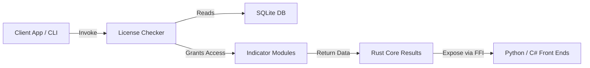

# Multi-Timeframe Indicator Licensing Framework - Technical Specification

## Vision
Deliver a Rust-centric indicator engine that performs multi-timeframe market analysis, enforces feature access through licensing, and exposes results to external consumers (Python, C#, NinjaTrader). The system must keep proprietary logic compiled, ensure only authorized users can invoke protected indicators, and remain easy to extend with new indicators and license tiers.

### Objectives
- Centralize license validation for every protected indicator without duplicating logic.
- Maintain Rust performance for OHLC processing while allowing other runtimes to visualize results.
- Provide a minimal CLI for creating, revoking, and associating license keys with tiers or individual indicators.
- Keep the codebase modular so indicators can live in separate modules yet consume shared utilities.

### Success Metrics
- ✅ License checks gate 100% of protected indicator entry points.
- ✅ CLI can create, list, associate, and revoke license keys without manual database edits.
- ✅ Indicators accept standardized inputs (`Vec<Ohlc>`, index, optional params) and return deterministic outputs.
- ✅ Python (or other host language) reads generated JSON/FFI data without modifying Rust internals.

## Tasks

⏳ Task 1.0: Persistence Layer & Data Model
* ⏳ 1.1: Define `Ohlc` struct and shared data model crate for indicator inputs.
* ⏳ 1.2: Design SQLite schema (`functions`, `licenses`, `license_function_map`).
* ⏳ 1.3: Implement persistence module for CRUD operations (Rusqlite abstraction).
* ⏳ 1.4: Create database migration/initialization routine with seed data for tiers and sample keys.

⏳ Task 2.0: License Checking Module
* ⏳ 2.1: Implement `LicenseChecker` struct with caching and database fallback.
* ⏳ 2.2: Expose `check_license(function: &str) -> Result<(), LicenseError>` helper.
* ⏳ 2.3: Load license key from configuration singleton (`lazy_static` or `OnceLock`).
* ⏳ 2.4: Add ergonomic error types (invalid key, missing mapping, license revoked).

⏳ Task 3.0: Indicator Framework
* ⏳ 3.1: Build trait-based abstraction (`Indicator`) with default hooks.
* ⏳ 3.2: Implement baseline indicators (bullish imbalance, order block) using simple license check pattern.
* ⏳ 3.3: Create optional wrapper struct for advanced users needing decorator-style enforcement.
* ⏳ 3.4: Provide module templates so future indicators register themselves with minimal boilerplate.

⏳ Task 4.0: Cross-Language Integration
* ⏳ 4.1: Prepare Rust library for FFI/export (`cdylib`) with C-friendly wrappers.
* ⏳ 4.2: Generate JSON outputs the Python front end can consume (Plotly overlay).
* ⏳ 4.3: Document NinjaTrader/C# interop strategy (P/Invoke, DLL loading).
* ⏳ 4.4: Package Python helper to parse Rust output and render charts (stretch goal).

⏳ Task 5.0: License Management CLI (`lk`)
* ⏳ 5.1: Scaffold Rust binary with commands: `new`, `list`, `associate`, `revoke`, `delete-function`.
* ⏳ 5.2: Support tier-based and function-specific associations.
* ⏳ 5.3: Provide output in table/JSON format for automation.
* ⏳ 5.4: Add secure key generation (UUID/random) and optional expiry metadata.

⏳ Task 6.0: Testing & Validation
* ⏳ 6.1: Add unit tests for license checker (valid, invalid, revoked scenarios).
* ⏳ 6.2: Write integration tests ensuring indicators refuse execution without proper key.
* ⏳ 6.3: test CLI commands against temporary SQLite database.
* ⏳ 6.4: Benchmark overhead of license checks to ensure negligible impact.

⏳ Task 7.0: Documentation & Distribution
* ⏳ 7.1: Document indicator API, inputs, and outputs for integrators.
* ⏳ 7.2: Provide developer guide for adding new indicators and license tiers.
* ⏳ 7.3: Create operational handbook for CLI usage and database backup strategy.
* ⏳ 7.4: Outline cloud migration plan (PostgreSQL schema + migration steps).

## Development Conventions

### Code Quality
1. Use type hints and Rust doc comments for all public structs/functions.
2. Favor immutable data and explicit ownership semantics; clone only when necessary.
3. Keep functions ≤ 80 lines and prefer splitting complex logic into helpers.
4. Ensure error messages are precise and actionable for operators.

### Logging & Telemetry
1. Apply structured logging (e.g., `tracing`) around license checks and indicator execution.
2. Avoid logging full license keys; hash or truncate to protect secrets.
3. Emit metrics hooks (success/failure counts) for future monitoring needs.

### Package & Build Management
1. Organize workspace using Cargo workspaces (`core`, `cli`, `ffi` crates) when complexity grows.
2. Use `cargo fmt` and `cargo clippy` as pre-commit checks.
3. Pin Rust toolchain via `rust-toolchain.toml` for reproducibility.

### Testing
1. Target coverage on license checker and indicator wrappers >80%.
2. Provide mock layers for database access to avoid hitting disk in unit tests.
3. Include regression tests verifying previously revoked licenses remain blocked.
4. Add cross-language smoke tests (Python harness invoking Rust library).

### Environment & Distribution
1. Store license database in application data directory; allow custom path via config.
2. Compile release binaries with `strip` to reduce distribution size.
3. Sign artifacts or ship checksums for clients to verify integrity.
4. Keep configuration files (license key, DB location) outside the distributed binary when possible.

## System Overview

## Notes
- All new indicators must register their function name in the database seeding script or CLI before deployment.
- License key storage should remain server-side; distribute only generated keys to clients.
- Plan future enhancement for remote key verification (cloud API) while keeping local fallback intact.
