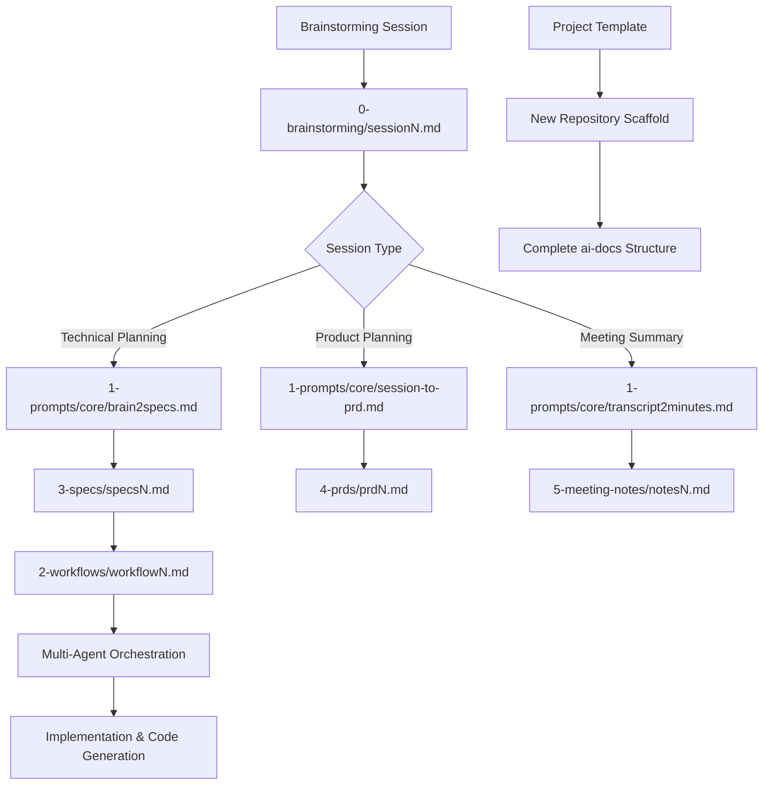

# Universal AI Agentic Coding Framework - Technical Specification

## Vision

Create a universal AI-docs framework that serves as a standardized, plug-and-play architecture for any AI coding environment (Claude Code, Codex, etc.), providing consistent project scaffolding, workflow orchestration, and document generation across different AI agentic coding frameworks.

### Objectives
- Establish a universal directory structure that works across all AI coding frameworks
- Create a standardized workflow system for converting brainstorming sessions into actionable specifications
- Implement automated document generation from different types of sessions (brainstorming, meetings, transcripts)
- Develop template-based project scaffolding for rapid development initialization
- Enable seamless integration with any AI coding assistant through standardized prompts and conventions

### Success Metrics
- Any AI coding framework can immediately understand and operate within the ai-docs structure
- Brainstorming sessions can be consistently converted to PRDs, specifications, or meeting notes through automated prompts
- New projects can be initialized with complete ai-docs scaffolding in under 30 seconds
- Template repository allows team members to create consistent project structures
- Workflow definitions enable multi-agent task orchestration without external tools

## Tasks

✅ Task 1.0: Restructure ai-docs directory with finalized folder hierarchy
* ✅ 1.1: Create 0-brainstorming folder with session naming convention (session1.md, session2.md)
* ✅ 1.2: Create 1-prompts/core folder for conversion prompts and shared guidance
* ✅ 1.3: Create 1-prompts/roles folder for assistant personas
* ✅ 1.4: Create 1-prompts/utilities folder for operational prompts and maintenance checklists
* ✅ 1.5: Create 2-workflows folder for multi-agent orchestration definitions
* ✅ 1.6: Create 3-specs folder for detailed specification documents with atomic tasks
* ✅ 1.7: Create 4-prds folder for high-level product requirement documents
* ✅ 1.8: Create 5-meeting-notes folder for general meeting summaries and transcripts
* ✅ 1.9: Create 6-resources folder for reference materials and documentation

🚧 Task 2.0: Develop comprehensive prompt templates for document conversion
* ✅ 2.1: Create brain2spec.md prompt for converting brainstorming sessions to specifications
* ✅ 2.2: Create session-to-prd.md prompt for converting sessions to product requirement documents
* 🔄 2.3: Create session-to-meeting-notes.md prompt for summarizing general discussions
* ✅ 2.4: Create simplify-spec.md prompt for over-engineering review and simplification - compares generated specs against original session to identify added features not requested, over-engineered tasks, and unnecessary feature enhancements that weren't discussed in the brainstorming session
* ⭕ 2.5: Test and validate all prompts with sample session content
* ⭕ 2.6: Document prompt usage guidelines and expected input/output formats

⭕ Task 3.0: Implement workflow orchestration system using markdown-driven approach
* ⭕ 3.1: Design workflow1.md template for basic brainstorm-to-spec-to-code flow
* ⭕ 3.2: Create workflow for session-to-PRD-to-spec progression
* ⭕ 3.3: Implement multi-agent workflow with specification review and simplification
* ⭕ 3.4: Define workflow syntax and conventions for agent coordination
* ⭕ 3.5: Test workflow execution with actual AI agents
* ⭕ 3.6: Document workflow creation guidelines and best practices

🚧 Task 4.0: Create GitHub template repository for project scaffolding
* 🔄 4.1: Organize existing ai-dev-environment repository with new structure
* ⭕ 4.2: Configure repository as GitHub private template
* ⭕ 4.3: Create placeholder files for each directory with usage instructions
* ⭕ 4.4: Add comprehensive README.md explaining framework usage
* ⭕ 4.5: Test template repository creation and usage workflow
* ⭕ 4.6: Document template customization process for different project types

⭕ Task 5.0: Develop Rust-based project initialization tool (stretch goal)
* ⭕ 5.1: Set up new Rust project for scaffolding CLI tool
* ⭕ 5.2: Implement directory creation and file templating functionality
* ⭕ 5.3: Add command-line interface for project initialization options
* ⭕ 5.4: Build cross-platform executable for team distribution
* ⭕ 5.5: Create installation and usage documentation
* ⭕ 5.6: Test tool with various project scenarios and languages

⭕ Task 6.0: Validate framework with real-world implementation
* ⭕ 6.1: Test complete workflow from brainstorming session to implemented code
* ⭕ 6.2: Validate multi-agent orchestration using workflow definitions
* ⭕ 6.3: Verify compatibility with different AI coding frameworks
* ⭕ 6.4: Gather feedback and iterate on structure and prompts
* ⭕ 6.5: Document lessons learned and framework refinements
* ⭕ 6.6: Create usage examples and case studies

## Development Conventions

### Code Quality
1. Use type hints for all function parameters and return values
2. Write clear docstrings for all functions, classes, and modules
3. Follow language-specific style guidelines (PEP 8 for Python, clippy for Rust)
4. Implement appropriate validation for data structures and file operations

### Logging and UI
1. Use appropriate libraries for console output and logging (rich for Python, clap for Rust CLI)
2. Implement structured logging with appropriate log levels
3. Design clear, informative error messages with actionable guidance
4. Provide progress indicators for long-running operations

### Package Management
1. Use uv for Python projects and Cargo for Rust projects
2. Document all dependencies and their purpose in project documentation
3. Maintain dependency files with pinned versions for reproducibility
4. Include dependency installation instructions in setup documentation

### Testing
1. Write unit tests for core functionality, especially file operations and templating
2. Aim for high test coverage of business logic and critical paths
3. Include both positive and negative test cases for robust error handling
4. Test cross-platform compatibility for file system operations

### Environment Setup
1. Python projects: `source .venv/bin/activate` (Mac/Linux) or `.venv\scripts\activate` (Windows)
2. Rust projects: Ensure Cargo is installed and up-to-date
3. Package installation: `uv add <package_name>` for Python, `cargo add <crate>` for Rust
4. Include platform-specific setup instructions in project documentation

### File and Directory Conventions
1. Use consistent naming patterns: sessionN.md, specsN.md, prdN.md, workflowN.md
2. Maintain clear separation between different document types in appropriate folders
3. Use markdown format for all documentation and specification files
4. Include metadata headers in generated documents for traceability

### AI Framework Compatibility
1. Design prompts to be framework-agnostic with clear input/output specifications
2. Use standardized status indicators (⭕ = not started, 🔄 = in progress, 🚧 = partially completed, ✅ = completed)
3. Structure documents with consistent markdown formatting for reliable parsing
4. Include version information in generated documents for change tracking

This specification provides a comprehensive implementation plan for creating a universal AI agentic coding framework that can be plugged into any AI coding environment, with clear task progression, standardized conventions, and robust workflow orchestration capabilities.
