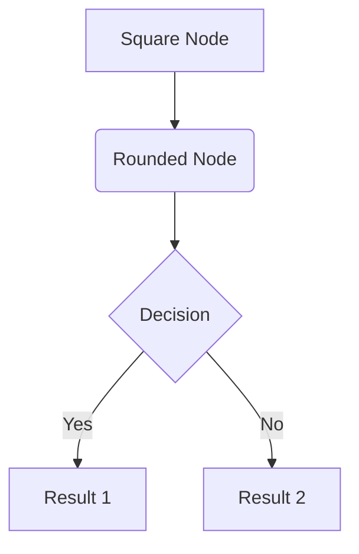
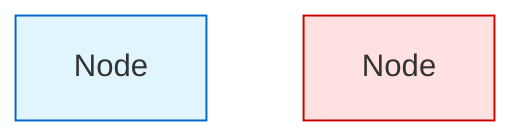
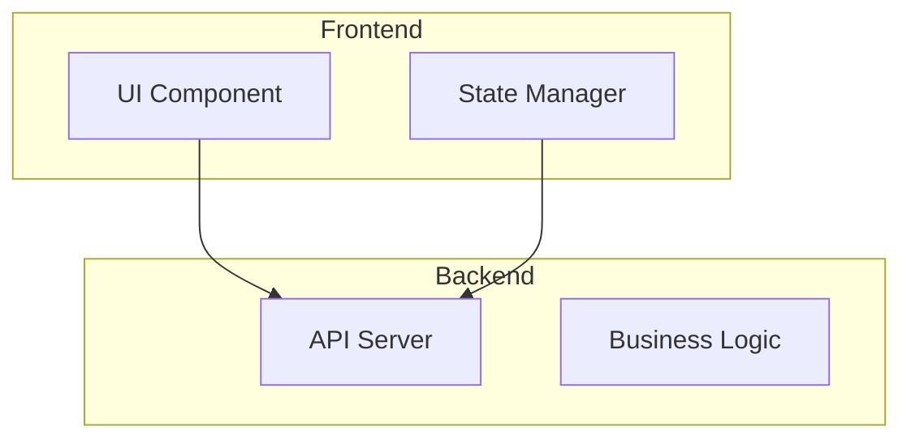
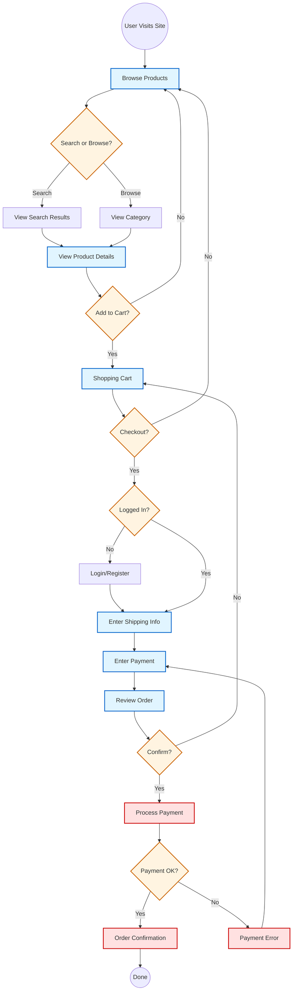
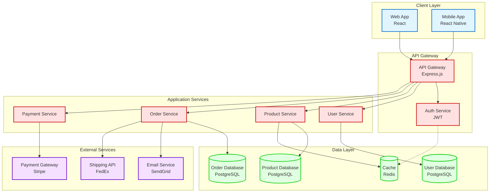
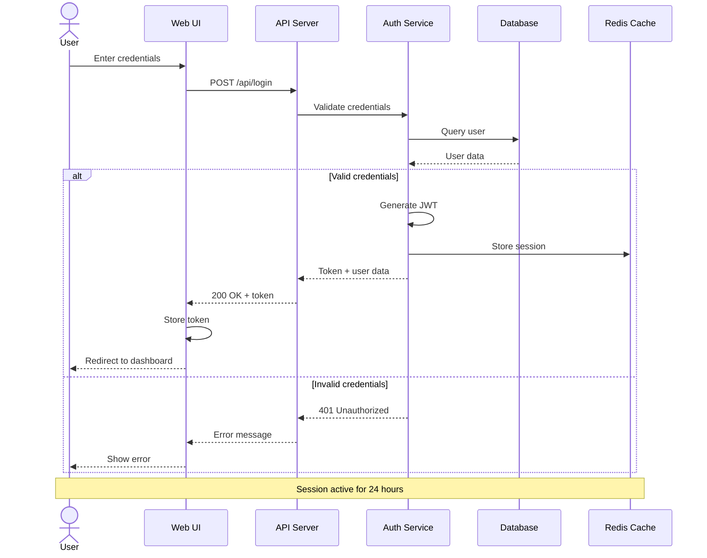
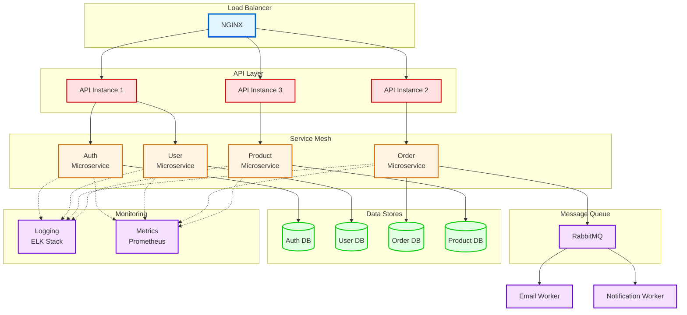
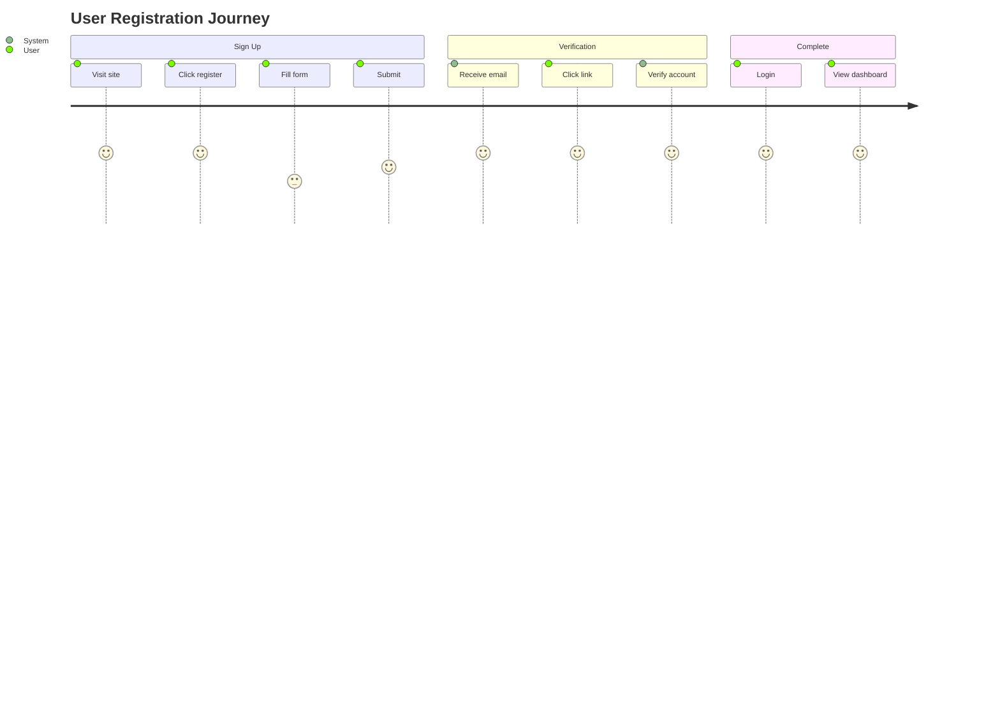
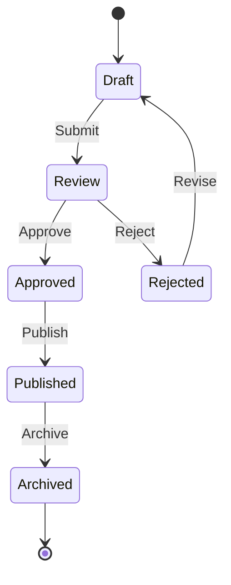
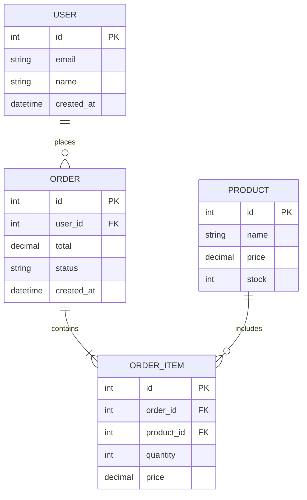

# Brain2Graph Guide

This document serves as a comprehensive guide for analyzing all project documentation and generating visual Mermaid diagrams that communicate system workflow and architecture. This guide transforms complex technical documentation into clear, concise visual representations.

## Purpose

The Brain2Graph process creates visual documentation that:
- Provides immediate understanding of system workflow and architecture
- Communicates complex ideas through simple diagrams
- Serves as onboarding material for new team members
- Documents key architectural decisions visually
- Bridges communication between technical and non-technical stakeholders
- Creates living documentation that evolves with the project

## Process Overview

1. **Input**: All project documents (Brainstorming + PRD + User Stories + Specs + Validation)
2. **Analysis**: Extract workflow patterns, system components, and architectural decisions
3. **Synthesis**: Transform information into two complementary visual representations
4. **Output**: Two Mermaid diagrams - Workflow and Architecture

## Output Structure

### Diagram Files

Generate two separate Mermaid diagram files:

```
ai-docs/2-diagrams/
├── workflow-[N].mmd      # User journey and process flow
└── architecture-[N].mmd  # System components and relationships
```

### File Format

Each `.mmd` file should contain:

```markdown
---
title: [Diagram Title]
session: [N]
created: [Date]
description: [Brief description]
---

[Mermaid diagram code]
```

## Diagram Types

### 1. Workflow Diagram (workflow-N.mmd)

**Purpose**: Show how users interact with the system and how processes flow

**Focus Areas**:
- User journeys from start to end
- Process sequences and decision points
- Data flow through the system
- User interactions and touchpoints
- State transitions
- Business process flow

**Recommended Mermaid Types**:
- `graph TD` or `graph LR` - For flowcharts
- `journey` - For user journey maps
- `stateDiagram-v2` - For state machines
- `sequenceDiagram` - For interaction flows

**Key Characteristics**:
- Clear entry and exit points
- Logical flow direction (top-to-bottom or left-to-right)
- Decision points clearly marked
- Error paths and alternate flows shown
- User-centric perspective

### 2. Architecture Diagram (architecture-N.mmd)

**Purpose**: Show system structure, components, and technical relationships

**Focus Areas**:
- System components and modules
- Data storage and databases
- External integrations
- API endpoints and services
- Technology stack
- Component dependencies
- Communication patterns

**Recommended Mermaid Types**:
- `graph TD` or `graph LR` - For component relationships
- `C4Context` - For system context (if using C4 extension)
- `flowchart` - For detailed component interactions
- `erDiagram` - For data models

**Key Characteristics**:
- Clear component boundaries
- Technology labels on components
- Integration points marked
- Data flow direction indicated
- Layered architecture visible

## Mermaid Syntax Guidelines

### Basic Graph Syntax



### Node Shapes

- `[Text]` - Rectangle (processes, actions)
- `(Text)` - Rounded rectangle (start/end points)
- `{Text}` - Diamond (decisions)
- `((Text))` - Circle (connectors)
- `[(Text)]` - Cylindrical (databases)
- `[[Text]]` - Subroutine shape
- `[/Text/]` - Parallelogram (input/output)

### Connection Types

- `-->` - Solid arrow (flow/dependency)
- `-.->` - Dotted arrow (optional/async)
- `==>` - Thick arrow (emphasis)
- `--o` - Circle end (composition)
- `--x` - Cross end (negation)
- `<-->` - Bidirectional

### Styling



### Subgraphs for Grouping



## Diagram Quality Guidelines

### Clarity Principles

1. **Keep It Simple**: Maximum 15-20 nodes per diagram
2. **Use Hierarchy**: Group related components with subgraphs
3. **Label Clearly**: Descriptive names, not abbreviations
4. **Show Flow**: Clear direction of data/process flow
5. **Consistent Style**: Use same shapes for similar concepts

### Complexity Management

**If diagram is too complex:**
- Break into multiple focused diagrams
- Use subgraphs to create hierarchy
- Abstract details into higher-level components
- Consider separate diagrams for different concerns

**Simplification strategies:**
- Merge similar components
- Abstract implementation details
- Focus on key decision points
- Remove obvious or trivial steps

### Visual Best Practices

- **Color coding**: Use consistent colors for component types
- **Spacing**: Avoid cluttered diagrams
- **Direction**: Maintain consistent flow direction
- **Labels**: Add explanatory labels on arrows
- **Legends**: Include legend if using custom styles

## Analysis Guidelines

### Extracting Workflow Information

From **User Stories**:
- Identify user actions and goals
- Extract step-by-step processes
- Note decision points
- Map user journeys

From **Specs**:
- Find process sequences
- Identify state transitions
- Extract algorithm flows
- Note error handling paths

From **Validation**:
- Understand test flows
- Identify validation points
- Map error scenarios

### Extracting Architecture Information

From **PRD**:
- Identify major features as components
- Extract integration requirements
- Note technical constraints

From **Specs**:
- Find component definitions
- Extract data structures
- Identify APIs and interfaces
- Note technology choices

From **Brainstorming**:
- Capture architectural decisions
- Identify technical approaches
- Extract system boundaries

## Examples

### Example 1: E-Commerce Workflow Diagram

```markdown
---
title: E-Commerce Purchase Workflow
session: 4
created: 2025-10-13
description: End-to-end user journey from product browsing to order confirmation
---


```

### Example 2: E-Commerce Architecture Diagram

```markdown
---
title: E-Commerce System Architecture
session: 4
created: 2025-10-13
description: System components and technical infrastructure
---


```

### Example 3: Authentication Workflow

```markdown
---
title: User Authentication Workflow
session: 4
created: 2025-10-13
description: Login and session management flow
---


```

### Example 4: Microservices Architecture

```markdown
---
title: Microservices System Architecture
session: 4
created: 2025-10-13
description: Distributed system with microservices
---


```

## Common Patterns

### User Journey Pattern



### State Machine Pattern



### Entity Relationship Pattern



## Best Practices

### DO:
- ✓ Start with a rough sketch on paper
- ✓ Focus on the most important flows/components
- ✓ Use consistent naming across diagrams
- ✓ Add legends if using custom styling
- ✓ Group related components with subgraphs
- ✓ Use descriptive labels on arrows
- ✓ Keep diagrams focused (one concern per diagram)
- ✓ Update diagrams when architecture changes
- ✓ Test diagram rendering before finalizing

### DON'T:
- ✗ Try to show everything in one diagram
- ✗ Use technical jargon without explanation
- ✗ Create diagrams with more than 25 nodes
- ✗ Mix workflow and architecture in same diagram
- ✗ Forget to add titles and descriptions
- ✗ Use inconsistent arrow types
- ✗ Overcomplicate with too many colors
- ✗ Create diagrams without clear flow direction

## Diagram Testing

Before finalizing, verify:

1. **Renders Correctly**: Test in Mermaid live editor
2. **Readable**: Text is legible, not cramped
3. **Complete**: All major flows/components shown
4. **Accurate**: Reflects actual system design
5. **Consistent**: Matches other project documentation
6. **Valuable**: Adds clarity, not confusion

## Mermaid Live Editor

Test diagrams at: https://mermaid.live/

This allows you to:
- Preview rendering
- Adjust layout
- Export as PNG/SVG
- Share with team
- Validate syntax

## Document Metadata

Include in each .mmd file:

```markdown
---
title: [Descriptive Title]
session: [Session Number]
created: [Date]
updated: [Date if revised]
description: [1-2 sentence description]
version: [Semantic version if tracked]
related_docs:
  - prd[N].md
  - specs-[N].md
  - stories-[N].md
---
```

## Practical Tips

1. **Start Simple**: Begin with high-level view, add detail as needed
2. **Iterate**: First draft is never perfect, refine based on feedback
3. **Get Feedback**: Share with team to validate understanding
4. **Maintain**: Update diagrams as system evolves
5. **Version**: Keep old versions for historical context
6. **Document Decisions**: Add notes explaining key architectural choices
7. **Link**: Reference diagrams in other documentation
8. **Export**: Generate PNG/SVG for presentations and documentation

## Integration with Development

### Workflow Diagram Uses:
- Onboarding new developers
- Planning implementation sequence
- Identifying integration points
- Communicating with stakeholders
- Documenting user journeys

### Architecture Diagram Uses:
- System design reviews
- Identifying bottlenecks
- Planning scalability
- Security analysis
- Technology stack documentation
- Deployment planning

## Conclusion

This Brain2Graph guide provides a standardized approach to transform comprehensive project documentation into clear, concise visual representations. Following this guide ensures consistent, valuable diagrams that enhance understanding, facilitate communication, and serve as living documentation that evolves with your project.

Remember: A good diagram communicates complexity simply. If your diagram is confusing, simplify it or break it into multiple focused diagrams.
