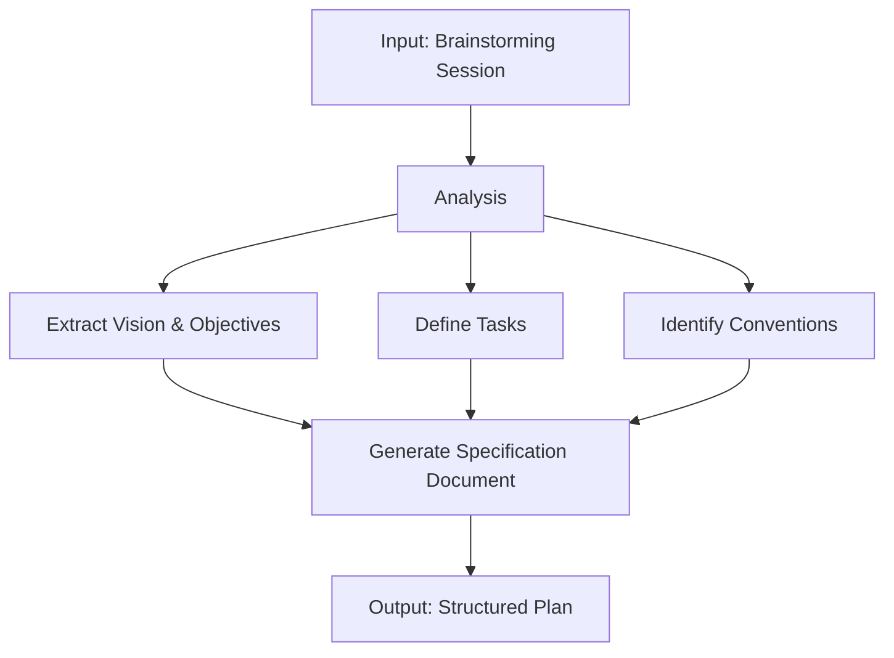

# Brain2Specs Guide

This document serves as a comprehensive guide for analyzing brainstorming sessions and converting them into structured technical specifications. This guide is designed to work with any project and can be used by AI assistants to create clear, actionable specification documents.

## Purpose

The Brain2Specs process bridges the gap between initial brainstorming conversations and structured development plans. This process ensures that concepts discussed in brainstorming sessions are translated into organized, actionable specifications that both humans and AI assistants can follow during development.

## Process Overview

1. **Input**: A brainstorming conversation transcript or notes
2. **Analysis**: Carefully review the transcript, giving more weight to conclusions and refined ideas near the end
3. **Extraction**: Identify core vision, objectives, tasks, and development guidelines
4. **Output**: A well-structured specification document with numbered tasks and development conventions

## Specification Document Structure

When creating a specification document from a brainstorming session, follow this structure:

### 1. Vision Section

```markdown
# Vision
[Clear statement of overall project vision]

## Objectives
- [Core objective 1]
- [Core objective 2]
- [Additional objectives...]

## Success Metrics
- [Key metric 1]
- [Key metric 2]
- [Additional metrics...]
```

### 2. Tasks Section

Structure all tasks using incremental numbering with completion status indicators:

```markdown
# Tasks
=4 Task 1.0: [Task description]
* =4 1.1: [Atomic subtask]
* =4 1.2: [Atomic subtask]

=4 Task 2.0: [Task description]
* =4 2.1: [Atomic subtask]
* =4 2.2: [Atomic subtask]
```

#### Task Guidelines:
- Each task must build incrementally upon previous tasks
- Break complex tasks into atomic subtasks
- Use clear, concise descriptions (one line per task)
- Make tasks actionable and measurable
- Number tasks sequentially (1.0, 2.0, etc.)
- Number subtasks with single decimal (1.1, 1.2, etc.)
- Initially mark ALL tasks with =4 (needs implementation)
- As implementation progresses, update status:
  - =â Completed tasks
  - =á Partially completed tasks
  - =4 Not started tasks

### 3. Development Conventions

```markdown
# Development Conventions

## Code Quality
1. Use type hints for all function parameters and return values
2. Write clear docstrings for all functions, classes, and modules
3. Follow language-specific style guidelines (e.g., PEP 8 for Python)
4. Implement appropriate validation for data structures

## Logging and UI
1. Use appropriate libraries for console output and logging
2. Implement structured logging with appropriate log levels
3. Design clear, informative error messages

## Package Management
1. Use appropriate package manager (e.g., uv for Python)
2. Document all dependencies and their purpose
3. Maintain dependency files with pinned versions

## Testing
1. Write unit tests for core functionality
2. Aim for high test coverage of business logic
3. Include both positive and negative test cases
```

## Analysis Guidelines

When analyzing a brainstorming transcript:

1. **Prioritize Later Discussion**: Ideas typically evolve during brainstorming, so give more weight to conclusions reached near the end of the session.

2. **Extract Key Elements**:
   - Overall project vision and purpose
   - Core objectives and goals
   - Primary functionality requirements
   - Technical constraints or preferences
   - Implementation steps or phases

3. **Resolve Contradictions**: If the brainstorming contains contradictory ideas, prioritize the most recent conclusions or those that appear to have more consensus.

4. **Identify Dependencies**: Note logical dependencies between tasks to ensure proper sequencing.

5. **Standardize Terminology**: Use consistent terminology throughout the specification document.

## Important Considerations

1. **Clarity Over Creativity**: Prioritize clear, unambiguous language over creative or elaborate descriptions.

2. **Actionable Tasks**: Each task should be concrete enough that a developer can take immediate action on it.

3. **Progressive Disclosure**: Organize tasks to build upon each other, with each task preparing for subsequent ones.

4. **Technical Alignment**: Ensure the specifications align with mentioned tools, frameworks, and technical preferences.

5. **Completeness**: Cover all key aspects discussed in the brainstorming session while avoiding unnecessary details.

6. **Future Maintenance**: Structure the document to support ongoing updates as tasks progress from =4 to =á to =â.

## Mermaid Diagrams (Optional)

Where helpful, include simple but informative Mermaid diagrams to visualize:
- System architecture
- Data flow
- Process workflow
- Component relationships

Example:


Remember to keep diagrams simple while capturing essential system components and relationships.

## Environment Setup Notes

Include relevant environment setup instructions if mentioned in the brainstorming:

For Python environments with uv:
- Mac: `source .venv/bin/activate`
- Windows: `.venv\scripts\activate`

## Practical Tips

1. **First Pass**: Quickly scan the entire transcript to get a general understanding.
2. **Second Pass**: Take detailed notes, focusing on concrete decisions and conclusions.
3. **Structuring**: Organize the identified elements into the specification format.
4. **Refining**: Review for clarity, consistency, and completeness.
5. **Numbering**: Apply the task numbering system consistently.

## Conclusion

This Brain2Specs guide provides a standardized approach to transform brainstorming sessions into actionable specifications. Following this guide will ensure consistent, clear, and comprehensive specification documents that facilitate effective development by both human developers and AI assistants.