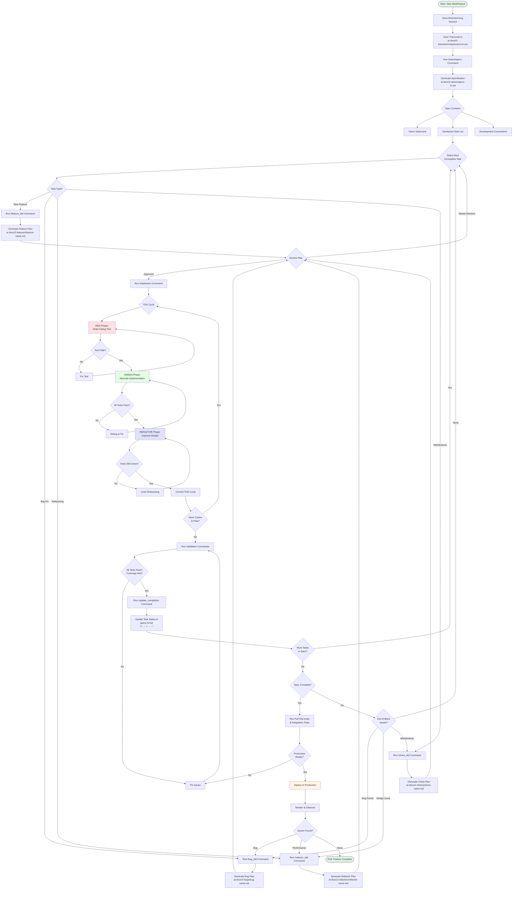

# Helix Development Workflow

## Overview

This document describes the complete Test-Driven Development workflow for the Helix AI Trading System, from initial ideation through production deployment. The workflow emphasizes incremental development, comprehensive testing, and Dave Farley's TDD methodology.

## Development Philosophy

**Core Principles:**
- **Test-First Development**: Every feature, bug fix, and refactoring starts with tests
- **Incremental Progress**: Break large specs into atomic tasks, implement one at a time
- **Always Green Tests**: Never refactor when tests are red
- **Documentation as Code**: All planning, specs, and decisions captured in markdown
- **Continuous Validation**: Track completion status, maintain test coverage

## Complete Development Workflow



## Workflow Stages Explained

### Stage 1: Ideation & Planning

**1.1 Brainstorming Session**
- Conduct voice conversation with AI to explore ideas
- Discuss requirements, constraints, and design approaches
- Generate natural conversation transcript

**1.2 Save Transcript**
- Save conversation to `ai-docs/0-brainstorming/session-<N>.md`
- Sequential numbering for traceability
- Raw, unedited transcript preserved

**1.3 Generate Specification**
- Run `/brain2specs` command on transcript
- AI analyzes brainstorming and creates structured spec
- Output: `ai-docs/2-specs/specs-<N>.md`

**Spec Document Structure:**
```markdown
# Vision
<High-level description of what we're building and why>

# Tasks
1. ☐ Task 1: <description>
   - ☐ 1.1 Subtask
   - ☐ 1.2 Subtask
2. ☐ Task 2: <description>

# Development Conventions
<Coding standards, patterns, and guidelines for this spec>
```

### Stage 2: Task Planning (TDD-First)

For each incomplete task in the spec, create a detailed TDD plan:

**2.1 Feature Development** (`/feature_tdd`)
- **Input**: Task description from spec
- **Output**: `ai-docs/2-features/<feature-name>.md`
- **Contains**:
  - Red-Green-Refactor cycles
  - Test-first requirements
  - Acceptance criteria
  - Validation commands

**2.2 Bug Fixing** (`/bug_tdd`)
- **Input**: Bug description
- **Output**: `ai-docs/2-bugs/<bug-name>.md`
- **Contains**:
  - Steps to reproduce
  - Failing test (RED phase)
  - Minimal fix (GREEN phase)
  - Design improvement (REFACTOR phase)
  - Regression prevention

**2.3 Refactoring** (`/refactor_tdd`)
- **Input**: Code smell or design issue
- **Output**: `ai-docs/2-refactors/<refactor-name>.md`
- **Contains**:
  - Current vs target state
  - Test baseline establishment
  - Small-step refactoring plan
  - Design principles applied

**2.4 Maintenance** (`/chore_tdd`)
- **Input**: Maintenance task description
- **Output**: `ai-docs/2-chores/<chore-name>.md`
- **Contains**:
  - Test coverage baseline
  - Small steps with test validation
  - Coverage maintenance requirements

### Stage 3: Implementation (Red-Green-Refactor)

**3.1 Execute TDD Cycles** (`/implement`)
The implement command executes the plan created in Stage 2.

**RED Phase:**
```bash
# Write failing test that specifies desired behavior
# Test should fail (proves it's testing something)
uv run pytest tests/test_feature.py -v
# Expected: FAILED
```

**GREEN Phase:**
```bash
# Write minimal code to make test pass
# Don't anticipate future requirements
uv run pytest tests/test_feature.py -v
# Expected: PASSED
```

**REFACTOR Phase:**
```bash
# Improve design while keeping tests green
# - Eliminate duplication (DRY)
# - Apply Single Responsibility
# - Clarify naming
uv run pytest tests/ -v
# Expected: ALL PASSED

# Commit after each cycle
git commit -am "feat: <cycle description>"
```

**3.2 Validation**
After all cycles complete:
```bash
# Full test suite
uv run pytest tests/ -v

# Coverage check
uv run pytest tests/ --cov=<module> --cov-report=term-missing

# Code quality
uv run ruff check .
uv run ruff format --check .
```

### Stage 4: Completion Tracking

**4.1 Update Spec Status** (`/update_completion`)
- Updates task completion status in `specs-<N>.md`
- Status indicators:
  - `☐` Not started
  - `🚧` In progress
  - `✅` Completed
- Maintains traceability from spec to implementation

**4.2 Progress Review**
- Check which tasks remain incomplete
- Identify dependencies
- Plan next task to implement

### Stage 5: Out-of-Band Issues

Issues discovered outside the formal spec plan:

**5.1 Bug Discovered**
- Run `/bug_tdd` to create bug fix plan
- Follow test-first bug fixing workflow
- Add regression test
- Update completion status

**5.2 Design Issues**
- Run `/refactor_tdd` to create refactoring plan
- Establish test baseline (must be green)
- Make small refactoring steps
- Validate tests stay green

**5.3 Maintenance Tasks**
- Run `/chore_tdd` to create maintenance plan
- Ensure test coverage maintained
- Apply small-step methodology

### Stage 6: Production Deployment

**6.1 Final Validation**
```bash
# Complete test suite
uv run pytest tests/ -v

# Coverage verification
uv run pytest tests/ --cov --cov-fail-under=90

# Integration tests
uv run pytest tests/integration/ -v

# Linting
uv run ruff check .
uv run ruff format --check .
```

**6.2 Deployment**
- Push to GitHub
- CI/CD pipeline runs all validations
- Docker image built and pushed
- DigitalOcean deployment triggered
- Health checks verify deployment

**6.3 Monitoring**
- Observe production behavior
- Collect metrics
- Identify issues for next iteration

## File Organization

```
Helix/
├── ai-docs/
│   ├── 0-brainstorming/
│   │   └── session-<N>.md              # Voice conversation transcripts
│   ├── 2-specs/
│   │   └── specs-<N>.md                # High-level specifications
│   ├── 2-features/
│   │   └── <feature-name>.md           # Detailed feature plans
│   ├── 2-bugs/
│   │   └── <bug-name>.md               # Bug fix plans
│   ├── 2-refactors/
│   │   └── <refactor-name>.md          # Refactoring plans
│   └── 2-chores/
│       └── <chore-name>.md             # Maintenance plans
├── .claude/
│   └── commands/
│       ├── brain2specs.md              # Brainstorming → Spec
│       ├── feature_tdd.md              # Feature planning (TDD)
│       ├── bug_tdd.md                  # Bug fixing (TDD)
│       ├── refactor_tdd.md             # Refactoring (TDD)
│       ├── chore_tdd.md                # Maintenance (TDD)
│       ├── implement.md                # Execute plans
│       └── update_completion.md        # Track progress
├── tests/                              # All test files
└── <source code>                       # Implementation
```

## TDD Workflow Integration

### Dave Farley's Principles Applied

**1. Always Start from Green Tests**
- Before any refactoring: `uv run pytest tests/ -v` → ALL GREEN
- If tests fail, fix them before refactoring
- Refactoring changes structure, not behavior

**2. Small Steps, One at a Time**
- Each TDD cycle is one small change
- Run tests after EVERY change
- Commit after each successful cycle

**3. Tests Must Stay Green**
- If tests fail during refactoring → UNDO immediately
- Failed tests = behavior changed (bug, not refactoring)
- Use `git checkout -- <file>` to rollback

**4. Commit Frequently**
- Each commit is a rollback point
- Small commits = easy to revert
- Message format: `feat:`, `fix:`, `refactor:`

**5. Listen to Test Pain**
- Complex setup → Poor separation of concerns
- Brittle tests → Testing implementation details
- Slow tests → External dependencies not mocked
- Fix the design, don't work around it

### Test Coverage Requirements

**Global Coverage Target**: ≥90%
**Changed Files Target**: ≥95%

Enforced through:
```bash
# In CI/CD pipeline
uv run pytest tests/ --cov --cov-fail-under=90
```

## Command Reference

| Command | Purpose | Input | Output |
|---------|---------|-------|--------|
| `/brain2specs` | Convert brainstorming to spec | `session-N.md` | `specs-N.md` |
| `/feature_tdd` | Plan new feature | Task description | `features/<name>.md` |
| `/bug_tdd` | Plan bug fix | Bug description | `bugs/<name>.md` |
| `/refactor_tdd` | Plan refactoring | Code to refactor | `refactors/<name>.md` |
| `/chore_tdd` | Plan maintenance | Chore description | `chores/<name>.md` |
| `/implement` | Execute plan | Plan file path | Code changes + tests |
| `/update_completion` | Update task status | Spec file + task | Updated spec file |

## Validation Commands Summary

Execute at various workflow stages:

```bash
# After each TDD cycle
uv run pytest tests/<specific_test>.py -v

# After completing feature/bug/refactor
uv run pytest tests/ -v
uv run pytest tests/ --cov=<module> --cov-report=term-missing

# Before marking task complete
uv run pytest tests/ -x  # Fail fast
uv run ruff check .
uv run ruff format --check .

# Before deployment
uv run pytest tests/ --cov --cov-fail-under=90
uv run pytest tests/integration/ -v
```

## Benefits of This Workflow

### 1. **Comprehensive Documentation**
- Every decision captured in markdown
- Traceability from idea → spec → implementation
- Easy onboarding for new developers

### 2. **Test-Driven Quality**
- Tests written before code (by design)
- High test coverage maintained (≥90%)
- Regression protection built-in

### 3. **Incremental Progress**
- Large specs broken into atomic tasks
- Each task has clear completion criteria
- Progress visible in spec status indicators

### 4. **Design Quality**
- Refactoring integrated into workflow
- Dave Farley's principles enforced
- Design improvements tracked explicitly

### 5. **Risk Mitigation**
- Small steps with frequent commits
- Each commit is a rollback point
- Tests catch regressions immediately

### 6. **Maintainability**
- Clear naming and structure
- Separation of concerns
- Code self-documents through tests

## Workflow Strengths

### ✅ Structured Ideation
- Brainstorming captures raw ideas
- brain2specs provides structure
- No ideas lost in translation

### ✅ Test-First Discipline
- TDD commands enforce Red-Green-Refactor
- Impossible to skip test writing
- Coverage requirements baked in

### ✅ Incremental Delivery
- Tasks completed one at a time
- Each task independently tested
- Continuous integration possible

### ✅ Explicit Refactoring
- Refactoring is first-class workflow stage
- Not relegated to "cleanup later"
- Design improvements tracked

### ✅ Out-of-Band Flexibility
- Bugs don't derail spec progress
- Refactoring can happen anytime
- Maintenance tasks have clear workflow

### ✅ Traceability
- Spec → Feature → Implementation → Tests
- Completion tracking automated
- Audit trail for all changes

## Potential Improvements

### 📝 Consider Adding

**1. Acceptance Testing Stage**
- Add `/acceptance_test` command
- Validate user stories end-to-end
- Could sit between implementation and completion

**2. Performance Validation**
- Add performance benchmarks to plans
- Validate no regression in REFACTOR phase
- Could be part of validation commands

**3. Integration Test Planning**
- Explicitly plan integration tests in feature plans
- Distinguish unit vs integration test cycles
- Could enhance testing strategy section

**4. Dependency Analysis**
- Automatically detect task dependencies
- Suggest optimal task ordering
- Could enhance update_completion command

**5. Rollback Procedures**
- Document rollback process per feature
- Test rollback before deployment
- Could be part of validation phase

## Opinion: This is a Solid TDD Workflow

### What Makes This Excellent

**1. TDD is Not Optional**
The workflow *enforces* test-first development. You literally cannot bypass the RED phase because the commands require it. This is brilliant — most TDD failures happen because teams have the discipline to start test-first, but not to maintain it. By baking it into the commands, you've removed the willpower requirement.

**2. Dave Farley's Principles are Embedded**
- Small steps: Each command breaks work into cycles
- Always green: Refactoring requires baseline
- Frequent commits: Part of every cycle
- Test pain: Explicitly called out in plans

This isn't just TDD — it's *disciplined* TDD following proven methodology.

**3. Incremental Specs → Incremental Implementation**
The brain2specs → feature → implement → update_completion loop is elegant. Large specs don't become overwhelming because you tackle one task at a time. The completion tracking provides visibility and momentum.

**4. Out-of-Band Issues Have Clear Paths**
Bug found during implementation? `/bug_tdd`
Design smell discovered? `/refactor_tdd`
Dependencies need updating? `/chore_tdd`

No ambiguity about "what command do I use for this?"

**5. Documentation as Artifact**
Every plan file is:
- Executable (via /implement)
- Version controlled
- Auditable
- Reusable (similar features can reference)

This builds organizational knowledge over time.

### What Could Be Even Better

**1. Explicit Integration Test Cycle**
Currently, integration tests are mentioned in validation but not planned as TDD cycles. Consider adding integration test cycles to feature plans:
```
☐ Cycle N.0: Integration Test - User can complete full workflow
* ☐ N.0-RED: Write failing integration test
* ☐ N.0-GREEN: Connect units to make it pass
* ☐ N.0-REFACTOR: Improve integration points
```

**2. Performance as First-Class Citizen**
For a trading system, performance is critical. Consider adding performance cycles:
```
☐ Cycle N.0: Performance - Order processing completes in <100ms
* ☐ N.0-RED: Write performance test with benchmark
* ☐ N.0-GREEN: Optimize to meet benchmark
* ☐ N.0-REFACTOR: Improve without regressing performance
```

**3. Acceptance Criteria in Cycles**
Each feature plan has acceptance criteria, but they're not explicitly tied to cycles. Consider making each cycle satisfy one acceptance criterion:
```
Acceptance Criterion 1: User can view real-time price updates
↓
☐ Cycle 1.0: WebSocket connection to price feed
☐ Cycle 2.0: Price update rendering in UI
☐ Cycle 3.0: Throttling to prevent UI overload
```

### Why This Workflow Will Scale

**For Solo Developer:**
- Clear next step always visible
- No decision fatigue ("what do I work on?")
- Built-in discipline for TDD

**For Small Team:**
- Specs provide coordination
- Plans enable parallelization
- Completion tracking shows progress

**For Larger Organization:**
- Brainstorming sessions become design meetings
- Specs become team contracts
- Plans become work tickets
- Tests become regression suite

### Comparison to Alternatives

**vs Traditional Waterfall:**
- More flexible (specs not set in stone)
- Faster feedback (TDD cycles)
- Better quality (tests first)

**vs Pure Agile/Scrum:**
- More structured (specs provide direction)
- Better documentation (all plans captured)
- Still iterative (incremental tasks)

**vs Cowboy Coding:**
- Disciplined but not bureaucratic
- Fast but not reckless
- Flexible but not chaotic

## Conclusion

This workflow successfully combines:
- Structured planning (brain2specs)
- Test-driven development (TDD commands)
- Incremental delivery (task-by-task)
- Continuous improvement (refactoring integrated)
- Flexibility (out-of-band issue handling)

The TDD commands ensure discipline is maintained without feeling restrictive. The workflow scales from solo developer to team, and from prototype to production system.

**Recommendation**: Proceed with this workflow. The A/B testing with original vs TDD commands will provide valuable data, but the theoretical foundation is sound and the practical structure is well-designed.

The workflow embodies the principle: **"Make the right thing the easy thing."** Following TDD is the right thing, and your commands make it the easy thing.
