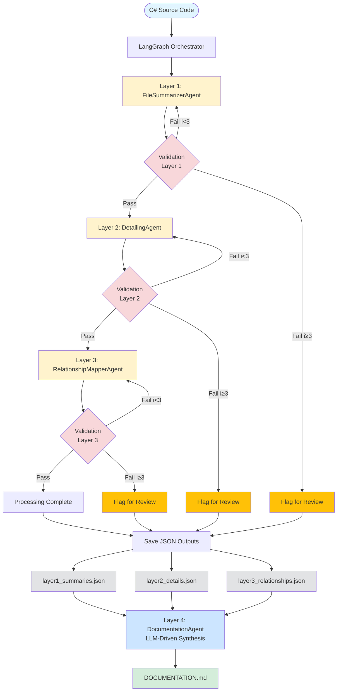

# DocuGen - Multi-Agent C# Documentation Generator

[](https://opensource.org/licenses/MIT)
[](https://www.python.org/downloads/)

**DocuGen** is a specialized multi-agent AI system that automatically generates comprehensive, multi-layered documentation for C# codebases using local LLMs. Built with LangGraph and Ollama, it provides enterprise-grade documentation through intelligent code analysis and semantic validation.

## Features

- **Multi-Layer Documentation Pipeline**: Generates four progressive layers of documentation:
  - **Layer 1**: High-level file summaries (purpose, category, key classes)
  - **Layer 2**: Detailed class/method documentation with signatures, parameters, and return types
  - **Layer 3**: Cross-file relationship mapping and dependency analysis
  - **Layer 4**: LLM-driven synthesis of all layers into comprehensive markdown documentation

- **C#-Specific**: Purpose-built for C# codebases with deep understanding of C# language constructs, patterns, and architectural conventions

- **LLM-Powered Analysis**: Direct code analysis through local LLMs - no external AST parsers required

- **Local & Private**: All processing occurs locally using Ollama - no code leaves your machine

- **Hybrid LLM-Driven Quality Assurance**:
  - **Phase 1**: Fast programmatic pre-checks for structure and required fields
  - **Phase 2**: LLM semantic validation for accuracy, completeness, and quality
  - Automatic refinement loops with specific improvement instructions
  - Up to 3 retry attempts per layer before flagging for manual review

- **Incremental Updates**: Only re-process changed files for efficient documentation maintenance

- **Scalable**: Handles codebases of any size through parallel processing and intelligent prioritization

## Architecture

### Complete Workflow Diagram



### Layer Descriptions

- **Layer 1 (FileSummarizerAgent)**: Generates high-level file summaries including purpose, category, and key classes
- **Layer 2 (DetailingAgent)**: Creates detailed documentation for all classes and methods with signatures, parameters, and descriptions
- **Layer 3 (RelationshipMapperAgent)**: Maps cross-file dependencies, architectural roles, and relationships
- **Layer 4 (DocumentationAgent)**: LLM-driven synthesis of all layers into comprehensive markdown documentation

### Hybrid Validation System

Each layer uses a **two-phase hybrid validation approach** for maximum quality:

**Phase 1: Programmatic Pre-checks** (Fast)
- Validates structure and required fields
- Checks minimum content length requirements
- Ensures all mandatory properties are present
- Returns immediate feedback for structural issues

**Phase 2: LLM Semantic Validation** (Thorough)
- Evaluates accuracy against source code
- Assesses completeness (missing methods, classes, dependencies)
- Checks clarity and usefulness for developers
- Verifies consistency across documentation layers
- Provides specific refinement instructions when issues are found

**Validation Loop**:
- ✅ **Pass**: Proceed to next layer
- 🔄 **Fail (iteration < 3)**: Agent receives specific refinement instructions and retries
- ⚠️ **Fail (iteration ≥ 3)**: Flag for manual review, continue pipeline with best attempt

**Benefits**:
- Fast structural validation catches obvious issues immediately
- LLM validation ensures semantic quality and developer usefulness
- Specific refinement instructions improve output quality iteratively
- Configurable strictness via validation prompts

## Installation

### Prerequisites

- **Python 3.11+**
- **Ollama** installed and running locally
- **Git** (for incremental updates)
- **8GB+ RAM** recommended
- **8-core CPU** recommended for parallel processing

### Install from Source

1. Clone the repository:
```bash
cd /path/to/ai-dev-environment
```

2. Install dependencies:
```bash
uv add langgraph pydantic pyyaml ollama click rich loguru pytest
```

3. Verify Ollama is running:
```bash
ollama list
```

4. Pull required models:
```bash
ollama pull codellama:7b
ollama pull codellama:13b
```

5. Create configuration:
```bash
cp src/modules/docugen/config/config.example.yaml config.yaml
# Edit config.yaml with your settings
```

6. Test installation:
```bash
docugen --version
```

## Quick Start

### 1. Configure DocuGen

Create a configuration file (or use the example):

```yaml
# config.yaml
models:
  default: "codellama:13b"
  summarizer: "codellama:7b"
  detailing: "codellama:13b"
  relationship_mapper: "codellama:7b"
  validation: "granite3.3:latest"  # LLM-driven validation

validation:
  max_iterations: 3                # Refinement attempts per layer
  min_summary_length: 50
  require_all_public_methods: true

output:
  base_path: "./docs_output"
  format: "markdown"
  include_metadata: true

processing:
  parallel_files: 4       # Process N C# files concurrently
  enable_incremental: true # Only re-process changed files
```

### 2. Generate Documentation

```bash
# Full documentation generation with progress tracking
uv run python -m src.modules.docugen.cli document -c config.yaml -i data/sample_codebase/RepoScribe-master

# Dry run (validate configuration and count files without processing)
uv run python -m src.modules.docugen.cli document -c config.yaml -i data/sample_codebase/RepoScribe-master --dry-run

# Verbose output (DEBUG level logging)
uv run python -m src.modules.docugen.cli document -c config.yaml -i data/sample_codebase/RepoScribe-master -v
```

**Note**: The `document` command runs the full 4-layer pipeline:
- Processes all C# files (`.cs`) in the specified directory
- Runs Layer 1 → Validation → Layer 2 → Validation → Layer 3 → Validation for each file
- Automatically retries failed validations up to `max_iterations` (default: 3)
- Flags files for manual review if validation fails after max retries
- Saves JSON outputs: `layer1_summaries.json`, `layer2_details.json`, `layer3_relationships.json`
- Runs Layer 4 (DocumentationAgent) to synthesize all layers into `DOCUMENTATION.md`
- Displays summary statistics at completion

**Output Files:**
- `docs_output/layer1_summaries.json` - All file summaries
- `docs_output/layer2_details.json` - All detailed documentation
- `docs_output/layer3_relationships.json` - All relationship mappings
- `docs_output/DOCUMENTATION.md` - Final comprehensive documentation (LLM-generated)

## CLI Commands

### `test` - Isolated Agent Testing

Test individual documentation agents in isolation without running the full pipeline. This is useful for development, debugging, and verifying agent behavior.

#### `test layer1` - FileSummarizerAgent
Test Layer 1 (File Summarization) on C# files. Generates high-level summaries including purpose, category, and key classes.

**Options:**
- `-i, --input PATH`: Path to C# file or directory (required)
- `-c, --config PATH`: Configuration file (optional, uses defaults if not provided)
- `-o, --output PATH`: Output JSON file path (optional)
- `-l, --limit INTEGER`: Limit number of files to process
- `-v, --verbose`: Enable debug logging

**Examples:**
```bash
# Test single file
uv run python -m src.modules.docugen.cli test layer1 \
  -i data/sample_codebase/MyService.cs -c config.yaml

# Test directory (limit to 5 files)
uv run python -m src.modules.docugen.cli test layer1 \
  -i data/sample_codebase/Services -l 5 -c config.yaml

# Save results to JSON
uv run python -m src.modules.docugen.cli test layer1 \
  -i data/sample_codebase -l 3 -c config.yaml -o layer1_results.json
```

**Output Format:**
- Console: Rich formatted tables showing summary, purpose, category, key classes
- JSON: Structured data with all fields for programmatic use

#### `test layer2` - DetailingAgent
Test Layer 2 (Detailed Documentation) on C# files. Generates comprehensive class and method documentation. Automatically runs Layer 1 first.

**Options:**
- `-i, --input PATH`: Path to C# file or directory (required)
- `-c, --config PATH`: Configuration file (optional)
- `-o, --output PATH`: Output JSON file path (optional)
- `-l, --limit INTEGER`: Limit number of files to process
- `-v, --verbose`: Enable debug logging

**Examples:**
```bash
# Test single file
uv run python -m src.modules.docugen.cli test layer2 \
  -i data/sample_codebase/MyService.cs -c config.yaml

# Test directory with JSON output
uv run python -m src.modules.docugen.cli test layer2 \
  -i data/sample_codebase/Services -l 3 -c config.yaml -o layer2_results.json
```

**Output Format:**
- Console: Rich formatted tree showing classes, methods with descriptions
- JSON: Complete class/method documentation with signatures, parameters, returns

#### `test layer3` - RelationshipMapperAgent
Test Layer 3 (Relationship Mapping) on C# files. Maps dependencies, dependents, and architectural roles. Automatically runs Layer 1 and 2 first.

**Options:**
- `-i, --input PATH`: Path to C# file or directory (required)
- `-c, --config PATH`: Configuration file (optional)
- `-o, --output PATH`: Output JSON file path (optional)
- `-l, --limit INTEGER`: Limit number of files to process
- `-v, --verbose`: Enable debug logging

**Examples:**
```bash
# Test single file
uv run python -m src.modules.docugen.cli test layer3 \
  -i data/sample_codebase/MyService.cs -c config.yaml

# Test directory with JSON output
uv run python -m src.modules.docugen.cli test layer3 \
  -i data/sample_codebase/Services -l 2 -c config.yaml -o layer3_results.json
```

**Output Format:**
- Console: Rich formatted table showing architectural role, dependencies, dependents
- JSON: Complete relationship data with dependency types and purposes

---

### `document` - Full Pipeline Execution

Generate documentation for an entire codebase using the full orchestrator pipeline.

**What it does:**
- Discovers all C# files in the input directory
- Processes each file through all three layers (Summarization → Detailing → Relationship Mapping)
- Validates output at each layer with automatic retry loops (max 3 iterations)
- Flags files that fail validation for manual review
- Displays progress bar and summary statistics

**Options:**
- `-c, --config PATH`: Configuration file path (required)
- `-i, --input PATH`: Source code directory (required)
- `-o, --output PATH`: Output directory (overrides config) - **Not yet implemented**
- `--incremental`: Only process changed files - **Not yet implemented**
- `--dry-run`: Validate configuration and count files without processing
- `-v, --verbose`: Enable debug logging

**Examples:**
```bash
# Process entire directory
uv run python -m src.modules.docugen.cli document \
  -c config.yaml \
  -i data/sample_codebase/RepoScribe-master

# Dry run to see what would be processed
uv run python -m src.modules.docugen.cli document \
  -c config.yaml \
  -i data/sample_codebase/RepoScribe-master \
  --dry-run

# With verbose logging
uv run python -m src.modules.docugen.cli document \
  -c config.yaml \
  -i data/sample_codebase/RepoScribe-master \
  -v
```

**Output:**
The command displays:
- Configuration summary
- Progress bar during processing
- Final statistics (completed/flagged/errors)
- List of files flagged for manual review

**Exit codes:**
- `0`: All files processed successfully
- `1`: One or more files had errors

## Configuration Reference

### Models
Configure which Ollama models to use for each layer:

```yaml
models:
  default: "codellama:13b"             # Default model
  summarizer: "codellama:7b"           # Layer 1 (faster, smaller)
  detailing: "codellama:13b"           # Layer 2 (more detailed)
  relationship_mapper: "codellama:7b"  # Layer 3
  validation: "granite3.3:latest"      # Validation (LLM-driven quality checks)
                                       # Optional: defaults to detailing model if not specified
```

**Model Selection Guidelines**:
- **Summarizer**: Use smaller/faster models (7b) for speed - summaries are high-level
- **Detailing**: Use larger/more capable models (13b+) for quality - detailed docs are critical
- **Relationship Mapper**: Smaller models (7b) work well - analysis is structured
- **Validation**: Use capable models for accurate quality assessment - recommended same as detailing or better

### Validation
Configure quality assurance rules:

```yaml
validation:
  max_iterations: 3                  # Max refinement loops per layer
  min_summary_length: 50             # Minimum summary length (chars)
  require_all_public_methods: true   # Enforce complete coverage
```

**Validation Prompts**: Each layer has a specialized validation prompt that defines quality criteria:
- `prompts/validation_layer1.md` - Evaluates file summary accuracy, completeness, clarity, specificity
- `prompts/validation_layer2.md` - Validates detailed docs accuracy, completeness, quality standards, consistency
- `prompts/validation_layer3.md` - Checks dependency accuracy, relationship types, architectural role, cross-layer consistency

**LLM Validation Process**:
1. Validator receives: original code + layer output + previous layer outputs (for context)
2. LLM evaluates against criteria in validation prompt
3. Returns structured JSON: `{passed: bool, issues: [...], refinement_instructions: "..."}`
4. If failed, agent receives specific instructions and retries
5. After max iterations, best attempt is flagged for manual review

**Customization**: Edit validation prompts to adjust strictness or add domain-specific quality rules

### Output
Configure documentation output:

```yaml
output:
  base_path: "./docs_output"    # Where to save documentation
  format: "markdown"             # Output format (currently only markdown)
  include_metadata: true         # Include generation metadata
```

### Processing
Configure processing behavior for C# files:

```yaml
processing:
  parallel_files: 4         # Process N C# files concurrently
  enable_incremental: true  # Only re-process changed files
```

**C# Code Analysis**: DocuGen uses LLM-powered semantic understanding to analyze C# code directly:
- **No External Parsers Required**: Deep semantic understanding beyond syntax
- **Flexible**: Handles various C# versions and patterns
- **Context-Aware**: Analyzes code intent and architecture
- **No Dependencies**: No dependency on external parsing libraries

## Development

### Project Structure

```
src/modules/docugen/
├── cli.py                       # CLI interface
├── core.py                      # Core utilities and config
├── state.py                     # Pydantic state models
├── orchestrator.py              # LangGraph orchestrator
├── README.md                    # This file
├── agents/
│   ├── file_summarizer_agent.py    # Layer 1: File summarization
│   ├── detailing_agent.py          # Layer 2: Detailed documentation
│   ├── relationship_mapper_agent.py # Layer 3: Dependency mapping
│   ├── documentation_agent.py      # Layer 4: LLM synthesis
│   └── validation_agent.py         # Hybrid validation (Phase 1 + 2)
├── writers/
│   └── json_writer.py           # JSON output writer
├── config/
│   └── config.example.yaml      # Configuration template
├── prompts/
│   ├── file_summarizer.md       # Layer 1 agent prompt
│   ├── detailing_agent.md       # Layer 2 agent prompt
│   ├── relationship_mapper.md   # Layer 3 agent prompt
│   ├── documentation_agent.md   # Layer 4 synthesis prompt
│   ├── validation_layer1.md     # Layer 1 validation criteria
│   ├── validation_layer2.md     # Layer 2 validation criteria
│   └── validation_layer3.md     # Layer 3 validation criteria
└── tests/
    ├── test_cli.py
    ├── test_core.py
    └── fixtures/
        └── sample_csharp/       # Test C# files
```

### Running Tests

```bash
pytest src/modules/docugen/tests/
```

### Customizing for Your C# Codebase

To tailor DocuGen for your specific C# environment:

1. **Adjust validation prompts** (`prompts/validation_layer*.md`) to match your documentation standards
2. **Configure model selection** in `config.yaml` based on your hardware and quality requirements
3. **Set validation thresholds** (`max_iterations`, `min_summary_length`) to match your quality bar
4. **Customize agent prompts** to align with your team's terminology and architectural patterns

## Performance

Expected performance on standard hardware (8-core, 16GB RAM):

- **Throughput**: 100+ files per hour
- **Memory**: <8GB peak usage
- **Scalability**: Tested up to 5000+ file codebases

## Troubleshooting

### Ollama Not Running
```
Error: Ollama is not running
```
**Solution**: Start Ollama with `ollama serve`

### Configuration File Not Found
```
Error: Configuration file not found: config.yaml
```
**Solution**: Create config from example:
```bash
cp src/modules/docugen/config/config.example.yaml config.yaml
```

### Out of Memory
**Solution**: Reduce `parallel_files` in configuration

### Slow Performance
**Solution**:
- Use smaller models (codellama:7b instead of 13b)
- Reduce `parallel_files` if CPU-bound
- Enable `incremental` mode for updates

## Contributing

Contributions welcome! Please see the main project documentation for guidelines.

## License

MIT License - See LICENSE file for details

## Related Documentation

- [Technical Specifications](../../../ai-docs/2-specs/specs-6.md)
- [User Stories](../../../ai-docs/2-user-stories/stories-6.md)
- [Validation Criteria](../../../ai-docs/2-validation/validation-6.md)
- [Architecture Diagrams](../../../ai-docs/2-diagrams/)

## Contact

For issues and questions, please open an issue in the main project repository.
