# DocuGen - Multi-Agent C# Documentation Generator

[](https://opensource.org/licenses/MIT)
[](https://www.python.org/downloads/)

Multi-agent AI system that generates comprehensive documentation for C# codebases using LangGraph and LLMs.

## Features

- **4-Layer Documentation Pipeline**: Summaries → Detailed docs → Dependencies → Markdown synthesis
- **Configurable LLM Endpoints**: Ollama (local), OpenRouter, Together AI, LM Studio, or any OpenAI-compatible API
- **Hybrid Validation**: Fast programmatic checks + LLM semantic validation with auto-refinement
- **Parallel Processing**: Process multiple files concurrently for faster generation
- **Local & Private**: All processing occurs locally (when using Ollama)

## Quick Start

### 1. Install

```bash
# Install dependencies
uv add langgraph pydantic pyyaml ollama click rich loguru

# Install docugen CLI
uv pip install -e .
```

### 2. Setup LLM

**Option A: Local Ollama (recommended for privacy)**
```bash
ollama serve
ollama pull codellama:7b
ollama pull codellama:13b
```

**Option B: OpenAI-compatible API**
- Get API key from OpenRouter, Together AI, or other provider
- Configure base_url in config.yaml (see Configuration section)

### 3. Create Configuration

```bash
cp src/modules/docugen/config/config.example.yaml config.yaml
# Edit config.yaml with your settings
```

### 4. Generate Documentation

```bash
# Full pipeline
docugen document -c config.yaml -i /path/to/csharp/code

# Test single layer
docugen test layer1 -c config.yaml -i MyFile.cs

# Dry run (validate config without processing)
docugen document -c config.yaml -i /path/to/code --dry-run
```

## Configuration

Create `config.yaml` with these settings:

```yaml
# Step 1: LLM Connection
ollama:
  base_url: "http://localhost:11434"  # Local Ollama
  # base_url: "https://openrouter.ai/api/v1"     # OpenRouter
  # base_url: "https://api.together.xyz/v1"      # Together AI
  # base_url: "http://localhost:1234/v1"         # LM Studio
  timeout: 300

# Step 2: Model Selection
models:
  summarizer: "codellama:7b"            # Layer 1 - Fast summaries
  detailing: "codellama:13b"            # Layer 2 - Quality docs
  relationship_mapper: "codellama:7b"   # Layer 3 - Dependencies
  validation: null                      # Defaults to detailing model

# Step 3: Quality Settings
validation:
  max_iterations: 3                     # Refinement attempts before review
  min_summary_length: 50
  require_all_public_methods: true

# Step 4: Output
output:
  base_path: "./docs_output"
  format: "markdown"
  include_metadata: true

# Step 5: Performance
processing:
  parallel_files: 4                     # Concurrent file processing
  enable_incremental: true              # Only re-process changed files
```

## CLI Commands

### `docugen document` - Full Pipeline

Generate documentation for entire codebase.

```bash
docugen document -c config.yaml -i /path/to/code [OPTIONS]
```

**Options:**
- `-c, --config PATH` - Configuration file (required)
- `-i, --input PATH` - Source code directory (required)
- `--dry-run` - Validate config without processing
- `-v, --verbose` - Debug logging

**Output:**
- `docs_output/layer1_summaries.json` - File summaries
- `docs_output/layer2_details.json` - Detailed documentation
- `docs_output/layer3_relationships.json` - Dependency mappings
- `docs_output/DOCUMENTATION.md` - Final comprehensive docs

**Example:**
```bash
docugen document -c config.yaml -i data/sample_codebase/RepoScribe-master
```

### `docugen test` - Test Individual Layers

Test agents in isolation for development/debugging.

#### Test Layer 1 (Summaries)
```bash
docugen test layer1 -c config.yaml -i MyFile.cs [OPTIONS]
```

**Options:**
- `-i, --input PATH` - C# file or directory (required)
- `-c, --config PATH` - Configuration file (optional)
- `-o, --output PATH` - Save JSON output
- `-l, --limit N` - Process only N files
- `-v, --verbose` - Debug logging

**Examples:**
```bash
# Test single file
docugen test layer1 -c config.yaml -i src/MyService.cs

# Test directory (limit 5 files)
docugen test layer1 -c config.yaml -i src/Services -l 5

# Save results
docugen test layer1 -c config.yaml -i src/ -l 3 -o layer1_test.json
```

#### Test Layer 2 (Detailed Docs)
```bash
docugen test layer2 -c config.yaml -i MyFile.cs [OPTIONS]
```

Generates detailed class/method documentation. Automatically runs Layer 1 first.

**Example:**
```bash
docugen test layer2 -c config.yaml -i src/MyService.cs
```

#### Test Layer 3 (Dependencies)
```bash
docugen test layer3 -c config.yaml -i MyFile.cs [OPTIONS]
```

Maps cross-file relationships. Automatically runs Layer 1 and 2 first.

**Example:**
```bash
docugen test layer3 -c config.yaml -i src/MyService.cs
```

## Architecture

### Pipeline Workflow

```mermaid
graph TB
    Start([C# Source Code]) --> L1[Layer 1: File Summaries]

    L1 --> V1{Validation}
    V1 -->|Pass| L2[Layer 2: Detailed Docs]
    V1 -->|Fail| R1[Refine]
    R1 -->|Retry < 3| L1
    R1 -->|Retry ≥ 3| Flag1[⚠️ Flag for Review]

    L2 --> V2{Validation}
    V2 -->|Pass| L3[Layer 3: Dependencies]
    V2 -->|Fail| R2[Refine]
    R2 -->|Retry < 3| L2
    R2 -->|Retry ≥ 3| Flag2[⚠️ Flag for Review]

    L3 --> V3{Validation}
    V3 -->|Pass| JSON[Save JSON Files]
    V3 -->|Fail| R3[Refine]
    R3 -->|Retry < 3| L3
    R3 -->|Retry ≥ 3| Flag3[⚠️ Flag for Review]

    Flag1 --> JSON
    Flag2 --> JSON
    Flag3 --> JSON

    JSON --> J1[layer1_summaries.json]
    JSON --> J2[layer2_details.json]
    JSON --> J3[layer3_relationships.json]

    J1 --> L4[Layer 4: LLM Synthesis]
    J2 --> L4
    J3 --> L4

    L4 --> Output([📄 DOCUMENTATION.md])

    style Start fill:#e3f2fd
    style L1 fill:#fff9c4
    style L2 fill:#fff9c4
    style L3 fill:#fff9c4
    style L4 fill:#c5e1a5
    style V1 fill:#ffccbc
    style V2 fill:#ffccbc
    style V3 fill:#ffccbc
    style Output fill:#a5d6a7
    style Flag1 fill:#ffb74d
    style Flag2 fill:#ffb74d
    style Flag3 fill:#ffb74d
```



### Agents

1. **FileSummarizerAgent** (Layer 1) - High-level file summaries
2. **DetailingAgent** (Layer 2) - Detailed class/method documentation
3. **RelationshipMapperAgent** (Layer 3) - Cross-file dependency mapping
4. **ValidationAgent** - Hybrid validation (programmatic + LLM semantic checks)
5. **DocumentationAgent** (Layer 4) - LLM-driven markdown synthesis

### Validation Loop

Each layer undergoes validation:
- ✅ **Pass** → Next layer
- 🔄 **Fail (iteration < max)** → Refine with specific instructions
- ⚠️ **Fail (iteration ≥ max)** → Flag for manual review, continue pipeline

## Project Structure

```
src/modules/docugen/
├── cli.py                          # CLI interface
├── core.py                         # Configuration models
├── state.py                        # Pydantic state models
├── orchestrator.py                 # LangGraph orchestrator
├── agents/                         # 5 agent implementations
├── writers/                        # JSON output writers
├── config/
│   └── config.example.yaml         # Configuration template
├── prompts/                        # Agent and validation prompts
└── tests/                          # Test suite
```

## Troubleshooting

**Ollama not running**
```bash
ollama serve
```

**Configuration not found**
```bash
cp src/modules/docugen/config/config.example.yaml config.yaml
```

**Out of memory**
- Reduce `parallel_files` in config.yaml

**Slow performance**
- Use smaller models (codellama:7b)
- Reduce `parallel_files` if CPU-bound

**Connection errors**
- Verify `ollama.base_url` in config.yaml
- Check API endpoint is accessible
- For OpenAI-compatible APIs, ensure API keys are configured in environment

## Performance

Expected on 8-core, 16GB RAM:
- **Throughput**: 100+ files/hour
- **Memory**: <8GB peak
- **Tested**: Up to 5000+ file codebases

## Customization

Adapt DocuGen to your codebase:

1. **Validation strictness**: Edit `prompts/validation_layer*.md`
2. **Model selection**: Adjust models in config.yaml based on hardware
3. **Quality thresholds**: Tune `max_iterations`, `min_summary_length`
4. **Agent behavior**: Customize prompts in `prompts/` directory

## License

MIT License - See LICENSE file for details
